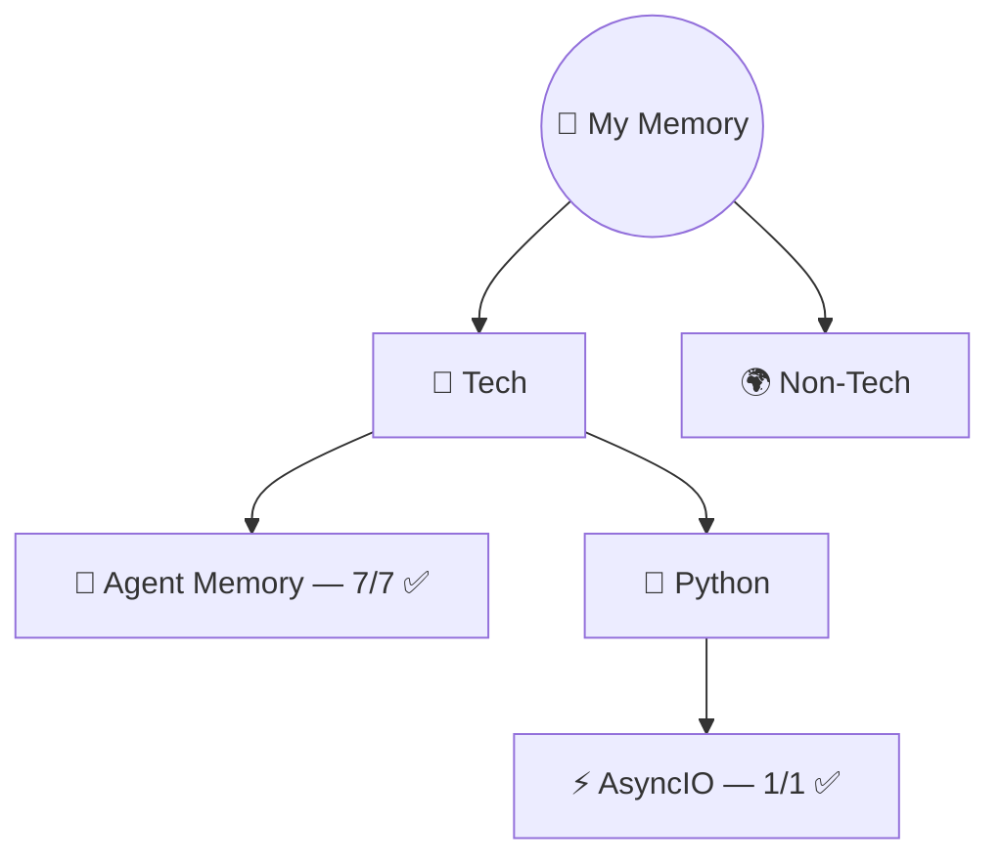

# 🧠 My Memory — Learning Vault

> *"Every expert was once a beginner who didn't quit."*

---

## 🗺️ The Map

## 📊 Stats

| Metric | Count |
|--------|-------|
| **Topics** | 2 |
| **Lessons** | 8 |
| **Flashcards** | 50+ |
| **Last updated** | 2026-03-21 |

## 📚 Topics

| Topic | Category | Lessons | Confidence | Source |
|-------|----------|---------|------------|--------|
| [🧠 Agent Memory](tech/agent-memory/README.md) | Tech | 7/7 ✅ | 🟡 Learning | DeepLearning.AI × Oracle |
| [⚡ AsyncIO](tech/python/asyncio/README.md) | Tech / Python | 1/1 ✅ | 🟡 Learning | Corey Schafer |

## 🏗️ How This Works

| Folder | What's Inside |
|--------|--------------|
| `tech/` | All technical topics |
| `non-tech/` | Everything else (coming soon) |
| `_maps/` | Auto-generated knowledge graphs |
| `_revision/` | Spaced repetition tracker |
| `_templates/` | Blueprints for new content |

## 📏 The Rules

1. **One folder = one topic**
2. **Numbered files = teaching order** (01, 02, 03...)
3. **Every folder has**: README.md + flashcards.md
4. **Diagram first, text second**
5. **English for concepts, Hinglish for aha! moments**
6. **Open in order = can teach anyone**

---

Built with ❤️ by [Ayush Sonu](https://github.com/AyushSonuu) · Powered by **Ayra** (AI Learning Agent)
