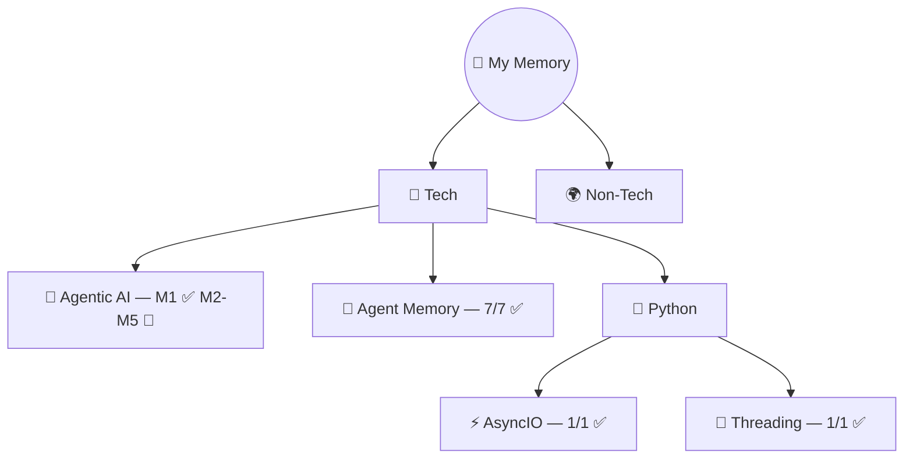

# 🧠 My Memory — Learning Vault

> *"Every expert was once a beginner who didn't quit."*

---

## 📅 Upcoming Revisions

| Date | Topic | Round | Flashcards |
|------|-------|-------|-----------|
| 🔔 **Mar 27** | 🧵 Threading | Round 1 — Day 3 | [→ cards](tech/python/threading/flashcards.md) |
| 🔔 **Mar 27** | 🤖 Agentic AI | Round 1 — Day 3 | [→ cards](tech/agentic-ai/flashcards.md) |
| 📅 **Mar 28** | 🧠 Agent Memory | Round 2 — Day 7 | [→ cards](tech/agent-memory/flashcards.md) |
| 📅 **Mar 28** | ⚡ AsyncIO | Round 2 — Day 7 | [→ cards](tech/python/asyncio/flashcards.md) |
| 📅 **Mar 31** | 🧵 Threading | Round 2 — Day 7 | [→ cards](tech/python/threading/flashcards.md) |
| 📅 **Apr 4** | 🧠 Agent Memory | Round 3 — Day 14 | [→ cards](tech/agent-memory/flashcards.md) |
| 📅 **Apr 4** | ⚡ AsyncIO | Round 3 — Day 14 | [→ cards](tech/python/asyncio/flashcards.md) |

---

## 🗺️ The Map

## 📊 Stats

| Metric | Count |
|--------|-------|
| **Topics** | 4 |
| **Lessons** | 17 |
| **Flashcards** | 75+ |
| **Last updated** | 2026-03-25 |

## 📚 Topics

| Topic | Category | Lessons | Confidence | Source |
|-------|----------|---------|------------|--------|
| [🤖 Agentic AI](tech/agentic-ai/README.md) | Tech | M1 ✅ (8/30 total) | 🔴 In Progress | DeepLearning.AI — Andrew Ng |
| [🧠 Agent Memory](tech/agent-memory/README.md) | Tech | 7/7 ✅ | 🟡 Learning | DeepLearning.AI × Oracle |
| [⚡ AsyncIO](tech/python/asyncio/README.md) | Tech / Python | 1/1 ✅ | 🟡 Learning | Corey Schafer |
| [🧵 Threading](tech/python/threading/README.md) | Tech / Python | 1/1 ✅ | 🟡 Learning | Corey Schafer |

## 🏗️ How This Works

| Folder | What's Inside |
|--------|--------------|
| `tech/` | All technical topics |
| `non-tech/` | Everything else (coming soon) |
| `_maps/` | Auto-generated knowledge graphs |
| `_revision/` | Spaced repetition tracker |
| `_templates/` | Blueprints for new content |

## 📏 The Rules

1. **One folder = one topic**
2. **Numbered files = teaching order** (01, 02, 03...)
3. **Every folder has**: README.md + flashcards.md
4. **Diagram first, text second**
5. **English for concepts, Hinglish for aha! moments**
6. **Open in order = can teach anyone**

---

Built with ❤️ by [Ayush Sonu](https://github.com/AyushSonuu) · Powered by **Ayra** (AI Learning Agent)
