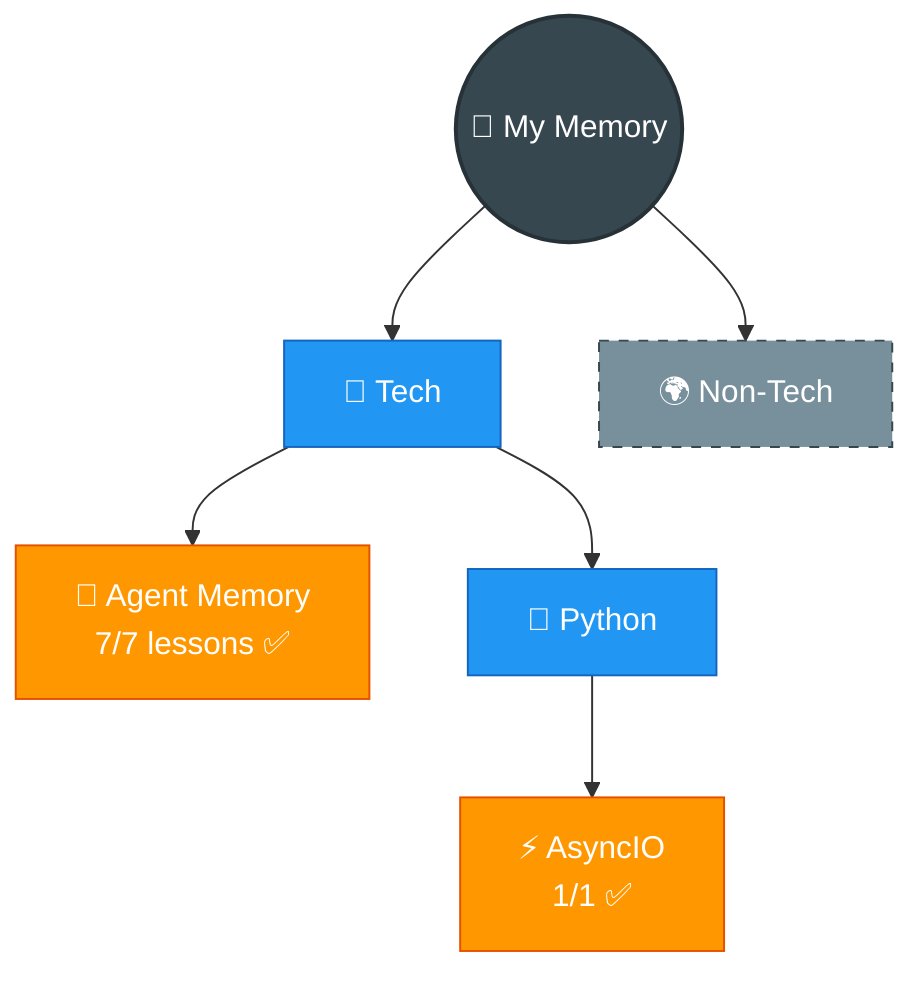

# 🧠 My Memory — Learning Vault

> Knowledge that sticks. Open any folder, teach anyone.

---

## 🗺️ The Map

## 📊 Stats

| Metric | Count |
|--------|-------|
| Topics | 2 |
| Lessons | 8 |
| Flashcards | 50+ |
| Last updated | 2026-03-21 |

## Topics

| Topic | Category | Lessons | Confidence | Source |
|-------|----------|---------|------------|--------|
| [🧠 Agent Memory](tech/agent-memory/) | Tech | 7/7 ✅ | 🟡 Learning | DeepLearning.AI × Oracle |
| [⚡ AsyncIO](tech/python/asyncio/) | Tech / Python | 1/1 ✅ | 🟡 Learning | Corey Schafer (YouTube) |

## How This Works

| Folder | What's Inside |
|--------|--------------|
| [`tech/`](tech/) | All technical topics |
| `non-tech/` | Everything else |
| [`_maps/`](_maps/) | Auto-generated knowledge graphs |
| [`_revision/`](_revision/) | Spaced repetition tracker |
| [`_templates/`](_templates/) | Blueprints for new content |

## The Rules
1. **One folder = one topic**
2. **Numbered files = teaching order** (01, 02, 03...)
3. **Every folder has**: README.md + flashcards.md
4. **Diagram first, text second**
5. **English for concepts, Hinglish for aha! moments**
6. **Open in order = can teach anyone**

---

> Built with ❤️ by Ayra (AI Learning Agent) · [GitHub Pages](https://ayushsonuu.github.io/my-memory/)
