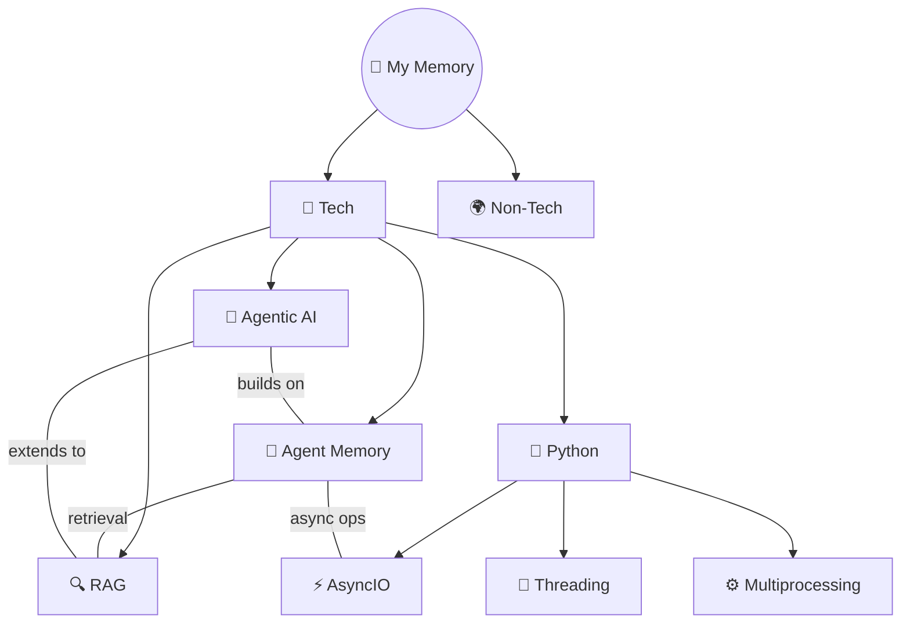

# 🧠 My Memory

### A personal learning vault and knowledge base, built and maintained by an AI agent.

> You never write the wiki yourself. The AI writes and maintains all of it. You're in charge of sourcing, exploration, and asking the right questions. The AI does all the grunt work.
>
> *Inspired by [Andrej Karpathy's LLM Wiki pattern](https://gist.github.com/karpathy/442a6bf555914893e9891c11519de94f)*

---

## The Problem

Most people's experience with LLMs and documents looks like RAG: upload files, retrieve chunks at query time, generate answers. It works, but the LLM is **rediscovering knowledge from scratch on every question**. Nothing accumulates. Nothing compounds.

Note-taking has the same problem from the other side. You take great notes for a week, then life happens. The notes rot. Cross-references break. That connection between Topic A and Topic B never gets written down. Six months later, you can't find anything and the whole system feels like a graveyard.

## The Solution

Instead of retrieving from raw sources at query time, an AI agent **incrementally builds and maintains a persistent knowledge vault** — a structured, interlinked collection of markdown files. When you add a new source (a video transcript, an article, a random thought), the agent doesn't just store it. It reads it, extracts key information, and integrates it into the existing vault — updating topic pages, creating flashcards, noting cross-topic connections, revising summaries, and flagging where new information contradicts old.

**The knowledge is compiled once and kept current, not re-derived on every query.**

This repo is a working implementation of that idea, specialized for **learning, revision, and teaching**.

---

## How It Works

```
┌─────────────────────────────────────────────────────────┐
│                    THE THREE LAYERS                       │
│                                                          │
│  📦 LAYER 1: Raw Sources (immutable)                     │
│     Course transcripts, PDFs, articles, URLs, tweets     │
│     You manage these. The agent reads but never edits.   │
│                                                          │
│  📝 LAYER 2: The Vault (AI-maintained)                   │
│     Lesson notes, READMEs, flashcards, cheatsheets,     │
│     comparison pages, knowledge maps, revision tracker   │
│     The agent owns this entirely. You read and review.   │
│                                                          │
│  ⚙️ LAYER 3: The Schema (conventions)                    │
│     AGENTS.md + SOUL.md + templates                      │
│     Tells the agent how to structure everything.         │
│     You and the agent co-evolve this over time.          │
└─────────────────────────────────────────────────────────┘
```

### The Workflow

```
You watch a video / read an article / have a thought
                    │
                    ▼
        Send it to the AI agent
        (transcript, URL, text)
                    │
                    ▼
    ┌───────────────────────────────┐
    │   Agent processes the input    │
    │                                │
    │   1. Cross-references PDFs     │
    │   2. Writes visual notes       │
    │   3. Creates flashcards        │
    │   4. Updates topic README      │
    │   5. Logs connections to       │
    │      other topics              │
    │   6. Updates knowledge maps    │
    │   7. Updates revision tracker  │
    │   8. Commits to git            │
    └───────────────────────────────┘
                    │
                    ▼
       Vault gets richer with every input
       You just read, revise, and learn
```

---

## What Makes This Different

| Feature | Traditional Notes | RAG Systems | This Vault |
|---------|------------------|-------------|------------|
| **Persistence** | Notes rot without maintenance | Re-derives on every query | Compiled once, kept current |
| **Cross-references** | Manual (never happens) | None | Auto-maintained by agent |
| **Revision system** | None | None | Spaced repetition: Day 1→3→7→14→30→90 |
| **Active recall** | Hope you remember | None | Flashcards at every level with cross-topic pulls |
| **Visual quality** | Depends on your effort | Plain text chunks | Diagrams, tables, ASCII art, memory hooks — visual first |
| **Teaching-ready** | Separate prep needed | Not a goal | Numbered files = open in order = instant video script |
| **Maintenance cost** | High (you abandon it) | Zero (no wiki to maintain) | Near-zero (AI does all bookkeeping) |
| **Knowledge graph** | Manual or none | None | Auto-generated maps showing connections, weak spots, progress |

---

## Repo Structure

```
my-memory/
├── AGENTS.md                 # Agent's brain — conventions, rules, workflows
├── SOUL.md                   # Agent's personality and values
├── USER.md                   # About the human (preferences, style)
├── MEMORY.md                 # Agent's long-term memory (curated, gitignored)
├── mkdocs.yml                # MkDocs Material config for docs site
├── build_docs.py             # Builds static site → docs/
│
├── tech/                     # All technical topics
│   ├── kafka/                #   Each topic = one folder
│   │   ├── README.md         #     Brain (connections) + Teach (lesson flow)
│   │   ├── 01-why-kafka.md   #     Numbered = teaching order
│   │   ├── 02-architecture.md
│   │   ├── flashcards.md     #     Self-test with cross-topic pulls
│   │   ├── cheatsheet.md     #     One-page everything
│   │   ├── vs.md             #     Comparisons (Kafka vs RabbitMQ)
│   │   ├── code/             #     Your practice code (you manage this)
│   │   └── course_material/  #     Raw PDFs, slides (immutable)
│   └── ...more topics
│
├── non-tech/                 # Non-technical topics (same structure)
│
├── _maps/                    # Auto-maintained knowledge graphs
│   ├── everything.md         #   God map — all topics + connections
│   ├── tech.md               #   Tech knowledge graph
│   ├── non-tech.md           #   Non-tech knowledge graph
│   ├── weak-spots.md         #   All weak areas — where to focus
│   ├── connections.md        #   Cross-topic links (rolling last 30)
│   ├── learning-journey.md   #   Gantt timeline
│   └── lint-report.md        #   Monthly vault health audit
│
├── _revision/                # Spaced repetition engine
│   ├── tracker.json          #   Topic schedules + confidence
│   └── due-today.md          #   What needs revision today
│
├── _templates/               # Blueprints for new content
│   ├── lesson.md
│   ├── topic-readme.md
│   ├── flashcards.md
│   ├── cheatsheet.md
│   └── vs.md
│
├── _playlists/               # YouTube content planning
├── _social/                  # LinkedIn, blog posts
│   └── linkedin/
│
├── plans/                    # Roadmaps, course trackers, goals
├── scripts/                  # Helper scripts (transcript extraction, etc.)
├── memory/                   # Daily session logs (raw, gitignored)
├── docs/                     # Built static site (auto-generated)
└── _generated/               # Code wrappers for docs (auto-generated)
```

### The Fractal Pattern

Every folder at every level follows the same structure:

```
any-topic/
├── README.md           # Brain (connections, progress) + Teach (lesson flow)
├── 01-first-lesson.md  # Numbered = teaching order
├── 02-second-lesson.md
├── flashcards.md       # Q&A cards with cross-topic pulls
├── cheatsheet.md       # (optional) one-page summary
├── vs.md               # (optional) comparisons
└── sub-topic/          # (optional) same pattern, deeper
    ├── README.md
    ├── 01-xxx.md
    └── flashcards.md
```

This recursive structure means the vault scales without redesign. A topic with 3 lessons and a topic with 30 lessons both work the same way.

---

## The Sync System

The vault stays consistent through a three-tier sync system:

### Tier 1 — Every Edit (automatic, local)
After every piece of content is created or updated:
- Topic README updated (progress, connections, memory fragments)
- Flashcards updated (new Q&A + cross-topic pulls)
- Revision tracker updated (dates, confidence)

### Tier 2 — End of Session (batched, global)
After a learning session is complete:
- All `_maps/` rebuilt (knowledge graphs, weak spots, connections)
- Category and root READMEs updated
- Docs site rebuilt and published
- Revision schedule regenerated

### Tier 3 — Monthly Lint (periodic health audit)
On the 1st of each month:
- Contradiction scan across topics
- Orphan page detection
- Stale content flagging
- Missing cross-references
- Map drift check (do maps match filesystem?)

---

## Two Ingest Modes

The vault accepts two kinds of input:

### Deep Ingest (for courses and study material)
- One lesson at a time, full treatment
- Every concept captured with diagrams, tables, memory hooks
- Full flashcard set, cross-references, all Tier 1 syncs
- Source: video transcripts + PDF slides + code notebooks

### KB Ingest (for articles, insights, research)
- Lighter processing, batchable
- Key insights extracted and filed into relevant topics
- Quick entries go to Memory Fragments in topic READMEs
- Source tagged: 📰 Article · 🐦 Tweet · 🎙️ Podcast · 💡 TIL · 📄 Paper

---

## Content Philosophy

The agent follows strict rules to make every page worth revisiting:

1. **Visual first, text second** — every concept opens with a diagram (Mermaid, ASCII, or table). The right visual tool for each concept, not one-size-fits-all.

2. **Complete but concise** — every fact from the source captured. Say each concept ONCE with the best visual. No repeating the same info as diagram + table + prose.

3. **Zero hallucination** — only facts from source material or web-verified. Confidence tags for anything uncertain. Definitions stay exact.

4. **Memorable** — analogies, humor, one-liners that make concepts click. If two explanations are equally accurate, pick the one that sticks.

5. **Teach-ready** — open any topic folder, read files in numbered order, and you can teach it to someone. Zero extra prep.

---

## Setting Up Your Own

### Prerequisites
- [OpenClaw](https://github.com/nicobailon/openclaw) (the agent runtime this vault runs on) or any AI coding agent that can read/write files ([Claude Code](https://docs.anthropic.com/en/docs/agents-and-tools/claude-code/overview), [OpenAI Codex](https://openai.com/index/codex/), [OpenCode](https://github.com/opencode-ai/opencode), or similar)
- Git
- Python 3.12+ (for MkDocs docs site, optional)

### Step 1: Fork or clone the structure

```bash
mkdir my-memory && cd my-memory
git init
```

Create the core directories:
```bash
mkdir -p tech non-tech _maps _revision _templates _social plans memory scripts
```

### Step 2: Create your schema files

The three files that tell your agent how everything works:

**`AGENTS.md`** — The agent's brain. Define:
- Repo structure and conventions
- Content rules (visual first, zero hallucination, etc.)
- Sync system (what to update and when)
- Ingest modes (how to process different input types)
- Templates for consistent content

**`SOUL.md`** — The agent's personality. Define:
- Tone and style (formal? casual? humorous?)
- Language preferences
- What makes content "good" in your vault
- Boundaries (what the agent should never do)

**`USER.md`** — About you. Define:
- Your learning preferences
- Content style you want
- Topics you care about
- Any personal context that helps the agent

> You can start by copying the structure from this repo and adapting it to your needs. The agent will help you evolve these files over time.

### Step 3: Create templates

Templates in `_templates/` ensure every page follows the same structure. At minimum:
- `lesson.md` — blueprint for a lesson file
- `topic-readme.md` — blueprint for a topic's README
- `flashcards.md` — blueprint for flashcard files
- `cheatsheet.md` — blueprint for one-page summaries
- `vs.md` — blueprint for comparison pages

### Step 4: Start feeding it

Send your agent a transcript, article, or any source material. Tell it to process it following your AGENTS.md conventions. The vault builds itself from there.

```
You: "Here's the transcript from a video about Docker containers. 
      Process it as a new topic."

Agent: Creates tech/docker/README.md
       Creates tech/docker/01-what-are-containers.md (visual notes)
       Creates tech/docker/flashcards.md (Q&A cards)
       Updates _maps/ (adds Docker to knowledge graph)
       Updates _revision/tracker.json (schedules first revision)
       Commits everything to git
```

### Step 5: (Optional) Set up docs site

```bash
python -m venv .venv
.venv/bin/pip install mkdocs-material mkdocs-jupyter
```

Configure `mkdocs.yml` with your nav structure, then:
```bash
python build_docs.py    # Builds static site to docs/
```

Deploy via GitHub Pages (Settings → Pages → Source: main, folder: `/docs`).

### Step 6: Keep going

Every source you add makes the vault richer. The agent handles all cross-referencing, connection-tracking, and maintenance. You focus on learning.

---

## Current Progress

| Metric | Count |
|--------|-------|
| **Topics** | 6 |
| **Lessons** | 45 |
| **Flashcards** | 150+ |
| **Last updated** | 2026-04-06 |

### Topics

| Topic | Lessons | Confidence | Source |
|-------|---------|------------|--------|
| [🤖 Agentic AI](tech/agentic-ai/) | 30/30 ✅ | 🟡 | DeepLearning.AI |
| [🧠 Agent Memory](tech/agent-memory/) | 7/7 ✅ | 🟡 | DeepLearning.AI × Oracle |
| [🔍 RAG](tech/rag/) | 5/62 | 🔴 | DeepLearning.AI |
| [⚡ AsyncIO](tech/python/asyncio/) | 1/1 ✅ | 🟡 | Corey Schafer |
| [🧵 Threading](tech/python/threading/) | 1/1 ✅ | 🟡 | Corey Schafer |
| [⚙️ Multiprocessing](tech/python/multiprocessing/) | 1/1 ✅ | 🟡 | Corey Schafer |

---

## Knowledge Map



---

## Inspiration

This vault implements the **LLM Wiki pattern** described by [Andrej Karpathy](https://gist.github.com/karpathy/442a6bf555914893e9891c11519de94f):

> *"Instead of just retrieving from raw documents at query time, the LLM incrementally builds and maintains a persistent wiki. The knowledge is compiled once and then kept current, not re-derived on every query."*

We specialize this pattern for **learning + teaching**: spaced repetition, visual-first notes, flashcards with cross-topic pulls, teach-ready lesson ordering, and a three-tier sync system that keeps everything consistent as the vault grows.

The agent (Ayra) runs on [OpenClaw](https://github.com/nicobailon/openclaw), an open-source agent runtime that provides file access, shell execution, web search, and session memory. OpenClaw handles the infrastructure; AGENTS.md handles the knowledge architecture.

The key insight both systems share: **humans abandon knowledge bases because the maintenance burden grows faster than the value. AI agents don't get bored, don't forget to update a cross-reference, and can touch 15 files in one pass.** The vault stays maintained because the cost of maintenance is near zero.

---

## License

This is a personal knowledge vault. The structure and system design are open for anyone to adapt. The content is my own learning notes.

---

Built with care by [Ayush Sonu](https://github.com/AyushSonuu) · Maintained by **Ayra** 🧠 · Powered by [OpenClaw](https://github.com/nicobailon/openclaw)
