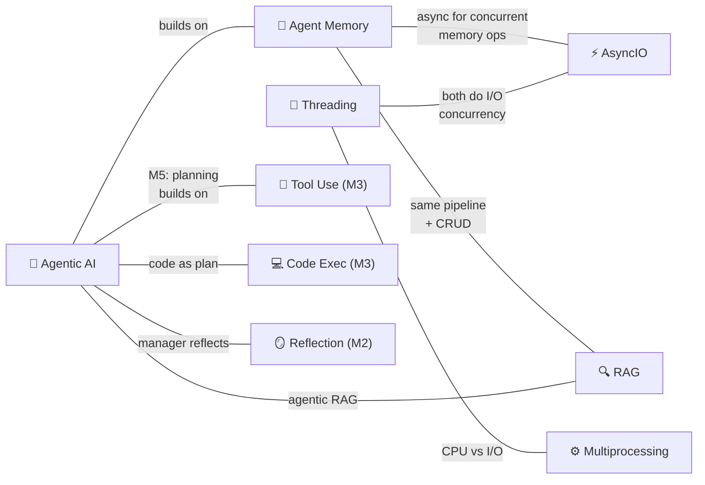

# 🔗 Cross-Topic Connections

> Rolling log of connections between topics. Max 30 entries.

## 🆕 Recently Discovered Connections

| Date | Connection | How I Found It |
|------|-----------|----------------|
| 2026-04-06 | RAG Architecture → Agent Memory (same retrieval pipeline) | RAG retriever + KB = same pattern as agent memory's semantic retrieval, but agent memory adds CRUD + write-back (M1/04) |
| 2026-04-06 | RAG → Agentic AI (agentic RAG) | RAG M1 mentions agentic RAG as future topic — AI agent decides what/when to retrieve. Connects to M5 planning. |
| 2026-04-06 | RAG Advantages → Reflection Pattern | RAG's "reduces hallucinations by grounding" parallels reflection's "external feedback grounds output" — both inject real-world info to improve LLM output |
| 2026-04-03 | Planning → Tool Use (builds on) | Planning adds a multi-step plan LAYER on top of tool use — same tools, but LLM decides the sequence (M5/01) |
| 2026-04-03 | Planning → Code Execution (code as plan) | Code > JSON > Text for plan format. LLM writes Python as its plan — thousands of functions vs handful of custom tools. Wang et al. 2024 confirms (M5/03) |
| 2026-04-03 | Multi-Agent → Planning | Manager agent uses planning to coordinate workers. Same mechanism but tools (green) replaced with agents (purple) (M5/04) |
| 2026-04-03 | Multi-Agent → Reflection | Manager agent can reflect on final output before delivering — reflection pattern inside multi-agent workflows (M5/04) |
| 2026-04-03 | Multi-Agent → Org Design | Communication patterns (linear, hierarchical, all-to-all) mirror human org charts — same design problem (M5/05) |
| 2026-03-31 | M4 Evals → M2 Evals deepened | M2 introduced basic eval concepts (objective + rubric). M4 goes much deeper: 2×2 framework, error analysis, component evals (M4/01) |
| 2026-03-31 | Error Analysis → Observability (traces/spans) | Terminology from computer observability literature adopted for agentic AI debugging (M4/02) |
| 2026-03-31 | Component Evals → Information Retrieval (F1 score) | Using IR metrics (F1 score, gold standard matching) to evaluate individual agentic components like web search (M4/04) |
| 2026-03-31 | Model Intelligence → Instruction Following | Larger frontier models (GPT-5) vastly outperform smaller ones (Llama 8B) at following complex multi-step instructions — PII redaction example (M4/05) |
| 2026-03-31 | aisuite → Model Swapping | aisuite not just for tool creation — also makes it easy to swap models for A/B comparison during error analysis (M4/05) |
| 2026-03-28 | Tool Use → Code Execution = meta-tool | One tool replaces 50 individual ones; LLM writes code to solve anything (M3/04) |
| 2026-03-28 | MCP → M×N to M+N | Standard protocol eliminates duplicate wrappers across apps (M3/05) |
| 2026-03-28 | aisuite → docstring = tool schema | Auto JSON schema from function name + docstring + params (M3/02-03) |
| 2026-03-28 | Code Execution → Reflection (M2) | Failed code → error message → reflect → retry. Same external feedback pattern! (M3/04) |
| 2026-03-28 | Reflection → External Feedback tools | Code execution, web search, regex, word count all act as external information sources (M2/05) |
| 2026-03-28 | Evals → Binary Rubric > Pair Comparison | Position bias in LLM judges; binary 0/1 criteria far more reliable (M2/04) |
| 2026-03-28 | Reflection → Multimodal | Critic LLM sees actual chart IMAGE, not just code — catches visual UX issues (M2/03) |
| 2026-03-28 | SQL Agent → aisuite library | Unified multi-provider LLM client by Andrew Ng's team (M2 code) |
| 2026-03-25 | Agentic AI → Evals & Error Analysis | Evals = #1 predictor of building agents well (M1/07) |
| 2026-03-25 | Agentic AI → HuggingGPT (Planning) | LLM orchestrates multiple HF models: openpose, vit-gpt2, fastspeech (M1/08) |
| 2026-03-25 | Agentic AI → Multi-Agent Debate | Du et al. 2023 — biographies, MMLU, chess all improve with multi-agent (M1/08) |
| 2026-03-25 | Agentic AI → ChatDev | Virtual software company with CEO/Programmer/Tester/Designer agents (M1/08) |
| 2026-03-25 | Reflection + Tool Use combine | Code generation example: self-critique loop + running code for error feedback (M1/08) |
| 2026-03-24 | Agentic AI ↔ Agent Memory | Agent memory is a key capability for agentic systems (M1 overview) |
| 2026-03-24 | Threading ↔ AsyncIO | Both solve I/O concurrency — threads use OS threads, asyncio uses event loop |
| 2026-03-24 | Threading → Multiprocessing | Threading for I/O-bound, multiprocessing for CPU-bound (Corey Schafer) |
| 2026-03-24 | Agentic AI → Parallelization | Agentic workflows use parallel execution (M1/04 Benefits) |
| 2026-03-21 | Agent Memory ↔ AsyncIO | Async for concurrent memory ops, tool execution, API calls |
| 2026-03-21 | Agent Memory → RAG | Same pipeline, agent memory adds CRUD (L02) |
| 2026-03-21 | Agent Memory → Vector Databases | OracleVS, COSINE, IVF indexes (L03) |
| 2026-03-21 | Agent Memory → LangChain | Orchestration framework (L03-L06) |
| 2026-03-21 | AsyncIO → FastAPI | FastAPI is built on AsyncIO patterns |

> Connections will grow as more topics are added! 🔗
