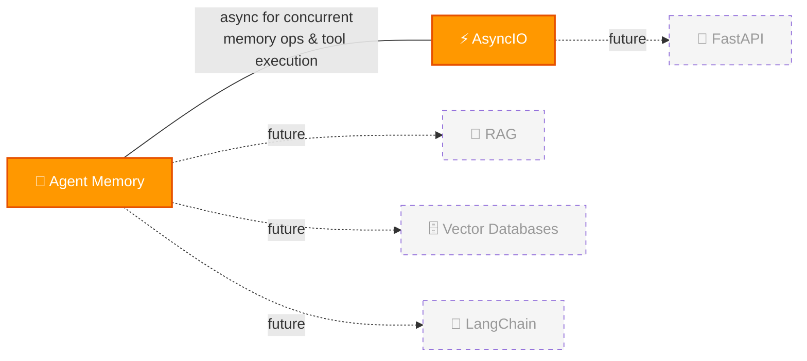

# 🔗 Cross-Topic Connections

> Rolling log of connections between topics. Max 30 entries.

## 🆕 Recently Discovered Connections

| Date | Connection | How I Found It |
|------|-----------|----------------|
| 2026-03-21 | Agent Memory ↔ AsyncIO | Async for concurrent memory ops, tool execution, API calls |
| 2026-03-21 | Agent Memory → RAG | Same pipeline, agent memory adds CRUD (L02) |
| 2026-03-21 | Agent Memory → Vector Databases | OracleVS, COSINE, IVF indexes (L03) |
| 2026-03-21 | Agent Memory → LangChain | Orchestration framework (L03-L06) |
| 2026-03-21 | AsyncIO → FastAPI | FastAPI is built on AsyncIO patterns |

> Connections will explode as more topics are added! 🔗
