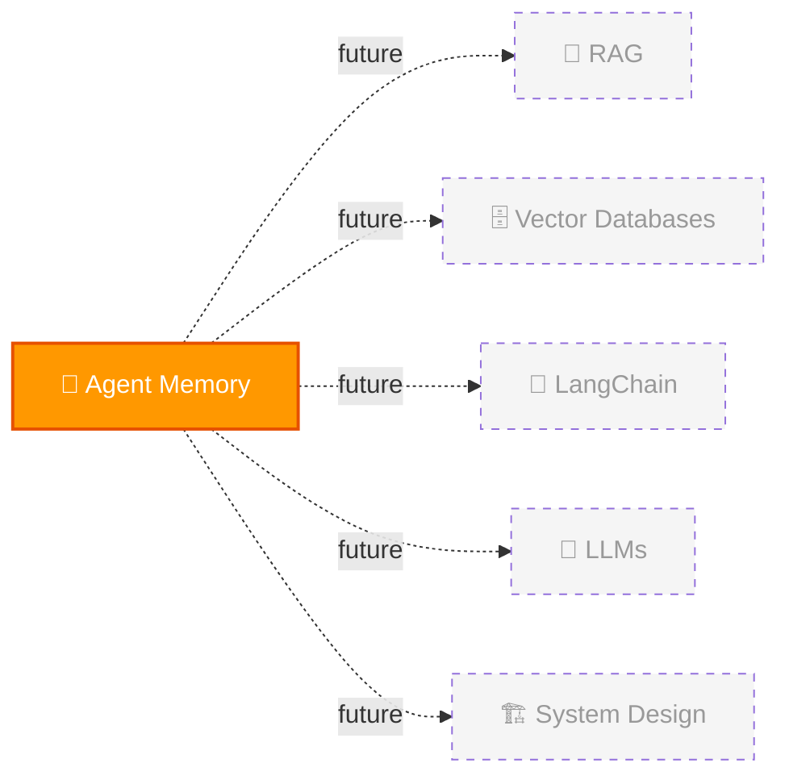

# 🔗 Cross-Topic Connections

> Rolling log of connections between topics. Max 30 entries.

## 🆕 Recently Discovered Connections

| Date | Connection | How I Found It |
|------|-----------|----------------|
| 2026-03-21 | Agent Memory → RAG (same pipeline, agent memory adds CRUD) | L02: RAG vs Agent Memory comparison |
| 2026-03-21 | Agent Memory → Vector Databases (OracleVS, COSINE, IVF indexes) | L03: Memory Manager code lab |
| 2026-03-21 | Agent Memory → LangChain (orchestration, OracleVS integration) | L03-L06: all code labs |
| 2026-03-21 | Agent Memory → LLMs (extraction, summarization, augmentation, reasoning) | L04-L06: augmentation, context eng, agent loop |

> Only 1 topic so far. Connections will explode as you add more topics! 🔗
