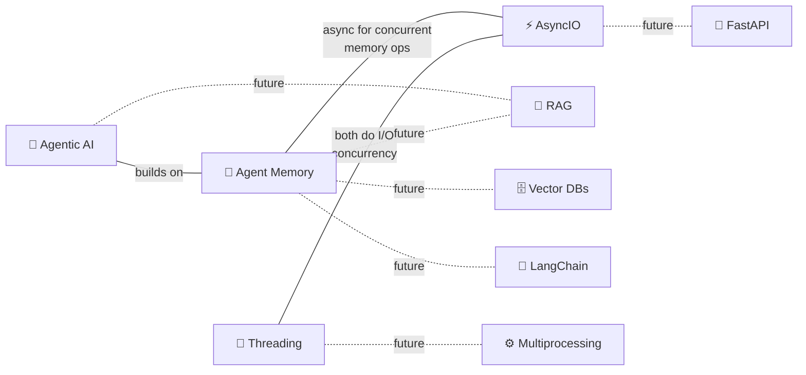

# 🔗 Cross-Topic Connections

> Rolling log of connections between topics. Max 30 entries.

## 🆕 Recently Discovered Connections

| Date | Connection | How I Found It |
|------|-----------|----------------|
| 2026-03-28 | Reflection → External Feedback tools | Code execution, web search, regex, word count all act as external information sources (M2/05) |
| 2026-03-28 | Evals → Binary Rubric > Pair Comparison | Position bias in LLM judges; binary 0/1 criteria far more reliable (M2/04) |
| 2026-03-28 | Reflection → Multimodal | Critic LLM sees actual chart IMAGE, not just code — catches visual UX issues (M2/03) |
| 2026-03-28 | SQL Agent → aisuite library | Unified multi-provider LLM client by Andrew Ng's team (M2 code) |
| 2026-03-25 | Agentic AI → Evals & Error Analysis | Evals = #1 predictor of building agents well (M1/07) |
| 2026-03-25 | Agentic AI → HuggingGPT (Planning) | LLM orchestrates multiple HF models: openpose, vit-gpt2, fastspeech (M1/08) |
| 2026-03-25 | Agentic AI → Multi-Agent Debate | Du et al. 2023 — biographies, MMLU, chess all improve with multi-agent (M1/08) |
| 2026-03-25 | Agentic AI → ChatDev | Virtual software company with CEO/Programmer/Tester/Designer agents (M1/08) |
| 2026-03-25 | Reflection + Tool Use combine | Code generation example: self-critique loop + running code for error feedback (M1/08) |
| 2026-03-24 | Agentic AI ↔ Agent Memory | Agent memory is a key capability for agentic systems (M1 overview) |
| 2026-03-24 | Threading ↔ AsyncIO | Both solve I/O concurrency — threads use OS threads, asyncio uses event loop |
| 2026-03-24 | Threading → Multiprocessing | Threading for I/O-bound, multiprocessing for CPU-bound (Corey Schafer) |
| 2026-03-24 | Agentic AI → Parallelization | Agentic workflows use parallel execution (M1/04 Benefits) |
| 2026-03-21 | Agent Memory ↔ AsyncIO | Async for concurrent memory ops, tool execution, API calls |
| 2026-03-21 | Agent Memory → RAG | Same pipeline, agent memory adds CRUD (L02) |
| 2026-03-21 | Agent Memory → Vector Databases | OracleVS, COSINE, IVF indexes (L03) |
| 2026-03-21 | Agent Memory → LangChain | Orchestration framework (L03-L06) |
| 2026-03-21 | AsyncIO → FastAPI | FastAPI is built on AsyncIO patterns |

> Connections will grow as more topics are added! 🔗
