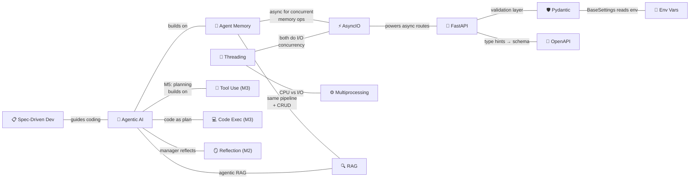

# 🔗 Cross-Topic Connections

> Rolling log of connections between topics. Max 30 entries.

```mermaid
graph LR
    AG["🤖 Agentic AI"]
    AM["🧠 Agent Memory"]
    AIO["⚡ AsyncIO"]
    THR["🧵 Threading"]
    MP["⚙️ Multiprocessing"]
    RAG["🔍 RAG"]
    FA["🚀 FastAPI"]
    PYD["🛡️ Pydantic"]

    AG ---|"builds on"| AM
    AM ---|"async for concurrent<br/>memory ops"| AIO
    THR ---|"both do I/O<br/>concurrency"| AIO
    THR ---|"CPU vs I/O"| MP
    AM ---|"same pipeline<br/>+ CRUD"| RAG
    AG ---|"agentic RAG"| RAG
    SDD["📋 Spec-Driven Dev"] ---|"guides coding"| AG
    AG ---|"M5: planning<br/>builds on"| TU["🔧 Tool Use (M3)"]
    AG ---|"code as plan"| CE["💻 Code Exec (M3)"]
    AG ---|"manager reflects"| REF["🪞 Reflection (M2)"]
    AIO ---|"powers async routes"| FA
    FA ---|"validation layer"| PYD
    FA ---|"type hints → schema"| OAS["📄 OpenAPI"]
    PYD ---|"BaseSettings reads env"| ENV["🔧 Env Vars"]
```

## 🆕 Recently Discovered Connections

| Date | Connection | How I Found It |
|------|-----------|----------------|
| 2026-06-17 | FastAPI → OpenAPI Standard | FastAPI auto-generates OpenAPI schema from type annotations → powers /docs Swagger UI and /redoc |
| 2026-06-16 | FastAPI Env Vars → Pydantic Settings | BaseSettings subclass reads env vars with full type validation + .env file support via python-dotenv |
| 2026-06-16 | FastAPI → AsyncIO (event loop) | async def route handlers run on Starlette/AnyIO event loop; def routes go to threadpool |
| 2026-06-15 | FastAPI → Pydantic BaseModel | All FastAPI request/response bodies validated through Pydantic — FastAPI is literally built on Pydantic |
| 2026-06-15 | FastAPI → Python Type Hints | FastAPI is entirely built on type hints — one annotation gives editor support + validation + docs |
| 2026-05-03 | Cross-Encoder → Reranking | Cross-encoders are too slow for initial search but PERFECT for reranking top K candidates. Bi-encoder finds, cross-encoder refines. |
| 2026-05-03 | ColBERT → High-Stakes Search | Token-level vectors (N per doc) give near cross-encoder quality at bi-encoder speed. Trade-off: massive storage. Good for legal/medical. |
| 2026-05-03 | Reranking → Easy Quality Win | Overfetch 20-100 docs, rerank with cross-encoder, return top 5-10. Often just one line to add. First technique to try. |
| 2026-04-20 | SDD → Agentic AI (SDD guides coding agents) | SDD is the workflow for directing coding agents — you write the spec, the agent implements. Directly connects to tool use and planning patterns from Agentic AI M3/M5. |
| 2026-04-06 | RAG Architecture → Agent Memory (same retrieval pipeline) | RAG retriever + KB = same pattern as agent memory's semantic retrieval, but agent memory adds CRUD + write-back (M1/04) |
| 2026-04-06 | RAG → Agentic AI (agentic RAG) | RAG M1 mentions agentic RAG as future topic — AI agent decides what/when to retrieve. Connects to M5 planning. |
| 2026-04-06 | RAG Advantages → Reflection Pattern | RAG's "reduces hallucinations by grounding" parallels reflection's "external feedback grounds output" — both inject real-world info to improve LLM output |
| 2026-04-03 | Planning → Tool Use (builds on) | Planning adds a multi-step plan LAYER on top of tool use — same tools, but LLM decides the sequence (M5/01) |
| 2026-04-03 | Planning → Code Execution (code as plan) | Code > JSON > Text for plan format. LLM writes Python as its plan — thousands of functions vs handful of custom tools. Wang et al. 2024 confirms (M5/03) |
| 2026-05-02 | RAG M2 Semantic Search → Agent Memory (retrieval) | Same embedding + cosine similarity pipeline used in both. Agent Memory's OracleVS uses the exact same ANN search under the hood |
| 2026-05-02 | RAG M3 HNSW → Vector Databases | HNSW is THE algorithm inside Weaviate/Pinecone. Without HNSW, billion-scale vector search would be impossible |
| 2026-05-02 | BM25 (keyword) + Embeddings (semantic) → Hybrid Search (RRF) | Neither alone is sufficient. RRF rank fusion + beta weighting combines both for production retrievers |
| 2026-04-03 | Multi-Agent → Planning | Manager agent uses planning to coordinate workers. Same mechanism but tools (green) replaced with agents (purple) (M5/04) |
| 2026-04-03 | Multi-Agent → Reflection | Manager agent can reflect on final output before delivering — reflection pattern inside multi-agent workflows (M5/04) |
| 2026-04-03 | Multi-Agent → Org Design | Communication patterns (linear, hierarchical, all-to-all) mirror human org charts — same design problem (M5/05) |
| 2026-03-31 | M4 Evals → M2 Evals deepened | M2 introduced basic eval concepts (objective + rubric). M4 goes much deeper: 2×2 framework, error analysis, component evals (M4/01) |
| 2026-03-31 | Error Analysis → Observability (traces/spans) | Terminology from computer observability literature adopted for agentic AI debugging (M4/02) |
| 2026-03-31 | Component Evals → Information Retrieval (F1 score) | Using IR metrics (F1 score, gold standard matching) to evaluate individual agentic components like web search (M4/04) |
| 2026-03-31 | Model Intelligence → Instruction Following | Larger frontier models (GPT-5) vastly outperform smaller ones (Llama 8B) at following complex multi-step instructions — PII redaction example (M4/05) |
| 2026-03-31 | aisuite → Model Swapping | aisuite not just for tool creation — also makes it easy to swap models for A/B comparison during error analysis (M4/05) |
| 2026-03-28 | Tool Use → Code Execution = meta-tool | One tool replaces 50 individual ones; LLM writes code to solve anything (M3/04) |
| 2026-03-28 | MCP → M×N to M+N | Standard protocol eliminates duplicate wrappers across apps (M3/05) |
| 2026-03-28 | aisuite → docstring = tool schema | Auto JSON schema from function name + docstring + params (M3/02-03) |
| 2026-03-28 | Code Execution → Reflection (M2) | Failed code → error message → reflect → retry. Same external feedback pattern! (M3/04) |
| 2026-03-28 | Reflection → External Feedback tools | Code execution, web search, regex, word count all act as external information sources (M2/05) |

> Connections will grow as more topics are added! 🔗
