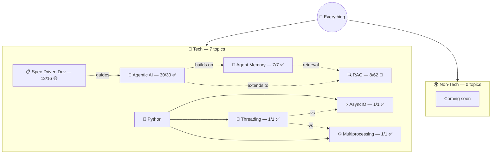

# 🗺️ Everything I Know

> God-level map of all knowledge.

## 📊 Dashboard

| Status | Count | Topics |
|--------|-------|--------|
| 🟢 Solid | 0 | — |
| 🟡 Learning | 6 | Agentic AI, Agent Memory, AsyncIO, Threading, Multiprocessing, SDD |
| 🔴 Starting | 1 | RAG (8/62 lessons) |

**Total:** 7 topics · 61 lessons · 200+ flashcards · Last updated: 2026-04-21

## Key Connections

| Connection | How they relate |
|-----------|----------------|
| Agentic AI ↔ Agent Memory | Agent memory = one of the capabilities agentic systems need |
| Agentic AI → RAG | Agentic RAG = AI agent decides what/when to retrieve |
| Agent Memory → RAG | Same retrieval pipeline, agent memory adds CRUD + write-back |
| Agentic AI → Evals & Error Analysis | #1 predictor of building agents well; M4 dedicated to this |
| Agentic AI → 4 Design Patterns | Reflection ✅, Tool Use ✅, Planning ✅, Multi-Agent ✅ |
| Reflection → External Feedback | Code execution, web search, regex = breaks performance plateau |
| Tool Use → Code Execution | THE meta-tool: LLM writes code, you execute it |
| Tool Use → MCP | M×N integrations → M+N via standard protocol |
| Planning → Tool Use → Code Execution | Planning builds on tools; code as plan format > JSON > Text |
| Multi-Agent → Planning + Reflection | Manager plans, coordinates workers, reflects on output |
| Threading ↔ AsyncIO ↔ Multiprocessing | Three approaches to concurrency: threads (I/O), event loop (I/O), processes (CPU) |
| SDD → Agentic AI | SDD is the workflow for directing coding agents; Agentic AI covers the agents themselves |
| Agent Memory ↔ AsyncIO | Async for concurrent memory operations, tool execution, API calls |

## 📖 Framework

This vault follows the [LLM Wiki pattern](llm-wiki-pattern.md) — raw sources → AI-maintained wiki → schema.

---

Detailed views: [Tech Map](tech.md) · [Non-Tech Map](non-tech.md) · [Weak Spots](weak-spots.md) · [Connections](connections.md) · [Timeline](learning-journey.md)
