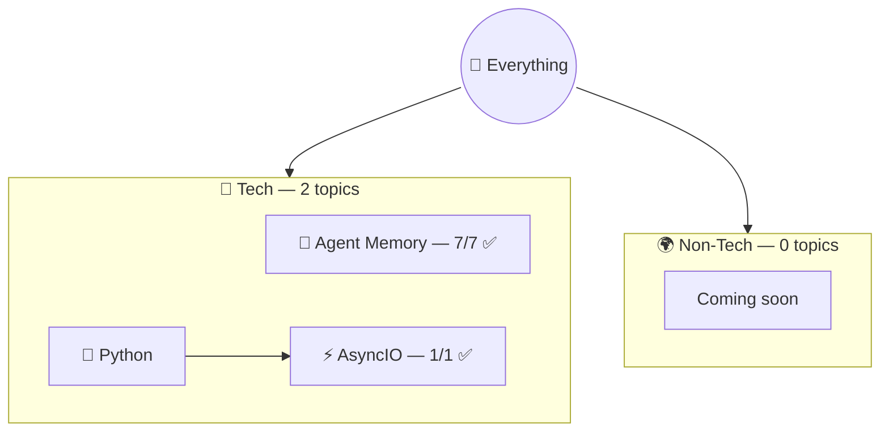

# 🗺️ Everything I Know

> God-level map of all knowledge.

## 📊 Dashboard

| Status | Count | Topics |
|--------|-------|--------|
| 🟢 Solid | 0 | — |
| 🟡 Learning | 2 | Agent Memory, AsyncIO |
| 🔴 Weak/Todo | 0 | — |

## Key Connections

| Connection | How they relate |
|-----------|----------------|
| Agent Memory ↔ AsyncIO | Async for concurrent memory operations, tool execution, API calls |
| Agent Memory → RAG | Same pipeline, agent memory adds CRUD + write-back |
| Agent Memory → Vector DBs | OracleVS, COSINE, IVF indexes |
| Agent Memory → LangChain | Orchestration framework |
| AsyncIO → FastAPI | FastAPI is built on AsyncIO |

---

Detailed views: [Tech Map](_maps/tech.md) · [Non-Tech Map](_maps/non-tech.md) · [Weak Spots](_maps/weak-spots.md) · [Connections](_maps/connections.md) · [Timeline](_maps/learning-journey.md)
