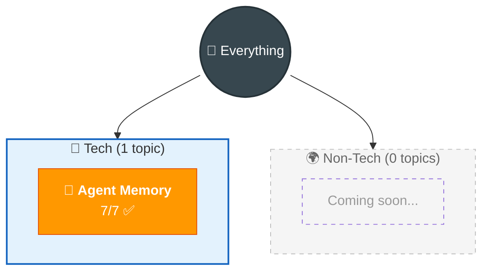

# 🗺️ Everything I Know

> God-level map of all knowledge. Auto-maintained.

## 📊 Dashboard

| Status | Count | Topics |
|--------|-------|--------|
| 🟢 Solid | 0 | — |
| 🟡 Learning | 1 | Agent Memory |
| 🔴 Weak/Todo | 0 | — |

## Key Connections

> Only 1 topic so far — connections will grow as more topics are added.
> Potential connections when future topics are added:
> - Agent Memory ↔ LangChain, Vector Databases, RAG, LLMs, System Design

---

> 📂 Detailed views: [Tech Map](tech.md) · [Non-Tech Map](non-tech.md) · [Weak Spots](weak-spots.md) · [Connections](connections.md) · [Timeline](learning-journey.md)
