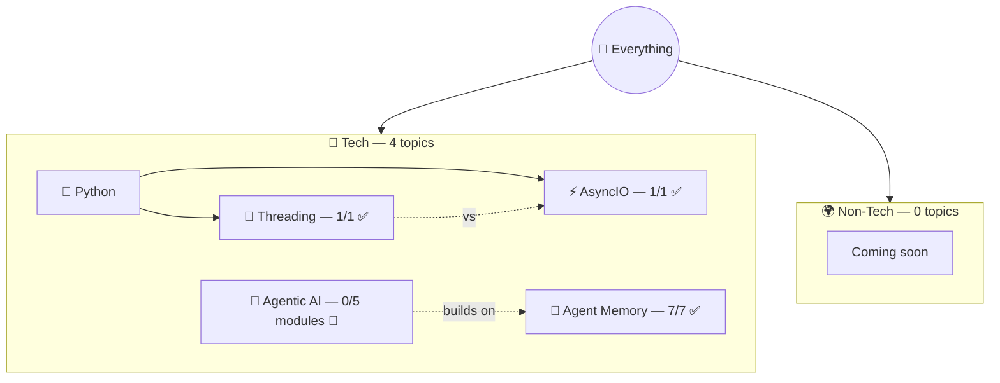

# 🗺️ Everything I Know

> God-level map of all knowledge.

## 📊 Dashboard

| Status | Count | Topics |
|--------|-------|--------|
| 🟢 Solid | 0 | — |
| 🟡 Learning | 3 | Agent Memory, AsyncIO, Threading |
| 🔴 Starting | 1 | Agentic AI |

## Key Connections

| Connection | How they relate |
|-----------|----------------|
| Agentic AI ↔ Agent Memory | Agent memory = one of the capabilities agentic systems need |
| Threading ↔ AsyncIO | Both do I/O concurrency — threading uses OS threads, AsyncIO uses event loop |
| Agent Memory ↔ AsyncIO | Async for concurrent memory operations, tool execution, API calls |
| Agent Memory → RAG | Same pipeline, agent memory adds CRUD + write-back |
| Agent Memory → Vector DBs | OracleVS, COSINE, IVF indexes |
| AsyncIO → FastAPI | FastAPI is built on AsyncIO |

---

Detailed views: [Tech Map](tech.md) · [Non-Tech Map](non-tech.md) · [Weak Spots](weak-spots.md) · [Connections](connections.md) · [Timeline](learning-journey.md)
