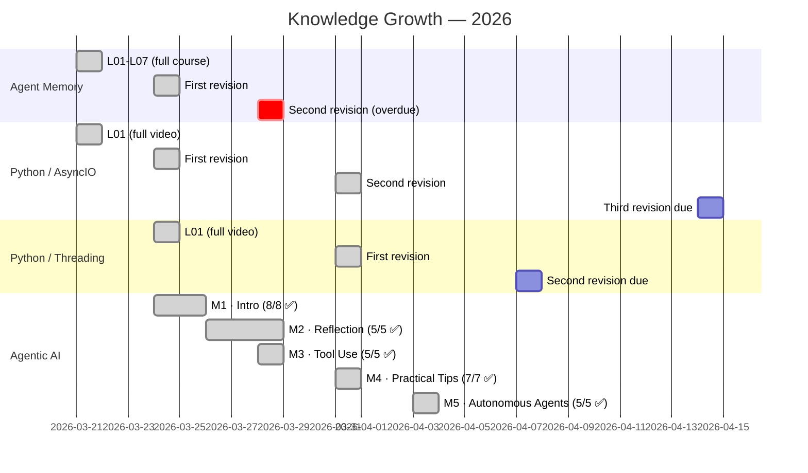

# 📅 My Learning Timeline

> What I learned and when. Auto-maintained.

## 📈 Monthly Stats

| Month | Topics Started | Lessons Created | Flashcards Added |
|-------|---------------|----------------|-----------------|
| Mar 2026 | 4 (Agent Memory, AsyncIO, Threading, Agentic AI) | 25 | 120+ |
| Apr 2026 | 0 (continued Agentic AI M5) | 5 | 20+ |

## 🏆 Milestones

| Date | Milestone |
|------|-----------|
| 2026-03-21 | 🎉 First topic completed! Agent Memory — 7 lessons in 1 day |
| 2026-03-21 | ⚡ Second topic completed! AsyncIO — full video in 1 session |
| 2026-03-21 | 🏗️ Vault structure established (templates, maps, revision system) |
| 2026-03-21 | 🌐 GitHub Pages deployment! |
| 2026-03-24 | 🧵 Threading completed! Full video + 6 code examples |
| 2026-03-24 | 🤖 Agentic AI course started! Andrew Ng, 5 modules |
| 2026-03-25 | ✅ Agentic AI Module 1 COMPLETE! 8/8 lessons, 15+ flashcards |
| 2026-03-25 | 📄 PDF cross-reference workflow established (pymupdf installed) |
| 2026-03-28 | 🪞 Agentic AI Module 2 COMPLETE! 5/5 lessons, code labs, evals vs.md |
| 2026-03-28 | 🔧 Agentic AI Module 3 COMPLETE! 5/5 lessons (tools, aisuite, code exec, MCP) |
| 2026-03-31 | 🛠️ Agentic AI Module 4 COMPLETE! 7/7 lessons (evals, error analysis, component evals, latency/cost) |
| 2026-03-31 | 🔄 Threading + AsyncIO revised (caught up on overdue revisions) |
| 2026-03-31 | 📊 25 lessons total — 83% of Agentic AI course done! |
| 2026-04-03 | 🏆 Agentic AI Module 5 COMPLETE! 5/5 lessons (planning, JSON/code plans, multi-agent, communication patterns) |
| 2026-04-03 | 🎓 AGENTIC AI COURSE COMPLETE! 30/30 lessons across all 5 modules! |
| 2026-04-03 | 📊 30 lessons total · 140+ flashcards · 4 topics covered |

---

> 📂 Back to [Everything Map](everything.md)
