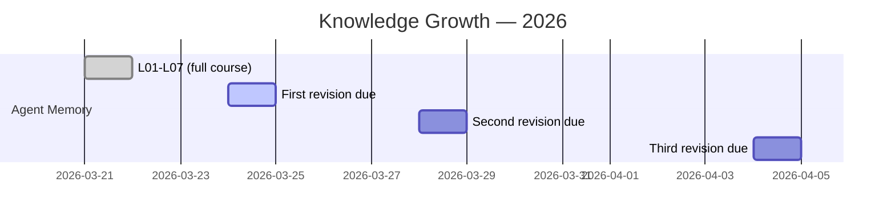

# 📅 My Learning Timeline

> What I learned and when. Auto-maintained.

## 📈 Monthly Stats

| Month | Topics Started | Lessons Created | Flashcards Added |
|-------|---------------|----------------|-----------------|
| Mar 2026 | 1 (Agent Memory) | 7 | 40+ |

## 🏆 Milestones

| Date | Milestone |
|------|-----------|
| 2026-03-21 | 🎉 First topic completed! Agent Memory — 7 lessons in 1 day |
| 2026-03-21 | 🏗️ Vault structure established (templates, maps, revision system) |

---

> 📂 Back to [Everything Map](everything.md)
