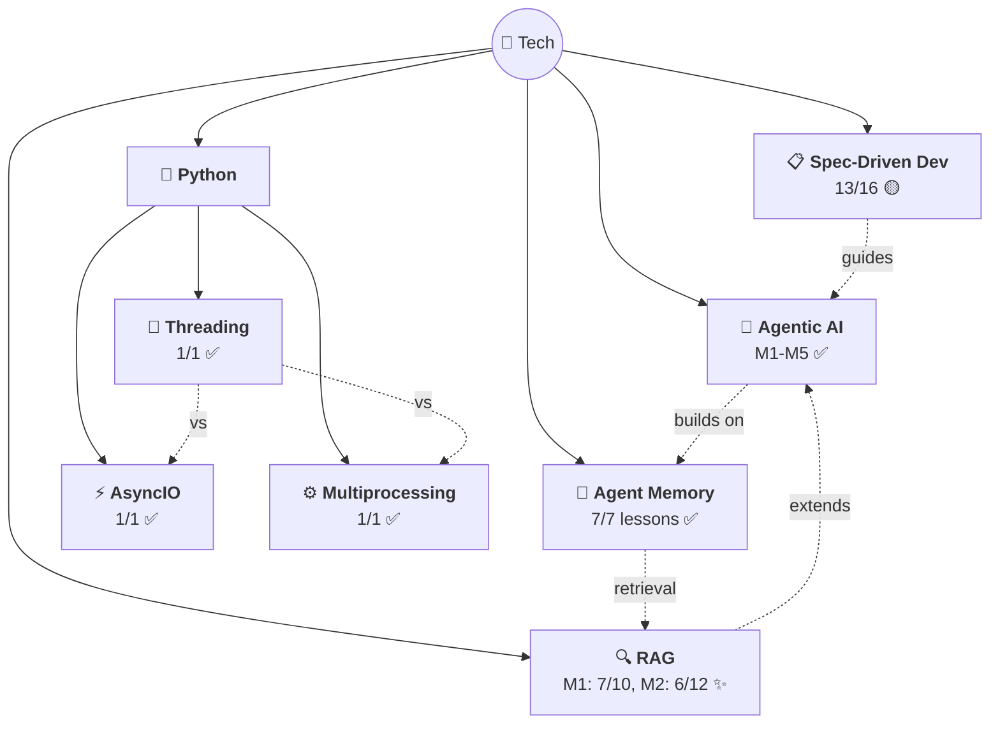

# 🗺️ Tech Knowledge Map

> All tech topics with confidence + progress.

## 📊 Topics

| Topic | Confidence | Lessons | Flashcards | Last Updated |
|-------|-----------|---------|------------|-------------|
| [🤖 Agentic AI](../tech/agentic-ai/) | 🟡 Learning | 30/30 ✅ | 95+ | 2026-04-03 |
| [🧠 Agent Memory](../tech/agent-memory/) | 🟡 Learning | 7/7 ✅ | 37 | 2026-03-21 |
| [🔍 RAG](../tech/rag/) | 🔴 Starting | 14/62 | 43 | 2026-04-24 |
| [📋 Spec-Driven Dev](../tech/spec-driven-development/) | 🟡 Learning | 13/16 | 30+ | 2026-04-20 |
| [⚡ AsyncIO](../tech/python/asyncio/) | 🟡 Learning | 1/1 ✅ | 12 | 2026-03-21 |
| [🧵 Threading](../tech/python/threading/) | 🟡 Learning | 1/1 ✅ | 11 | 2026-03-24 |
| [⚙️ Multiprocessing](../tech/python/multiprocessing/) | 🟡 Learning | 1/1 ✅ | 11 | 2026-04-04 |

## What's Covered

### Agentic AI (5 modules — complete ✅)
| # | Module | Status | Topics |
|---|--------|--------|--------|
| 01 | Intro to Agentic Workflows | ✅ 8/8 | What is it, Autonomy levels, Benefits, Applications, Task Decomposition, Evals, Design Patterns |
| 02 | Reflection Design Pattern | ✅ 5/5 | Self-critique, Direct vs Iterative, Chart/SQL gen, Evals (objective + rubric), External Feedback |
| 03 | Tool Use | ✅ 5/5 | What are tools, aisuite + JSON schema, Code Execution (meta-tool, sandbox), MCP (M×N→M+N) |
| 04 | Practical Tips | ✅ 7/7 | Evals (2×2 framework), Error Analysis (traces, spreadsheets), Component Evals, Addressing Problems, Latency/Cost |
| 05 | Autonomous Agents | ✅ 5/5 | Planning, LLM Plans, Multi-Agent, Communication Patterns |

### RAG (5 modules — in progress 🔴)
| # | Module | Status | Topics |
|---|--------|--------|--------|
| 01 | RAG Overview | 🟡 7/10 | What is RAG, Applications, Architecture, LLMs, IR |
| 02 | IR & Search Foundations | 🟡 5/12 | Retriever architecture, metadata filtering, TF-IDF (SVG visualizations), BM25 (SVG + hyperparameters) |
| 03 | IR with Vector Databases | 🔴 0/12 | ANN, Vector DBs, Weaviate, Chunking, Query parsing, Reranking |
| 04 | LLMs & Text Generation | 🔴 0/14 | Transformers, Sampling, Prompt engineering, Hallucinations, Agentic RAG |
| 05 | RAG in Production | 🔴 0/14 | Evaluation, Monitoring, Tracing, Quantization, Cost/Latency, Security |

### Spec-Driven Development (16 lessons — nearly complete 🟡)
| # | Lesson | Status |
|---|--------|--------|
| 01–03 | Intro, Why SDD, Workflow | ✅ |
| 04–05 | Setup (skipped) | ⬜ |
| 06–15 | Constitution → Agent Replaceability | ✅ (10/10) |
| 16 | Conclusion | 🔴 |

### Python (3 sub-topics — all complete ✅)
| # | Sub-topic | Status | Topics |
|---|-----------|--------|--------|
| 01 | AsyncIO | ✅ 1/1 | Event Loop, Coroutines, Tasks, gather, TaskGroup, to_thread, Semaphores |
| 02 | Threading | ✅ 1/1 | Threads, Thread Pool, submit/map, join, GIL, daemon threads |
| 03 | Multiprocessing | ✅ 1/1 | Processes, Pool, submit/map, bypasses GIL, CPU-bound tasks |

---

> 🌱 7 topics and growing!
