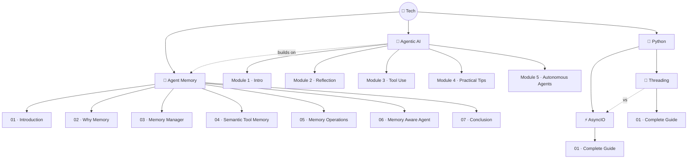

# 🗺️ Tech Knowledge Graph

> Deep view with sub-topics and lesson-level detail.

## Topics Detail

| Topic | Status | Lessons | Key Concepts |
|-------|--------|---------|-------------|
| [🤖 Agentic AI](../tech/agentic-ai/README.md) | 🔴 0/5 modules | 30 videos | Reflection, Tool Use, Planning, Multi-Agent, Evals |
| [🧠 Agent Memory](../tech/agent-memory/README.md) | 🟡 7/7 ✅ | 7 | Memory Manager, Toolbox Pattern, Summarization/Compaction, Agent Loop, Harness |
| [⚡ AsyncIO](../tech/python/asyncio/README.md) | 🟡 1/1 ✅ | 1 | Event Loop, Coroutines, Tasks, gather, TaskGroup, Threads, Processes, Semaphores |
| [🧵 Threading](../tech/python/threading/README.md) | 🟡 1/1 ✅ | 1 | Manual Threads, ThreadPoolExecutor, submit vs map, I/O-bound vs CPU-bound |

---

Detailed topic views → [Agentic AI](../tech/agentic-ai/README.md) · [Agent Memory](../tech/agent-memory/README.md) · [AsyncIO](../tech/python/asyncio/README.md) · [Threading](../tech/python/threading/README.md)
