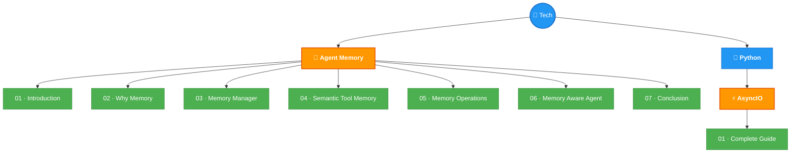

# 🗺️ Tech Knowledge Graph

> Deep view with sub-topics and lesson-level detail.

## Topics Detail

| Topic | Status | Lessons | Key Concepts |
|-------|--------|---------|-------------|
| 🧠 Agent Memory | 🟡 7/7 ✅ | 7 | Memory Manager, Toolbox Pattern, Summarization/Compaction, Agent Loop, Harness |
| ⚡ AsyncIO | 🟡 1/1 ✅ | 1 | Event Loop, Coroutines, Tasks, gather, TaskGroup, Threads, Processes, Semaphores |

---

> Detailed topic views → [Agent Memory](../tech/agent-memory/README.md) · [AsyncIO](../tech/python/asyncio/README.md)
