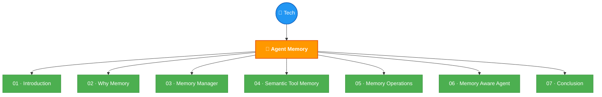

# 🗺️ Tech Knowledge Graph

> Deep view with sub-topics and lesson-level detail.

## Topics Detail

| Topic | Status | Lessons | Key Concepts |
|-------|--------|---------|-------------|
| 🧠 Agent Memory | 🟡 7/7 ✅ | 7 completed | Memory Manager, Toolbox Pattern, Summarization/Compaction, Agent Loop, Harness |

---

> Detailed topic view → [tech/agent-memory/README.md](../tech/agent-memory/README.md)
