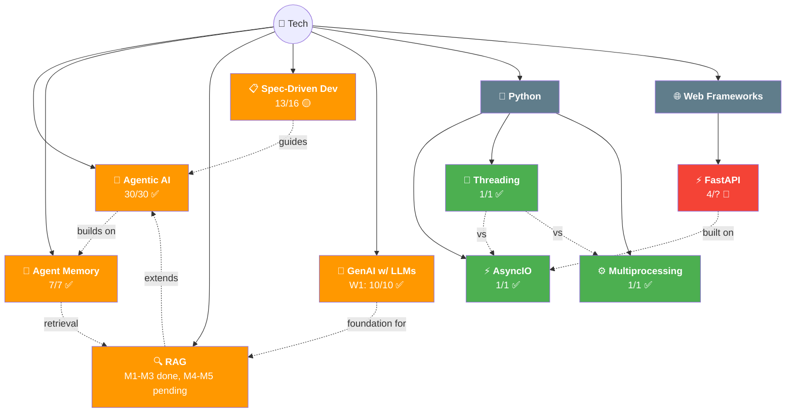

# 🗺️ Tech Knowledge Map

> All tech topics with confidence + progress.

```mermaid
graph TB
    T(("🔧 Tech"))

    T --> AG["🤖 <b>Agentic AI</b><br/>30/30 ✅"]
    T --> AM["🧠 <b>Agent Memory</b><br/>7/7 ✅"]
    T --> RAG["🔍 <b>RAG</b><br/>M1-M3 done, M4-M5 pending"]
    T --> SDD["📋 <b>Spec-Driven Dev</b><br/>13/16 🟡"]
    T --> GN["🧠 <b>GenAI w/ LLMs</b><br/>W1: 10/10 ✅"]

    T --> PY["🐍 <b>Python</b>"]
    PY --> AIO["⚡ <b>AsyncIO</b><br/>1/1 ✅"]
    PY --> THR["🧵 <b>Threading</b><br/>1/1 ✅"]
    PY --> MP["⚙️ <b>Multiprocessing</b><br/>1/1 ✅"]

    T --> WF["🌐 <b>Web Frameworks</b>"]
    WF --> FA["⚡ <b>FastAPI</b><br/>4/? 🔴"]

    AG -.->|"builds on"| AM
    AM -.->|"retrieval"| RAG
    RAG -.->|"extends"| AG
    SDD -.->|"guides"| AG
    FA -.->|"built on"| AIO
    THR -.->|"vs"| AIO
    THR -.->|"vs"| MP
    GN -.->|"foundation for"| RAG

    style AG fill:#ff9800,color:#fff
    style AM fill:#ff9800,color:#fff
    style RAG fill:#ff9800,color:#fff
    style SDD fill:#ff9800,color:#fff
    style GN fill:#ff9800,color:#fff
    style AIO fill:#4caf50,color:#fff
    style THR fill:#4caf50,color:#fff
    style MP fill:#4caf50,color:#fff
    style FA fill:#f44336,color:#fff
    style WF fill:#607d8b,color:#fff
    style PY fill:#607d8b,color:#fff
```

## 📊 Topics

| Topic | Confidence | Lessons | Flashcards | Last Updated |
|-------|-----------|---------|------------|-------------|
| [🤖 Agentic AI](../tech/agentic-ai/) | 🟡 Learning | 30/30 ✅ | 95+ | 2026-04-03 |
| [🧠 Agent Memory](../tech/agent-memory/) | 🟡 Learning | 7/7 ✅ | 37 | 2026-03-21 |
| [🔍 RAG](../tech/rag/) | 🟡 Learning | 24/62 | 80+ | 2026-05-03 |
| [📋 Spec-Driven Dev](../tech/spec-driven-development/) | 🟡 Learning | 13/16 | 30+ | 2026-04-20 |
| [🧠 GenAI with LLMs](../tech/genai-with-llms/) | 🟡 Learning | 10/? (W1 done) | — | 2026-06-15 |
| [⚡ AsyncIO](../tech/python/asyncio/) | 🟢 Done | 1/1 ✅ | 12 | 2026-03-21 |
| [🧵 Threading](../tech/python/threading/) | 🟢 Done | 1/1 ✅ | 11 | 2026-03-24 |
| [⚙️ Multiprocessing](../tech/python/multiprocessing/) | 🟢 Done | 1/1 ✅ | 11 | 2026-04-04 |
| [⚡ FastAPI](../tech/fastapi/) | 🔴 Starting | 4/? | 30+ | 2026-06-17 |

## What's Covered

### Agentic AI (5 modules — complete ✅)
| # | Module | Status | Topics |
|---|--------|--------|--------|
| 01 | Intro to Agentic Workflows | ✅ 8/8 | What is it, Autonomy levels, Benefits, Applications, Task Decomposition, Evals, Design Patterns |
| 02 | Reflection Design Pattern | ✅ 5/5 | Self-critique, Direct vs Iterative, Chart/SQL gen, Evals (objective + rubric), External Feedback |
| 03 | Tool Use | ✅ 5/5 | What are tools, aisuite + JSON schema, Code Execution (meta-tool, sandbox), MCP (M×N→M+N) |
| 04 | Practical Tips | ✅ 7/7 | Evals (2×2 framework), Error Analysis (traces, spreadsheets), Component Evals, Addressing Problems, Latency/Cost |
| 05 | Autonomous Agents | ✅ 5/5 | Planning, LLM Plans, Multi-Agent, Communication Patterns |

### RAG (5 modules — in progress 🟡)
| # | Module | Status | Topics |
|---|--------|--------|--------|
| 01 | RAG Overview | 🟡 7/10 | What is RAG, Applications, Architecture, LLMs, IR. **3 SVGs** |
| 02 | IR & Search Foundations | 🟡 9/12 | Retriever architecture, metadata filtering, TF-IDF, BM25, semantic search, embeddings, hybrid search, RRF, evaluation metrics. **22 SVGs** |
| 03 | IR with Vector Databases | 🟡 8/11 | ANN/KNN/NSW/HNSW, vector databases, chunking, query parsing, cross-encoders, ColBERT, reranking. **22 SVGs** |
| 04 | LLMs & Text Generation | 🔴 0/14 | Transformers, Sampling, Prompt engineering, Hallucinations, Agentic RAG |
| 05 | RAG in Production | 🔴 0/14 | Evaluation, Monitoring, Tracing, Quantization, Cost/Latency, Security |

### Spec-Driven Development (16 lessons — nearly complete 🟡)
| # | Lesson | Status |
|---|--------|--------|
| 01–03 | Intro, Why SDD, Workflow | ✅ |
| 04–05 | Setup (skipped) | ⬜ |
| 06–15 | Constitution → Agent Replaceability | ✅ (10/10) |
| 16 | Conclusion | 🔴 |

### GenAI with LLMs — Week 1 (complete ✅)
| # | Lesson | Status | Topics |
|---|--------|--------|--------|
| L00 | Course Introduction | ✅ | Overview, structure, what to expect |
| L01 | Introduction | ✅ | GenAI landscape, LLM capabilities |
| L02 | Generative AI & LLMs | ✅ | What is GenAI, what are LLMs |
| L03 | LLM Use Cases | ✅ | Applications across industries |
| L04 | Before Transformers | ✅ | RNNs, limitations, why Transformers won |
| L05 | Transformers Architecture | ✅ | Encoder/Decoder, self-attention, multi-head, embeddings |
| L06 | Generating Text | ✅ | Autoregressive loop, 3 architecture variants |
| L07 | Prompting | ✅ | Zero/one/few-shot, in-context learning, scale |
| L08 | Generative Config | ✅ | max_tokens, greedy, random, top-k, top-p, temperature |
| L09 | GenAI Project Lifecycle | ✅ | Scope → select → adapt+align → deploy |

| Week | Status | Notes |
|------|--------|-------|
| W1 Pre-training | ✅ 10/10 | All lessons done |
| W2 Fine-tuning | 🔴 0/? | Not started |
| W3 RLHF & Deployment | 🔴 0/? | Not started |

### 🌐 Web Frameworks

#### FastAPI (in progress 🔴 — 4 lessons, source: FastAPI official docs)
| # | Lesson | Status | Topics |
|---|--------|--------|--------|
| L01 | Python Types Intro | ✅ | Type hints, Pydantic basics |
| L02 | Concurrency & Async/Await | ✅ | async def, await, concurrency model |
| L03 | Environment Variables | ✅ | os.environ, dotenv, settings management |
| L04 | First Steps | ✅ | Path operations, decorators, response model |

### Python (3 sub-topics — all complete ✅)
| # | Sub-topic | Status | Topics |
|---|-----------|--------|--------|
| 01 | AsyncIO | ✅ 1/1 | Event Loop, Coroutines, Tasks, gather, TaskGroup, to_thread, Semaphores |
| 02 | Threading | ✅ 1/1 | Threads, Thread Pool, submit/map, join, GIL, daemon threads |
| 03 | Multiprocessing | ✅ 1/1 | Processes, Pool, submit/map, bypasses GIL, CPU-bound tasks |

---

> 🌱 9 topics across 4 domains and growing.
