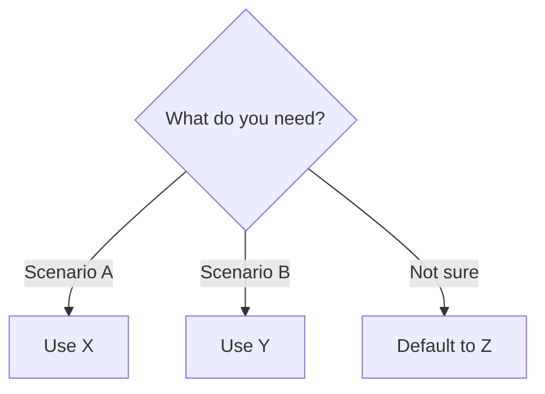

# 📋 {Topic} Cheatsheet

> Everything on one page. Print it. Stick it on your wall. Screenshot it.

---

## Core Concepts (30 sec)

| Concept | What | Remember |
|---------|------|---------|
| {Term} | {1-line} | {Hook} |

---

## Key Commands / APIs

```bash
# {Most used commands}
{command 1}
{command 2}
```

---

## Common Patterns

```
Pattern 1: {Name}
→ {When to use}
→ {How it works in 1 line}

Pattern 2: {Name}
→ {When to use}  
→ {How it works in 1 line}
```

---

## Decision Guide



---

## ⚠️ Gotchas (Top 5)
1. ❌ {Mistake} → ✅ {Fix}
2. ❌ {Mistake} → ✅ {Fix}
3. ❌ {Mistake} → ✅ {Fix}

---

## Quick Reference

| Setting/Config | Default | Recommended | Why |
|---------------|---------|-------------|-----|
| {param} | {val} | {val} | {reason} |

---

> One page. Bas. Isse zyada chahiye toh lessons padho 📖
