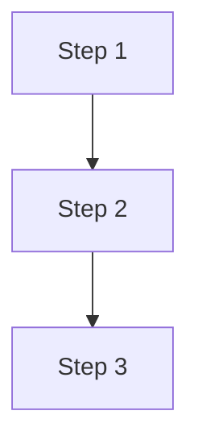
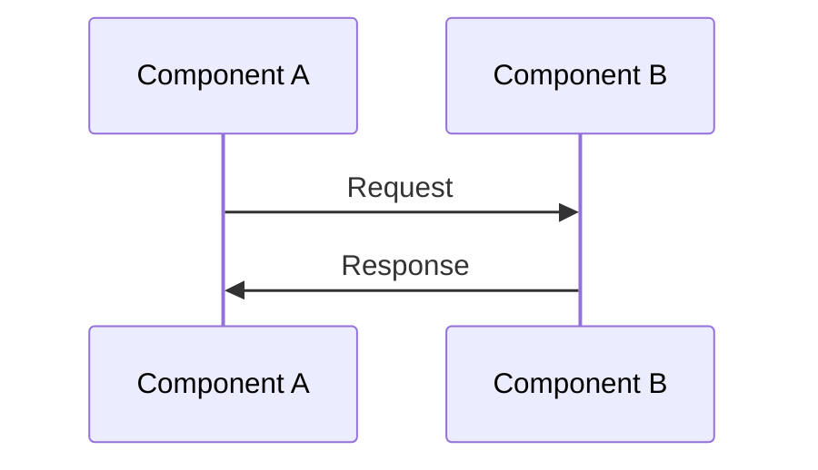

# {##} · {Title} {emoji}

---

## 🎯 One Line
> {Entire concept in one sentence. If you can't, you don't understand it yet.}

---

## 🖼️ The Picture

> {Hinglish/funny explanation of the diagram}
> {Make it memorable — analogy, joke, real-world comparison}

---

## 🧱 Key Pieces

| Concept | Kya hai | Yaad rakhne ka trick |
|---------|---------|----------------------|
| {Term 1} | {Simple explanation} | {Analogy/hook} |
| {Term 2} | {Simple explanation} | {Analogy/hook} |

---

## ⚡ How It Works

> {Walk through the flow in plain language}

---

## 💡 "Aha!" Moments

**{Insight 1}**
> {Hinglish analogy or memorable explanation}

**{Insight 2}**  
> {Another hook that makes it stick}

---

## ⚠️ Gotchas
- ❌ {Common mistake 1}
- ❌ {Common mistake 2}
- ❌ {Thing people get wrong}

---

## 🧪 Quick Check

❓ {Question 1}

{Answer with explanation. Keep it tight.}

❓ {Question 2}

{Answer — bonus points for Hinglish humor}

---

> **Next →** [{Next lesson title}]({next-file.md})
