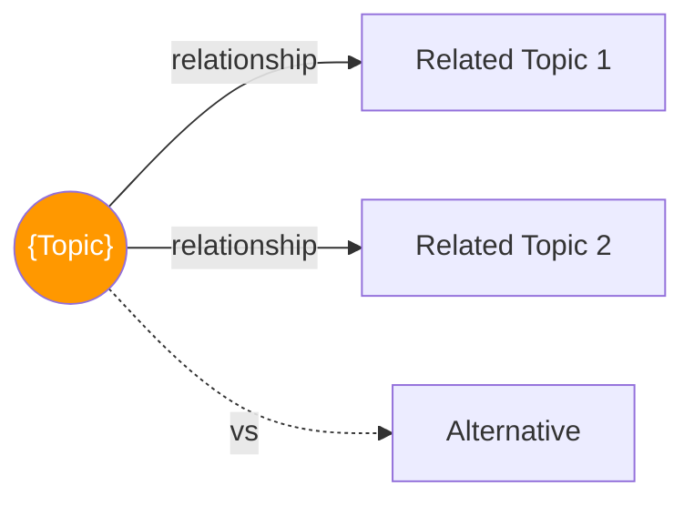

# {emoji} {Topic Name}

> {One-line description — concise, Hinglish humor welcome}

---

## 🧠 Brain — How This Connects

## 📊 Progress
| # | Lesson | Confidence | Revised |
|---|--------|-----------|---------|
| 01 | [Title](01-title.md) | 🔴 | — |
| 02 | [Title](02-title.md) | 🔴 | — |

## 🧩 Memory Fragments
> Things picked up over time. Random "aha!" moments, project learnings, 
> stuff that doesn't fit elsewhere but you don't want to forget.
> 
> - _Add fragments as you learn..._

---

## 🎬 Teach Mode — Lesson Flow

> Open these in order = you can teach anyone {Topic}

| # | Lesson | One-liner | Time |
|---|--------|-----------|------|
| 01 | [Title](01-title.md) | What and why | 3 min |
| 02 | [Title](02-title.md) | Core concepts | 5 min |

**Supporting:**
- [Comparisons](vs.md) — when to use what
- [Cheatsheet](cheatsheet.md) — one-page everything

---

## 📚 Sources
> - 🎓 Course: {name} 
> - 📄 Article: {name}
> - 🎬 Video: {name}
> - 💻 Project: {name}

## 🔗 Connected Topics
> → [topic1](../topic1/) · [topic2](../topic2/)

## 30-Second Recall 🧠
> {Quick revision paragraph — if you can't explain it in 30 sec, you don't know it well enough}
