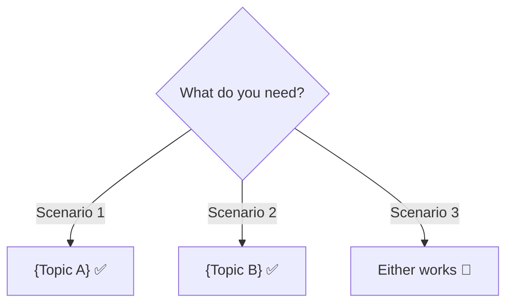

# ⚔️ {Topic A} vs {Topic B}

> When to use what — no BS, just facts

---

## Quick Pick

---

## One-Liner Each
> **{A}** = {one line definition}
> **{B}** = {one line definition}

---

## Full Comparison

| Feature | {A} | {B} |
|---------|-----|-----|
| {Feature 1} | ... | ... |
| {Feature 2} | ... | ... |
| {Feature 3} | ... | ... |
| Best for | {use case} | {use case} |
| Avoid when | {scenario} | {scenario} |

---

## Real Talk

**Pick {A} when:**
- {reason 1}
- {reason 2}

**Pick {B} when:**
- {reason 1}
- {reason 2}

**Dono chalega when:**
- {scenario where it doesn't matter much}

---

> "Simple rule: {one memorable decision heuristic}" 🎯
