# 🎯 Roadmap 2026-27 — The Mission

> **Deadline: March 2027.** Technically elite. Communication sharp. Ready for PM.
> No shortcuts. No excuses. Every week counts.

---

## 🏔️ The Summit

```mermaid
graph LR
    subgraph NOW ["📍 Where You Are (Apr 2026)"]
        N1["2.5 yrs GenAI/Agentic"]
        N2["SAP (6 months in)"]
        N3["DSA: Needs work"]
        N4["Speaking: Growing"]
    end

    subgraph Q2 ["⚡ Q2: Foundation Sprint"]
        Q2A["DSA: Arrays → Trees"]
        Q2B["RAG + GenAI Course"]
        Q2C["First Toastmasters speech"]
        Q2D["LLD: OOPs + SOLID + First Patterns"]
    end

    subgraph Q3 ["🔥 Q3: Deep Build"]
        Q3A["DSA: Graphs → DP"]
        Q3B["NLP Specialization"]
        Q3C["LLD: All Patterns + System Builds"]
        Q3D["Presenting at SAP regularly"]
    end

    subgraph Q4 ["🎯 Q4: Interview Ready"]
        Q4A["DSA: 200+ problems, Mock interviews"]
        Q4B["HLD: Alex Xu complete"]
        Q4C["Can hold a room for 10 min"]
        Q4D["PM learning begins"]
    end

    subgraph TARGET ["🏆 Mar 2027"]
        T1["Senior AI Engineer ready"]
        T2["PM conversations started"]
        T3["Strong public speaker"]
    end

    NOW --> Q2 --> Q3 --> Q4 --> TARGET
```

---

## 📊 Overall Progress

| Track | Target | Progress | Status |
|-------|--------|----------|--------|
| **DSA** | 200+ problems | 0/200 | 🔴 Starting |
| **System Design — LLD** | 40 videos + GoF | 0/40 | 🔴 Starting |
| **System Design — HLD** | Alex Xu Vol 1 (13 chapters) | 0/13 | 🔴 Not started |
| **AI Courses** | 3 mandatory + PyTorch | 0/4 | 🔴 Starting |
| **Public Speaking** | Toastmasters + SAP talks | 0/10 | 🔴 Starting |
| **PM Readiness** | Q4 start | Not yet | ⏳ Deferred |

---

## 🗺️ Detailed Plans

| Plan | What | Link |
|------|------|------|
| 🔢 DSA Tracker | Daily problems, topic progress, streaks | [Open →](dsa-tracker.md) |
| 🏗️ LLD Tracker | Design patterns, system builds, GoF | [Open →](lld-tracker.md) |
| 📖 HLD Tracker | Alex Xu chapters, system designs | [Open →](hld-tracker.md) |
| 🤖 AI Courses | RAG, GenAI, NLP, PyTorch | [Open →](ai-courses-tracker.md) |
| 🎤 Speaking Tracker | Toastmasters, SAP presentations, daily practice | [Open →](speaking-tracker.md) |
| 📅 Weekly Reviews | Sunday self-reflection logs | [Open →](weekly-reviews.md) |

---

## 🚨 Guardrails — Non-Negotiable Rules

!!! danger "HARD RULES — Break these and you're lying to yourself"

    1. **No zero days on DSA.** Even 1 easy problem counts. Streak > Intensity.
    2. **Speaking practice is DAILY.** 15 min minimum. Record or shadow. No exceptions.
    3. **Sunday review is sacred.** 30 min. Open this page. Check boxes. Be brutally honest.
    4. **AI courses on weekends ONLY.** Don't let them eat DSA time.
    5. **If you skip 3 days in a row on ANY track, that's a crisis.** Stop everything, do 1 small task to restart the streak.

!!! warning "SELF-REFLECTION CHECKPOINTS"

    **Every Sunday, answer these honestly:**

    - [ ] Did I solve at least 5 DSA problems this week?
    - [ ] Did I practice speaking every day?
    - [ ] Did I watch at least 1 LLD video and take notes?
    - [ ] Am I on track with the monthly milestone?
    - [ ] What's the ONE thing I'm avoiding? (Do that first next week)

---

## 📅 Quarterly Outcomes (Not Activities — OUTCOMES)

### Q2 (Apr-Jun 2026) — Foundation Sprint

!!! success "By June 30, I can..."

    - [ ] Solve any medium Array/String/HashMap/LinkedList problem in 30 min
    - [ ] Explain 5 design patterns with UML + code from memory
    - [ ] Complete RAG course + GenAI with LLMs course (certs on LinkedIn)
    - [ ] Give a 5-minute Toastmasters speech without freezing
    - [ ] Present a technical demo at SAP sprint review

### Q3 (Jul-Sep 2026) — Deep Build

!!! success "By September 30, I can..."

    - [ ] Solve medium Graph/Tree/DP problems confidently
    - [ ] Design Zomato/Spotify/Payment Gateway LLD on whiteboard
    - [ ] Complete NLP Specialization (cert on LinkedIn)
    - [ ] Run a 15-minute knowledge sharing session at SAP
    - [ ] Explain any GoF pattern with a real-world analogy in 60 seconds

### Q4 (Oct-Dec 2026) — Interview Ready

!!! success "By December 31, I can..."

    - [ ] Clear a mock DSA interview (2 mediums in 45 min)
    - [ ] Design any common system (URL shortener, chat app, etc.) in HLD interview
    - [ ] Hold attention in a 10-minute presentation to 20+ people
    - [ ] Started formal PM learning (can articulate product thinking)
    - [ ] 200+ DSA problems solved

### Q1 2027 (Jan-Mar) — Level Up

!!! success "By March 31, 2027, I am..."

    - [ ] Technically ready for Senior AI Engineer interviews at any company
    - [ ] Having real PM conversations at SAP (roadmap input, stakeholder management)
    - [ ] A confident speaker who people seek out for presentations
    - [ ] Portfolio: 3 AI certs + 200+ DSA + System Design knowledge + public speaking
