# 🎯 Roadmap 2026-27 — The Mission

> **Deadline: March 2027.** Technically elite. Communication sharp. Ready for PM.
> No shortcuts. No excuses. Every week counts.

---

## 🏔️ The Journey

```mermaid
graph TB
    START["📍 <b>START</b><br/>Apr 2026<br/>───────────<br/>2.5 yrs GenAI Builder<br/>SAP · 6 months in<br/>DSA: Needs work<br/>Speaking: Growing"]

    START --> L1

    subgraph Q2 ["⚡ Q2 · FOUNDATION SPRINT · Apr-Jun 2026"]
        L1["🎮 <b>Level 1: Arrays & Strings</b><br/>30 DSA problems<br/>RAG course complete"]
        L2["🎮 <b>Level 2: Stacks & Lists</b><br/>60 problems total<br/>GenAI with LLMs course"]
        L3["🎮 <b>Level 3: Trees & Search</b><br/>90 problems<br/>First Toastmasters speech"]
        L1 --> L2 --> L3
    end

    L3 --> L4

    subgraph Q3 ["🔥 Q3 · DEEP BUILD · Jul-Sep 2026"]
        L4["🎮 <b>Level 4: Graphs</b><br/>120 problems<br/>NLP Spec Course 1-2"]
        L5["🎮 <b>Level 5: Dynamic Programming</b><br/>150 problems<br/>LLD patterns complete"]
        L6["🎮 <b>Level 6: Advanced DSA</b><br/>180 problems<br/>Presenting at SAP"]
        L4 --> L5 --> L6
    end

    L6 --> L7

    subgraph Q4 ["🎯 Q4 · INTERVIEW READY · Oct-Dec 2026"]
        L7["🎮 <b>Level 7: Mock Interviews</b><br/>200+ problems<br/>NLP Spec complete"]
        L8["🎮 <b>Level 8: System Design</b><br/>HLD complete<br/>ML System Design"]
        L9["🎮 <b>Level 9: PM Launch</b><br/>PM learning starts<br/>Holding the room"]
        L7 --> L8 --> L9
    end

    L9 --> BOSS

    BOSS["🏆 <b>FINAL BOSS</b><br/>Mar 2027<br/>───────────<br/>Senior AI Engineer ready<br/>PM conversations active<br/>Confident public speaker<br/>3 AI certs · 200+ DSA<br/>System Design mastery"]

    style START fill:#2196f3,color:#fff,stroke:none
    style L1 fill:#ff9800,color:#fff,stroke:none
    style L2 fill:#ff9800,color:#fff,stroke:none
    style L3 fill:#ff9800,color:#fff,stroke:none
    style L4 fill:#f44336,color:#fff,stroke:none
    style L5 fill:#f44336,color:#fff,stroke:none
    style L6 fill:#f44336,color:#fff,stroke:none
    style L7 fill:#9c27b0,color:#fff,stroke:none
    style L8 fill:#9c27b0,color:#fff,stroke:none
    style L9 fill:#9c27b0,color:#fff,stroke:none
    style BOSS fill:#4caf50,color:#fff,stroke:none
```



---

## 📊 Overall Progress

| Track | Target | Current | Status | Tracker |
|-------|--------|---------|--------|---------|
| 🔢 **DSA** | 200+ problems | 0/200 | 🔴 Starting | [Open →](dsa-tracker.md) |
| 📐 **LLD** | 40 videos + GoF | 0/40 | 🔴 Starting | [Open →](lld-tracker.md) |
| 📖 **HLD** | Alex Xu (13 ch) | 0/13 | ⏳ June start | [Open →](hld-tracker.md) |
| 🤖 **AI Courses** | 3 mandatory | 0/3 | 🔴 Starting | [Open →](ai-courses-tracker.md) |
| 🎤 **Speaking** | Room commander | 0/10 milestones | 🔴 Starting | [Open →](speaking-tracker.md) |
| 💼 **PM** | Q4 launch | — | ⏳ Oct start | — |
| 📅 **Reviews** | Every Sunday | — | — | [Open →](weekly-reviews.md) |

---

## 🎮 Level Map — Milestones

Each level = 1 month. Clear the boss requirements to advance.

### ⚡ Q2: Foundation Sprint (Apr-Jun)

```
╔══════════════════════════════════════════════════════════════════╗
║  🎮 LEVEL 1 · APRIL                 🔓 UNLOCKED                ║
║  ════════════════════════════════════════════════════════════    ║
║                                                                  ║
║  🔢 DSA      │ Arrays, Strings, HashMap — 30 problems           ║
║  📐 LLD      │ OOPs + SOLID + UML (Videos 1-6)                  ║
║  🤖 AI       │ RAG course COMPLETE                               ║
║  🎤 Speaking  │ Find Toastmasters · Record first self-video      ║
║  📖 Read     │ Alex Xu Ch 1 (Scale from Zero)                    ║
║                                                                  ║
║  🏆 BOSS: Solve any easy Array/String in < 15 min               ║
╚══════════════════════════════════════════════════════════════════╝

╔══════════════════════════════════════════════════════════════════╗
║  🎮 LEVEL 2 · MAY                   🔒 LOCKED                   ║
║  ════════════════════════════════════════════════════════════    ║
║                                                                  ║
║  🔢 DSA      │ Linked Lists, Stacks, Queues — 60 total          ║
║  📐 LLD      │ Strategy, Factory, Singleton, Observer            ║
║  🤖 AI       │ GenAI with LLMs — START                           ║
║  🎤 Speaking  │ First Toastmasters meeting · PREP framework      ║
║  📖 Read     │ Alex Xu Ch 2-3                                    ║
║                                                                  ║
║  🏆 BOSS: Reverse a linked list + explain Strategy pattern       ║
╚══════════════════════════════════════════════════════════════════╝

╔══════════════════════════════════════════════════════════════════╗
║  🎮 LEVEL 3 · JUNE                  🔒 LOCKED                   ║
║  ════════════════════════════════════════════════════════════    ║
║                                                                  ║
║  🔢 DSA      │ Trees, Binary Search, Intervals — 90 total       ║
║  📐 LLD      │ Decorator, Command, Adapter, Facade + Builds     ║
║  🤖 AI       │ GenAI with LLMs — COMPLETE · NLP Spec START      ║
║  🎤 Speaking  │ First Toastmasters speech (Ice Breaker!)         ║
║  📖 Read     │ Alex Xu Ch 4-5                                    ║
║                                                                  ║
║  🏆 BOSS: 5-min Toastmasters speech without freezing            ║
╚══════════════════════════════════════════════════════════════════╝
```

### 🔥 Q3: Deep Build (Jul-Sep)

```
╔══════════════════════════════════════════════════════════════════╗
║  🎮 LEVEL 4 · JULY                  🔒 LOCKED                   ║
║  ════════════════════════════════════════════════════════════    ║
║                                                                  ║
║  🔢 DSA      │ Graphs, BFS/DFS, Backtracking — 120 total        ║
║  📐 LLD      │ Composite, Template, Proxy, Chain of Resp.       ║
║  🤖 AI       │ NLP Spec Course 1 COMPLETE                        ║
║  🎤 Speaking  │ Present at SAP sprint review                     ║
║  📖 Read     │ Alex Xu Ch 6-8                                    ║
║                                                                  ║
║  🏆 BOSS: BFS/DFS any graph problem + design Google Docs LLD    ║
╚══════════════════════════════════════════════════════════════════╝

╔══════════════════════════════════════════════════════════════════╗
║  🎮 LEVEL 5 · AUGUST                🔒 LOCKED                   ║
║  ════════════════════════════════════════════════════════════    ║
║                                                                  ║
║  🔢 DSA      │ Dynamic Programming — 150 total                  ║
║  📐 LLD      │ All remaining patterns + Zomato/Spotify builds   ║
║  🤖 AI       │ NLP Spec Course 2 COMPLETE                        ║
║  🎤 Speaking  │ Run a knowledge-sharing session at SAP           ║
║  📖 Read     │ Alex Xu Ch 9-11                                   ║
║                                                                  ║
║  🏆 BOSS: Solve a medium DP in 30 min + explain 10 patterns     ║
╚══════════════════════════════════════════════════════════════════╝

╔══════════════════════════════════════════════════════════════════╗
║  🎮 LEVEL 6 · SEPTEMBER             🔒 LOCKED                   ║
║  ════════════════════════════════════════════════════════════    ║
║                                                                  ║
║  🔢 DSA      │ Greedy, Advanced — 180 total                     ║
║  📐 LLD      │ ALL 40 videos DONE + GoF book cross-referenced   ║
║  🤖 AI       │ NLP Spec Course 3 COMPLETE                        ║
║  🎤 Speaking  │ 3+ Toastmasters speeches delivered               ║
║  📖 Read     │ Alex Xu Ch 12-13 (BOOK COMPLETE)                  ║
║                                                                  ║
║  🏆 BOSS: Design Zomato LLD on whiteboard in 30 min             ║
╚══════════════════════════════════════════════════════════════════╝
```

### 🎯 Q4: Interview Ready (Oct-Dec)

```
╔══════════════════════════════════════════════════════════════════╗
║  🎮 LEVEL 7 · OCTOBER               🔒 LOCKED                   ║
║  ════════════════════════════════════════════════════════════    ║
║                                                                  ║
║  🔢 DSA      │ 200+ problems · Hard problems + contests         ║
║  📐 LLD      │ ML System Design starts                          ║
║  🤖 AI       │ NLP Spec COMPLETE · PyTorch cert START            ║
║  🎤 Speaking  │ 10-min talk to 15+ people                        ║
║  💼 PM       │ Formal PM learning BEGINS                         ║
║                                                                  ║
║  🏆 BOSS: Clear mock DSA interview (2 mediums in 45 min)        ║
╚══════════════════════════════════════════════════════════════════╝

╔══════════════════════════════════════════════════════════════════╗
║  🎮 LEVEL 8 · NOVEMBER              🔒 LOCKED                   ║
║  ════════════════════════════════════════════════════════════    ║
║                                                                  ║
║  🔢 DSA      │ Mock interviews (DSA + System Design)            ║
║  📐 System   │ Full mock: LLD + HLD combined                    ║
║  🤖 AI       │ PyTorch cert ongoing                              ║
║  🎤 Speaking  │ Led a team meeting at SAP                        ║
║  💼 PM       │ Product thinking + stakeholder skills             ║
║                                                                  ║
║  🏆 BOSS: Design URL shortener HLD + Payment Gateway LLD combo  ║
╚══════════════════════════════════════════════════════════════════╝

╔══════════════════════════════════════════════════════════════════╗
║  🎮 LEVEL 9 · DECEMBER              🔒 LOCKED                   ║
║  ════════════════════════════════════════════════════════════    ║
║                                                                  ║
║  🔢 DSA      │ Contest practice · Edge cases · Speed drills     ║
║  📐 System   │ Can design ANY common system in interview        ║
║  🤖 AI       │ All certs on LinkedIn                             ║
║  🎤 Speaking  │ Confident. People listen when you talk.          ║
║  💼 PM       │ Can articulate product thinking clearly           ║
║                                                                  ║
║  🏆 BOSS: Full mock interview (DSA + SD + Behavioral) — PASS    ║
╚══════════════════════════════════════════════════════════════════╝
```

### 🏆 Final Boss — Q1 2027 (Jan-Mar)

```
╔══════════════════════════════════════════════════════════════════╗
║                                                                  ║
║  👑  F I N A L   B O S S                                         ║
║                                                                  ║
║  ════════════════════════════════════════════════════════════    ║
║                                                                  ║
║  "I am technically ready for Senior AI Engineer at any company"  ║
║  "I am having real PM conversations at SAP"                      ║
║  "People seek me out for presentations"                          ║
║                                                                  ║
║  📊 Portfolio:                                                   ║
║     ✦ 3 AI certificates (GenAI + NLP + PyTorch)                 ║
║     ✦ 200+ DSA problems solved                                  ║
║     ✦ System Design: 40 LLD + 13 HLD chapters                  ║
║     ✦ GoF Design Patterns mastered                              ║
║     ✦ 5+ public speeches delivered                              ║
║     ✦ SAP knowledge-sharing sessions led                        ║
║                                                                  ║
╚══════════════════════════════════════════════════════════════════╝
```

---

## 🚨 Guardrails — Non-Negotiable Rules

!!! danger "HARD RULES — Break these and you're lying to yourself"

    1. **No zero days on DSA.** Even 1 easy problem counts. Streak > Intensity.
    2. **Speaking practice is DAILY.** 15 min minimum. Record or shadow. No exceptions.
    3. **Sunday review is sacred.** 30 min. Open this page. Check boxes. Be brutally honest.
    4. **AI courses on weekends ONLY.** Don't let them eat DSA time.
    5. **If you skip 3 days in a row on ANY track, that's a crisis.** Stop everything, do 1 small task to restart the streak.

!!! warning "SELF-REFLECTION CHECKPOINTS — Every Sunday"

    - [ ] Did I solve at least 5 DSA problems this week?
    - [ ] Did I practice speaking every day?
    - [ ] Did I watch at least 1 LLD video and take notes?
    - [ ] Am I on track with the monthly milestone?
    - [ ] What's the ONE thing I'm avoiding? (Do that first next week)

---

## 📅 Quarterly Outcomes — WHAT I CAN DO (Not what I did)

### ⚡ Q2 (Apr-Jun 2026) — Foundation Sprint

| Outcome | How I'll Prove It |
|---------|------------------|
| Solve any medium Array/String/HashMap problem in 30 min | Timed practice on LeetCode |
| Explain 5 design patterns with UML + code from memory | Whiteboard test (no notes) |
| RAG course + GenAI with LLMs COMPLETE | Certs on LinkedIn |
| Give a 5-minute speech without freezing | Toastmasters Ice Breaker |
| Present a technical demo at SAP | Sprint review participation |

### 🔥 Q3 (Jul-Sep 2026) — Deep Build

| Outcome | How I'll Prove It |
|---------|------------------|
| Solve medium Graph/Tree/DP problems confidently | 3 in a row, no hints |
| Design Zomato/Spotify LLD on whiteboard in 30 min | Record yourself doing it |
| NLP Specialization COMPLETE | Cert on LinkedIn |
| Run a 15-min knowledge sharing session at SAP | Actually schedule and do it |
| Explain any GoF pattern in 60 seconds | Random pattern quiz |

### 🎯 Q4 (Oct-Dec 2026) — Interview Ready

| Outcome | How I'll Prove It |
|---------|------------------|
| Clear mock DSA interview (2 mediums in 45 min) | Pramp/Interviewing.io mock |
| Design any common system in HLD interview format | 35-min timed practice |
| Hold attention in 10-min presentation to 20+ people | Do it at SAP or meetup |
| Started formal PM learning | Can explain RICE, PRD, roadmap |
| 200+ DSA problems solved | LeetCode profile count |

### 🏆 Q1 2027 (Jan-Mar) — Level Up

| Outcome | How I'll Prove It |
|---------|------------------|
| Ready for Senior AI Engineer interviews anywhere | Full mock: DSA + SD + Behavioral |
| Real PM conversations at SAP | Roadmap input, stakeholder meetings |
| Confident speaker people seek out | Invited to present / share knowledge |
| Complete portfolio on LinkedIn | All certs, projects, skills visible |
