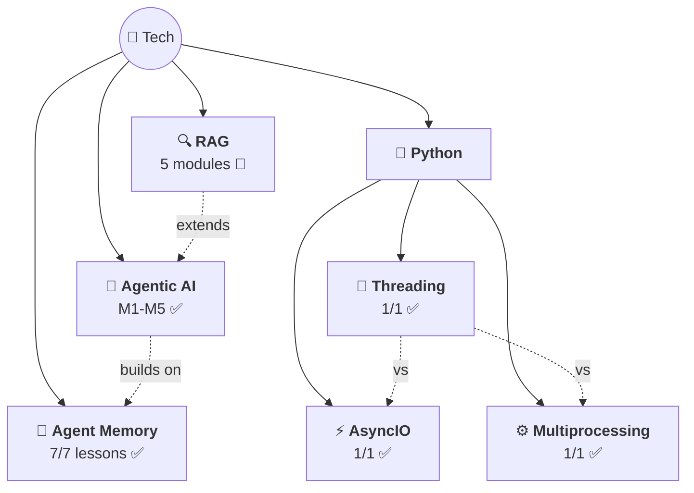

# 🗺️ Tech Knowledge Map

> All tech topics with confidence + progress.

## 📊 Topics

| Topic | Confidence | Lessons | Flashcards | Last Updated |
|-------|-----------|---------|------------|-------------|
| [🤖 Agentic AI](agentic-ai/) | 🟡 Learning | 30/30 ✅ | 55+ | 2026-03-31 |
| [🧠 Agent Memory](agent-memory/) | 🟡 Learning | 7/7 ✅ | 40+ | 2026-03-21 |
| [🔍 RAG](rag/) | 🔴 Not started | 0/62 | — | 2026-04-04 |
| [⚡ AsyncIO](python/asyncio/) | 🟡 Learning | 1/1 ✅ | 12 | 2026-03-21 |
| [🧵 Threading](python/threading/) | 🟡 Learning | 1/1 ✅ | 10 | 2026-03-24 |
| [⚙️ Multiprocessing](python/multiprocessing/) | 🟡 Learning | 1/1 ✅ | 10 | 2026-04-04 |

## What's Covered

### Agentic AI (5 modules — complete ✅)
| # | Module | Status | Topics |
|---|--------|--------|--------|
| 01 | Intro to Agentic Workflows | ✅ 8/8 | What is it, Autonomy levels, Benefits, Applications, Task Decomposition, Evals, Design Patterns |
| 02 | Reflection Design Pattern | ✅ 5/5 | Self-critique, Direct vs Iterative, Chart/SQL gen, Evals (objective + rubric), External Feedback |
| 03 | Tool Use | ✅ 5/5 | What are tools, aisuite + JSON schema, Code Execution (meta-tool, sandbox), MCP (M×N→M+N) |
| 04 | Practical Tips | ✅ 7/7 | Evals (2×2 framework), Error Analysis (traces, spreadsheets), Component Evals, Addressing Problems (LLM vs non-LLM), Latency/Cost, Dev Process |
| 05 | Autonomous Agents | ✅ 5/5 | Planning, LLM Plans, Multi-Agent, Communication Patterns |

### RAG (5 modules — starting! 🔴)
| # | Module | Status | Topics |
|---|--------|--------|--------|
| 01 | RAG Overview | 🔴 0/10 | What is RAG, Applications, Architecture, LLMs intro, IR intro |
| 02 | IR & Search Foundations | 🔴 0/12 | Retriever arch, TF-IDF, BM25, Semantic search, Embeddings, Hybrid, Eval |
| 03 | IR with Vector Databases | 🔴 0/12 | ANN, Vector DBs, Weaviate, Chunking, Query parsing, Reranking |
| 04 | LLMs & Text Generation | 🔴 0/14 | Transformers, Sampling, Prompt engineering, Hallucinations, Agentic RAG |
| 05 | RAG in Production | 🔴 0/14 | Evaluation, Monitoring, Tracing, Quantization, Cost/Latency, Security |

---

> 🌱 6 topics and growing!
