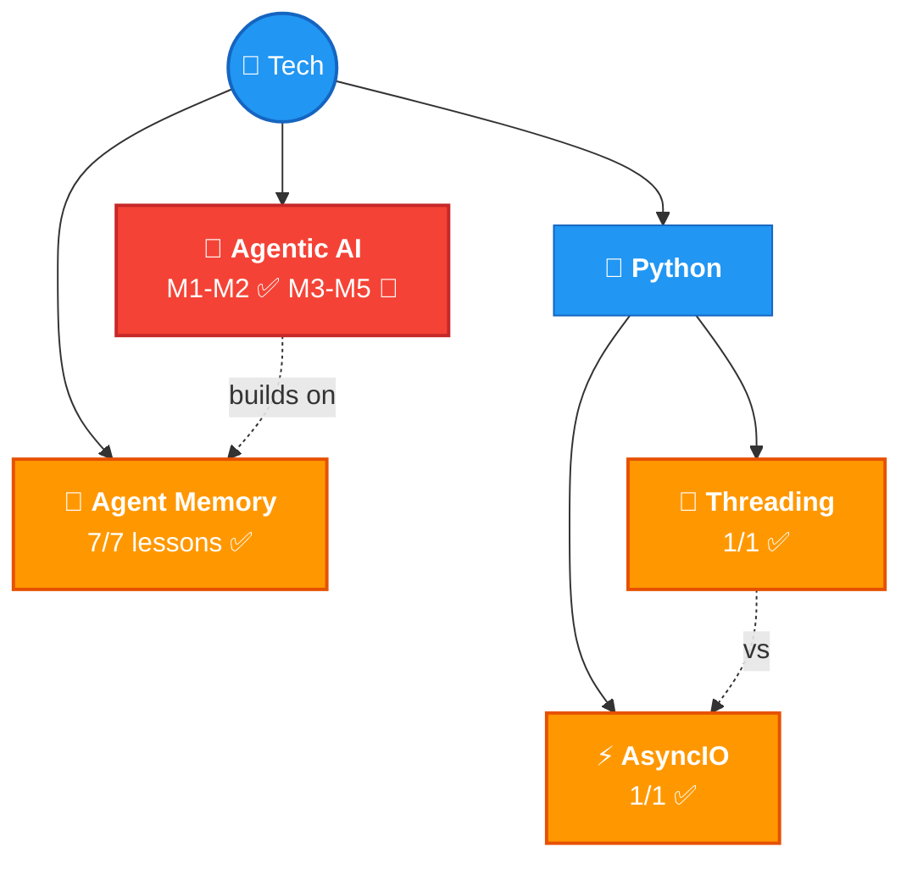

# 🗺️ Tech Knowledge Map

> All tech topics with confidence + progress.

## 📊 Topics

| Topic | Confidence | Lessons | Flashcards | Last Updated |
|-------|-----------|---------|------------|-------------|
| [🤖 Agentic AI](agentic-ai/) | 🔴 M1-M2 done | 13/30 | 30+ | 2026-03-28 |
| [🧠 Agent Memory](agent-memory/) | 🟡 Learning | 7/7 ✅ | 40+ | 2026-03-21 |
| [⚡ AsyncIO](python/asyncio/) | 🟡 Learning | 1/1 ✅ | 12 | 2026-03-21 |
| [🧵 Threading](python/threading/) | 🟡 Learning | 1/1 ✅ | 10 | 2026-03-24 |

## What's Covered

### Agentic AI (5 modules — M1-M2 complete ✅)
| # | Module | Status | Topics |
|---|--------|--------|--------|
| 01 | Intro to Agentic Workflows | ✅ 8/8 | What is it, Autonomy levels, Benefits, Applications, Task Decomposition, Evals, Design Patterns |
| 02 | Reflection Design Pattern | ✅ 5/5 | Self-critique, Direct vs Iterative, Chart/SQL gen, Evals (objective + rubric), External Feedback |
| 03 | Tool Use | 🔴 0/5 | Tools, Creating Tools, Syntax, Code Execution, MCP |
| 04 | Practical Tips | 🔴 0/7 | Evals, Error Analysis, Component Evals, Cost/Latency Optimization |
| 05 | Autonomous Agents | 🔴 0/5 | Planning, LLM Plans, Multi-Agent, Communication Patterns |

### Agent Memory (7 lessons)
| # | Topic |
|---|-------|
| 01 | Introduction — goldfish problem, evolution path |
| 02 | Why Agents Need Memory — 4 pillars, taxonomy, RAG vs Agent Memory |
| 03 | Memory Manager — agent stack, CRUD, deterministic vs agent-triggered, lifecycle |
| 04 | Semantic Tool Memory — toolbox pattern, augmentation, search-and-store |
| 05 | Memory Operations — summarization, compaction, workflow memory |
| 06 | Memory Aware Agent — agent loop, harness, full implementation |
| 07 | Conclusion — 5 building blocks of Memory Engineering |

### AsyncIO (1 lesson)
| # | Topic |
|---|-------|
| 01 | Complete Guide — event loop, coroutines, tasks, gather, TaskGroup, threads, processes, real-world example, profiling |

### Threading (1 lesson)
| # | Topic |
|---|-------|
| 01 | Complete Guide — sync vs threaded, manual threads, ThreadPoolExecutor, submit vs map, real-world image download |

---

> 🌱 4 topics and growing!
