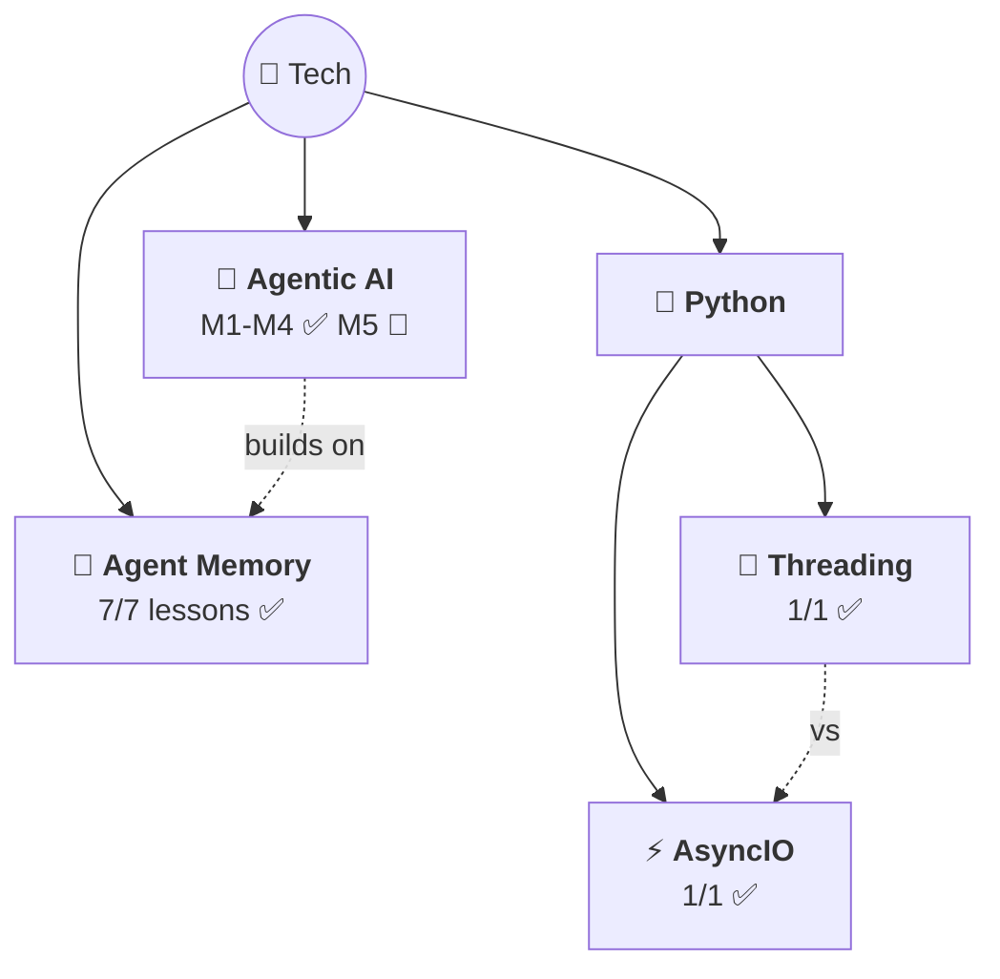

# 🗺️ Tech Knowledge Map

> All tech topics with confidence + progress.

## 📊 Topics

| Topic | Confidence | Lessons | Flashcards | Last Updated |
|-------|-----------|---------|------------|-------------|
| [🤖 Agentic AI](agentic-ai/) | 🔴 M1-M4 done, M5 pending | 25/30 | 55+ | 2026-03-31 |
| [🧠 Agent Memory](agent-memory/) | 🟡 Learning | 7/7 ✅ | 40+ | 2026-03-21 |
| [⚡ AsyncIO](python/asyncio/) | 🟡 Learning | 1/1 ✅ | 12 | 2026-03-21 |
| [🧵 Threading](python/threading/) | 🟡 Learning | 1/1 ✅ | 10 | 2026-03-24 |

## What's Covered

### Agentic AI (5 modules — M1-M4 complete ✅)
| # | Module | Status | Topics |
|---|--------|--------|--------|
| 01 | Intro to Agentic Workflows | ✅ 8/8 | What is it, Autonomy levels, Benefits, Applications, Task Decomposition, Evals, Design Patterns |
| 02 | Reflection Design Pattern | ✅ 5/5 | Self-critique, Direct vs Iterative, Chart/SQL gen, Evals (objective + rubric), External Feedback |
| 03 | Tool Use | ✅ 5/5 | What are tools, aisuite + JSON schema, Code Execution (meta-tool, sandbox), MCP (M×N→M+N) |
| 04 | Practical Tips | ✅ 7/7 | Evals (2×2 framework), Error Analysis (traces, spreadsheets), Component Evals, Addressing Problems (LLM vs non-LLM), Latency/Cost, Dev Process |
| 05 | Autonomous Agents | 🔴 0/5 | Planning, LLM Plans, Multi-Agent, Communication Patterns |

---

> 🌱 4 topics and growing!
