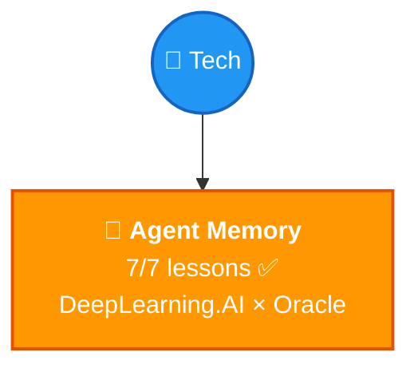

# 🗺️ Tech Knowledge Map

> Auto-maintained. Shows all tech topics with confidence + progress.

## 📊 Topics

| Topic | Confidence | Lessons | Flashcards | Last Updated |
|-------|-----------|---------|------------|-------------|
| [🧠 Agent Memory](agent-memory/) | 🟡 Learning | 7/7 ✅ | 40+ | 2026-03-21 |

## What's Covered in Agent Memory

| Lesson | Topic |
|--------|-------|
| 01 | Introduction — goldfish problem, evolution path |
| 02 | Why Agents Need Memory — 4 pillars, taxonomy, RAG vs Agent Memory |
| 03 | Memory Manager — agent stack, CRUD, deterministic vs agent-triggered, lifecycle |
| 04 | Semantic Tool Memory — toolbox pattern, augmentation, search-and-store |
| 05 | Memory Operations — summarization, compaction, workflow memory |
| 06 | Memory Aware Agent — agent loop, harness, full implementation |
| 07 | Conclusion — 5 building blocks of Memory Engineering |

---

> 🌱 First topic planted! More coming soon.
