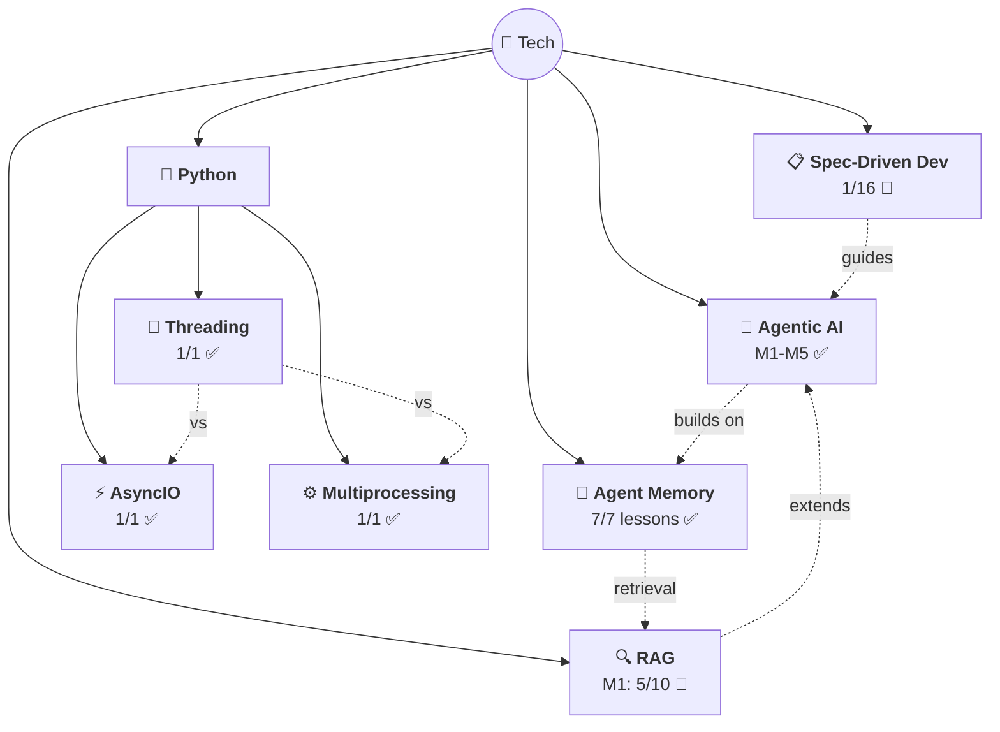

# 🗺️ Tech Knowledge Map

> All tech topics with confidence + progress.

## 📊 Topics

| Topic | Confidence | Lessons | Flashcards | Last Updated |
|-------|-----------|---------|------------|-------------|
| [🤖 Agentic AI](agentic-ai/) | 🟡 Learning | 30/30 ✅ | 55+ | 2026-04-03 |
| [🧠 Agent Memory](agent-memory/) | 🟡 Learning | 7/7 ✅ | 40+ | 2026-03-21 |
| [🔍 RAG](rag/) | 🔴 Starting | 5/62 | 20+ | 2026-04-06 |
| [⚡ AsyncIO](python/asyncio/) | 🟡 Learning | 1/1 ✅ | 12 | 2026-03-21 |
| [🧵 Threading](python/threading/) | 🟡 Learning | 1/1 ✅ | 10 | 2026-03-24 |
| [⚙️ Multiprocessing](python/multiprocessing/) | 🟡 Learning | 1/1 ✅ | 10 | 2026-04-04 |
| [📋 Spec-Driven Dev](spec-driven-development/) | 🔴 Starting | 1/16 | 10 | 2026-04-20 |

---

> 🌱 7 topics and growing!
