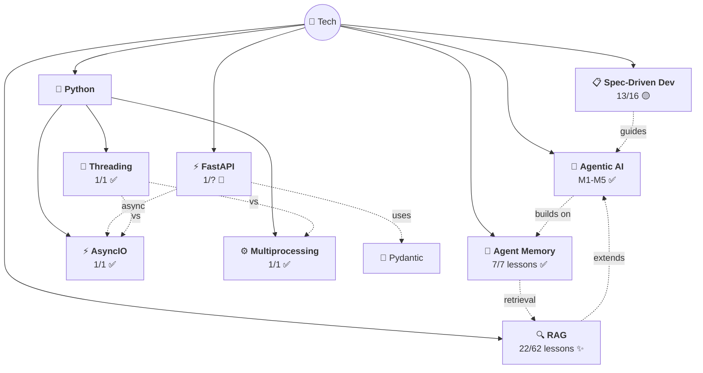

# 🔧 Tech Hub

> Your learning command center — 8 courses and counting.

---

## 🤖 AI & Agents

<a href="agentic-ai/" class="course-card">
  

    🤖
    Agentic AI
  

  Learning
  

    
Design patterns for AI agents: reflection, tool use, planning, multi-agent systems.

  

  

    

  

  

    📚 30/30 lessons
    🃏 55+ cards
    🎓 DeepLearning.AI
  

</a>

<a href="agent-memory/" class="course-card">
  

    🧠
    Agent Memory
  

  Learning
  

    
Persistent memory for AI agents — semantic retrieval, CRUD operations, memory-aware agents.

  

  

    

  

  

    📚 7/7 lessons
    🃏 40+ cards
    🎓 DLAI × Oracle
  

</a>

<a href="rag/" class="course-card">
  

    🔍
    RAG
  

  Learning
  

    
Retrieval-Augmented Generation — search, embeddings, vector DBs, hybrid search, reranking.

  

  

    

  

  

    📚 22/62 lessons
    🃏 80+ cards
    🎓 DeepLearning.AI
  

</a>

<a href="spec-driven-development/" class="course-card">
  

    📋
    Spec-Driven Dev
  

  Learning
  

    
Workflow for directing coding agents — specs, constitutions, validation, replanning.

  

  

    

  

  

    📚 13/16 lessons
    🃏 30+ cards
    🎓 DLAI × JetBrains
  

</a>

## 🌐 Web Frameworks

<a href="fastapi/" class="course-card">
  

    ⚡
    FastAPI
  

  Learning
  

    
Modern Python web framework — type hints, Pydantic validation, async support, auto OpenAPI docs.

  

  

    

  

  

    📚 1/? lessons
    🃏 12 cards
    🌐 FastAPI Docs
  

</a>

## 🐍 Python

<a href="python/asyncio/" class="course-card">
  

    ⚡
    AsyncIO
  

  Learning
  

    
Event loop, coroutines, tasks, gather, TaskGroup — async I/O concurrency.

  

  

    

  

  

    📚 1/1 complete
    🃏 12 cards
    🎓 Corey Schafer
  

</a>

<a href="python/threading/" class="course-card">
  

    🧵
    Threading
  

  Learning
  

    
Threads, ThreadPoolExecutor, submit vs map, GIL, daemon threads — I/O parallelism.

  

  

    

  

  

    📚 1/1 complete
    🃏 10 cards
    🎓 Corey Schafer
  

</a>

<a href="python/multiprocessing/" class="course-card">
  

    ⚙️
    Multiprocessing
  

  Learning
  

    
Processes, ProcessPoolExecutor, bypassing GIL — true CPU parallelism.

  

  

    

  

  

    📚 1/1 complete
    🃏 10 cards
    🎓 Corey Schafer
  

</a>

---

<strong>🗺️ Knowledge Graph</strong>

```mermaid
graph TB
    T(("🔧 Tech"))
    T --> AG["🤖 <b>Agentic AI</b><br/>M1-M5 ✅"]
    T --> AM["🧠 <b>Agent Memory</b><br/>7/7 lessons ✅"]
    T --> RAG["🔍 <b>RAG</b><br/>22/62 lessons ✨"]
    T --> PY["🐍 <b>Python</b>"]
    PY --> AIO["⚡ <b>AsyncIO</b><br/>1/1 ✅"]
    PY --> THR["🧵 <b>Threading</b><br/>1/1 ✅"]
    PY --> MP["⚙️ <b>Multiprocessing</b><br/>1/1 ✅"]
    AG -.->|"builds on"| AM
    AM -.->|"retrieval"| RAG
    RAG -.->|"extends"| AG
    T --> SDD["📋 <b>Spec-Driven Dev</b><br/>13/16 🟡"]
    T --> FA["⚡ <b>FastAPI</b><br/>1/? 🔴"]
    SDD -.->|"guides"| AG
    FA -.->|"uses"| PD["🧱 Pydantic"]
    FA -.->|"async"| AIO
    THR -.->|"vs"| AIO
    THR -.->|"vs"| MP
```

---

> 🌱 8 courses and growing! Click any card to dive in.
