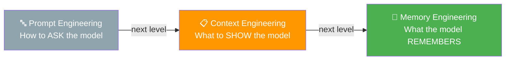
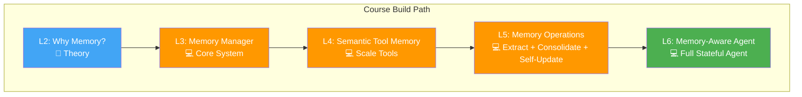

# 01 · Introduction 🎬

> 📚 Source: DeepLearning.AI × Oracle — "Agent Memory: Building Memory-Aware Agents"
> ✅ Verified — directly from course transcript
> 
> Confidence tags: ✅ Direct from source | 💡 Analogy

---

## 🎯 One Line
> AI agents today are stateless goldfish — memory engineering gives them a persistent, structured diary that survives across sessions.

---

## 🖼️ The Picture

```mermaid
graph TB
    subgraph "❌ Today's Problem"
        A["Agent starts session"] --> B["Does great work 💪"]
        B --> C["Session ends"]
        C --> D["💀 Everything forgotten"]
        D --> E["Next session = blank slate"]
    end
    
    subgraph "✅ The Solution"
        F["Agent starts session"] --> G["Does great work 💪"]
        G --> H["Memory Manager saves context"]
        H --> I["Session ends"]
        I --> J["🧠 Memory persists"]
        J --> K["Next session = picks up where it left off"]
    end
    
    style D fill:#f44336,color:#fff
    style J fill:#4caf50,color:#fff
    style H fill:#ff9800,color:#fff
```

> 💡 Sochlo aise — stateless agent = voh friend jo har baar milne pe puchhta hai "tum karte kya ho?" 😂
> Memory-aware agent = friend who remembers your birthday, your job, AND that you hate coriander.

---

## 🧱 Key Pieces

| Concept | Kya hai | Yaad rakhne ka trick |
|---------|---------|----------------------|
| ✅ Stateless Agent | Works in 1 session, forgets everything after | Goldfish 🐟 — 3 second memory |
| ✅ Memory Engineering | Treating long-term memory as first-class infra | Building a brain 🧠 OUTSIDE the model |
| ✅ The Evolution | Prompt Eng → Context Eng → Memory Eng | From telling → showing → remembering |
| ✅ Persistent Memory | Survives across sessions, structured & external | Like writing in a diary vs remembering in your head |
| ✅ Long-horizon tasks | Multi-step tasks across sessions | Can't build a house if you forget the blueprint every morning |

---

## ⚡ The Evolution of AI Engineering

> ✅ **Prompt Engineering** = "How do I phrase my question?" → Getting better outputs from better prompts.
> ✅ **Context Engineering** = "What do I put in the context window?" → RAG, tool results, system prompts.
> ✅ **Memory Engineering** = "What does the agent *remember* across sessions?" → Persistent, structured, external memory.
>
> 💡 Analogy: Prompt Eng = teaching someone to ask good questions. Context Eng = giving them the right textbook during the exam. Memory Eng = making sure they actually *remember* stuff from last semester.

---

## 🛠️ What You'll Build (Course Roadmap)

| Component | What it does | Lesson |
|-----------|-------------|--------|
| ✅ Memory Manager | Core system for storing/retrieving memories | L3 |
| ✅ Extraction Pipelines | Pull important info from conversations | L5 |
| ✅ Contradiction Handling | Detect & resolve conflicting memories | L5 |
| ✅ Write-back Loops | Self-updating memory system | L5 |
| ✅ Semantic Tool Memory | Scale tool selection using memory | L4 |
| ✅ Stateful Agent | Fully memory-aware agent | L6 |

---

## 🛠️ Tech Stack

| Tool | Role |
|------|------|
| ✅ Oracle AI Database | Persistent memory storage (vector + relational) |
| ✅ LangChain | Agent framework / orchestration |
| ✅ LLM-powered pipelines | Memory extraction, consolidation, reasoning |

---

## 👨‍🏫 Instructors

| Who | Role |
|-----|------|
| ✅ Richmond Alake | Director of AI Developer Experience, Oracle |
| ✅ Nacho Martínez | Principal Data Science Advocate, Oracle |
| ✅ Andrew Ng | Introduction (DeepLearning.AI founder) |

---

## 💡 "Aha!" Moments

**Memory is INFRASTRUCTURE, not a feature**
> ✅ Most people think of memory as "oh just save the chat history." Nah. Memory engineering means treating it like a database — external to the model, persistent, structured, queryable. It's infra, not an afterthought.

**The goldfish problem is real**
> ✅ Today's agents can write code, search the web, call APIs — but ask them "what did we discuss yesterday?" and they're blank. Sab kuch kar sakte hain, bas yaad nahi rakh sakte 😅

**This is the next frontier**
> 💡 Prompt engineering had its moment. RAG/context engineering is having its moment now. Memory engineering is next — it's what separates a "useful chatbot" from a "reliable long-term assistant."

---

## 🧪 Quick Check

❓ Why do current AI agents struggle with long-horizon tasks?

✅ Because they're stateless — everything happens within a single context window/session. When the session ends, all context is lost. They start fresh every time, like a goldfish with amnesia.

❓ What's the difference between Context Engineering and Memory Engineering?

✅ **Context Engineering** = deciding what to put INTO the context window for THIS session (RAG, tool outputs, system prompts).
**Memory Engineering** = building persistent, structured memory that survives ACROSS sessions — external to the model.

Context = what's on the exam cheat sheet. Memory = what you actually learned and remember. 📝🧠

❓ What are the 4 key components you'll build in this course?

✅ 1. Memory Manager (core storage/retrieval system)
2. Extraction Pipelines (pull info from conversations)
3. Contradiction Handling + Self-Updating Memory (resolve conflicts, keep memory fresh)
4. Semantic Tool Memory (scale tool selection)

All combined into a fully stateful memory-aware agent.

---

> **Next →** [Why AI Agents Need Memory](02-why-agents-need-memory.md)
