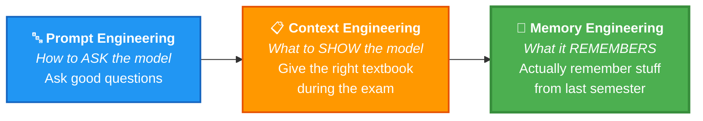

# 01 · Introduction 🎬

## 🎯 One Line
> Stateless agents = goldfish. Memory engineering gives them a diary that survives across sessions.

---

## ❌ The Problem → ✅ The Solution

| | Stateless Agent 🐟 | Memory-Aware Agent 🧠 |
|--|---|---|
| **Session 1** | Does great work | Does great work |
| **Session ends** | 💀 Everything gone | 💾 Memory persists |
| **Session 2** | Blank slate, starts over | Picks up where it left off |

> 💡 Stateless agent = voh friend jo har baar milne pe puchhta hai "tum karte kya ho?" 😂

---

## ⚡ The Evolution

**Key insight:** Memory is **infrastructure**, not a feature. External to the model, persistent, structured, queryable.

---

## 🗺️ Course Roadmap

| # | Lesson | Type | What you build |
|---|--------|------|----------------|
| 2 | Why Agents Need Memory | 📖 | Failure modes + memory-first architecture |
| 3 | Memory Manager | 💻 | Core store/retrieve system |
| 4 | Semantic Tool Memory | 💻 | Scale tool selection via search |
| 5 | Memory Operations | 💻 | Extraction + consolidation + self-update |
| 6 | Memory-Aware Agent | 💻 | Full stateful agent, end-to-end |

**Stack:** Oracle AI Database · LangChain · LLM pipelines

---

## 🧪 Quick Check

❓ Why do current agents struggle with long-horizon tasks?

They're stateless — session ends, context lost. Goldfish with amnesia. 🐟

❓ Context Engineering vs Memory Engineering?

**Context** = what's on the cheat sheet for THIS exam.
**Memory** = what you actually learned and remember across semesters. 📝→🧠

---

> **Next →** [Why AI Agents Need Memory](02-why-agents-need-memory.md)
