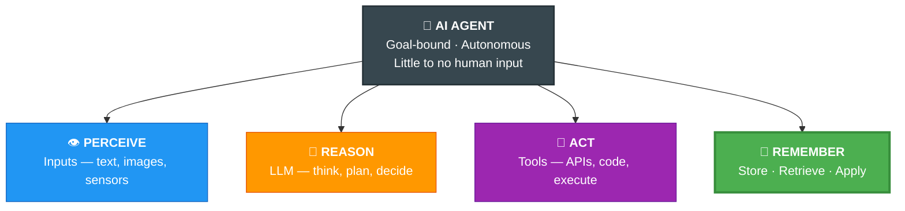
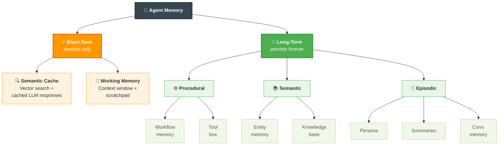
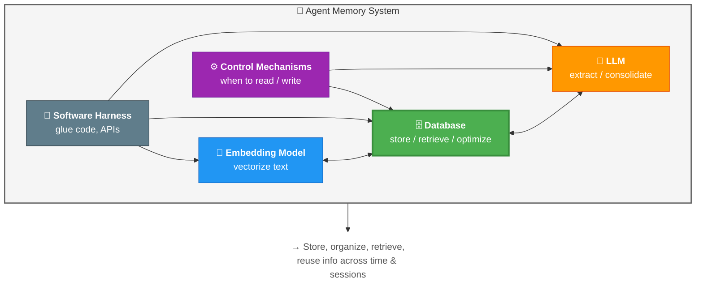
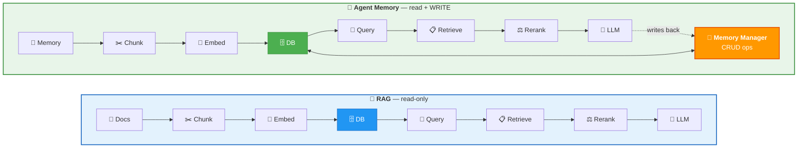

# 02 · Why AI Agents Need Memory 🤔

> ✅ Verified — directly from course transcript

---

## 🎯 One Line
> An agent without memory is a genius with amnesia — brilliant per turn, useless over time.

---

## 🤖 What is an AI Agent?

**4 pillars — miss one and it's not really an agent:**



> 💡 Perception, Reasoning, Action = body. **Memory = soul** — without it the agent forgets who it was 5 minutes ago.

---

## 🐟 Stateless vs 🧠 Memory-Augmented

**The Restaurant Problem:**

| Turn | User Says | 🐟 Stateless | 🧠 Memory-Augmented |
|------|-----------|-------------|----------------------|
| 1 | "Italian restaurants near me?" | Lists 3 options ✅ | Lists 3 options ✅ |
| 2 | "Which one has outdoor seating?" | Answers ✅ | Answers ✅ |
| 3 | "Book the first one for 7pm" | ❌ "Which one??" | ✅ Books restaurant #1 |

> 🐟 Stateless = goldfish brain. Har turn fresh start.
> 🧠 Memory = stores turns 1-2 in external DB → turn 3 mein "first one" samajh aata hai!

---

## ❌ Stateless Pain vs ✅ Memory Gains

```
  ❌ STATELESS                          ✅ MEMORY-AUGMENTED
  ─────────────────────────────────     ─────────────────────────────────
  Can't do long-horizon tasks           Long-running tasks across
  (minutes → hours → days)              minutes, hours, even days

  No context across sessions            Sustained context — picks up
  (every session = blank slate)         where it left off

  No learning / adaptation              Learns from past interactions
  (same mistakes, forever)              (adapts & improves)

  High cost — stuff EVERYTHING          Efficient — retrieve only
  into context every single turn        what's relevant per turn
  (token bill goes brrr 💸)             (smart retrieval = $$ saved)
```

> 💡 Stateless agent pe paisa lagana = leaky bucket mein paani dalna 🪣

---

## 💬 Conversational Memory (Simplest Form)

The entry-level memory — just save the chat history.

| Field | What's stored |
|-------|--------------|
| ⏰ Timestamp | When the exchange happened |
| 👤 User msg | What the human said |
| 🤖 Assistant msg | What the agent replied |

**How it enters the LLM:**

```
┌──────────────────────────────────────────────┐
│  📋 System Prompt                            │
├──────────────────────────────────────────────┤
│  💬 Conversational Memory (time-ordered)     │
│    [t1] User: ...  Assistant: ...            │
│    [t2] User: ...  Assistant: ...            │
│    [t3] User: ...  Assistant: ...            │
├──────────────────────────────────────────────┤
│  🎤 Current User Prompt                     │
└──────────────────────────────────────────────┘
         ↓ all of this → LLM context window
```

> Also called **Episodic Memory** — it's a time-ordered episode log of what happened.

---

## 🚫 Why Conversational Memory Isn't Enough

| Limitation | Why it hurts |
|-----------|--------------|
| 📏 **Finite context window** | Window has a limit, but user relationships don't. Eventually old convos get evicted |
| 👤 **No entity extraction** | People, places, preferences — not explicitly captured. "My wife's name is Priya" gets buried in chat |
| 📦 **Missing non-chat info** | Workflow steps, tool outputs, outcomes — valuable but not in conversations |
| 🔍 **Not queryable** | Need structured, searchable knowledge — not a raw chat log dump |

> 💡 Conversational memory = diary. Useful, but you also need a **contacts list, a to-do app, and a knowledge base!**

---

## 🗺️ Memory Taxonomy (The Big Picture)



**Cheat sheet:**

| Type | Duration | Contains | Example |
|------|----------|----------|---------|
| 🔍 **Semantic Cache** | Short | Cached LLM responses for similar queries | "Weather in Delhi?" → reuse cached answer |
| 📝 **Working Memory** | Short | Context window + scratchpad | Current chain-of-thought, intermediate results |
| ⚙️ **Procedural** | Long | Workflow steps, tool configurations | "To deploy: step 1→2→3" |
| 📚 **Semantic** | Long | Entities, domain knowledge | "Ayush works at SAP", "Kafka uses partitions" |
| 📖 **Episodic** | Long | Persona, summaries, conversations | Past interactions, behavioral patterns |

> 💡 Short-term = RAM (gone when you shut down). Long-term = hard disk (survives reboots). Bas yehi farak hai! 💾

---

## 🏗️ What IS Agent Memory?

Not just a database. It's a **system** of parts working together:



---

## 🔗 RAG → Agent Memory Connection

**Same pipeline, different purpose:**



> **Key difference:** RAG = read-only library. Agent Memory = living notebook the agent reads AND writes to. Memory Manager = the librarian handling all CRUD. 📚✏️

---

## 🏛️ The Core = The Database

**What's the MOST important piece?**

| Component | Why NOT the core? |
|-----------|-------------------|
| 🤖 LLM | Parametric memory — can't update after training. Static. |
| 🔢 Embedding Model | Converts text to vectors. Important but not the bottleneck. |
| **🗄️ Database** | **✅ THE CORE. Sees ALL the data traffic — store, retrieve, optimize, scale.** |

> 💡 LLM = the brain (thinks but forgets). Database = the diary (remembers everything). The diary is more important for memory! 📓

**The database is the primary infrastructure of the entire agentic memory system.**

---

## 🧪 Quick Check

<details>
<summary>❓ What are the 4 pillars of an AI agent?</summary>

**Perception** (inputs) · **Reasoning** (LLM) · **Action** (tools) · **Memory** (store/retrieve/apply)

Remove any one → not a real agent. Memory is the one most agents are missing today.
</details>

<details>
<summary>❓ Why isn't conversational memory enough?</summary>

4 reasons: finite context windows, no entity extraction, misses non-chat info (workflows, outcomes), and not queryable/structured.

> Sirf chat history rakhna = sirf diary rakhna. Contacts, to-do, knowledge base bhi chahiye! 📋
</details>

<details>
<summary>❓ What's the difference between RAG and Agent Memory?</summary>

Same pipeline! But RAG = **read-only** from a static knowledge base. Agent Memory = **read+write** to live tables via a Memory Manager. The agent can update its own memory.
</details>

<details>
<summary>❓ Why is the database the core of agent memory, not the LLM?</summary>

LLM = parametric memory, frozen after training, can't update. Database handles ALL the data traffic — storage, retrieval, optimization. It's the primary infrastructure.

> LLM soochta hai, DB yaad rakhta hai. Yaad rakhne waala zyada important hai! 🧠
</details>

---

> **← Prev:** [Introduction](01-introduction.md) | **Next →** [Memory Manager](03-memory-manager.md)
