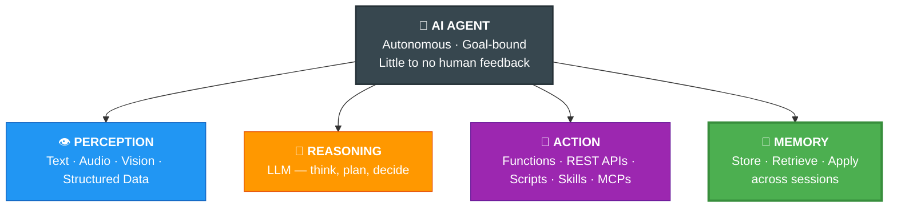
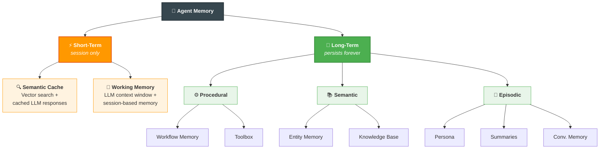
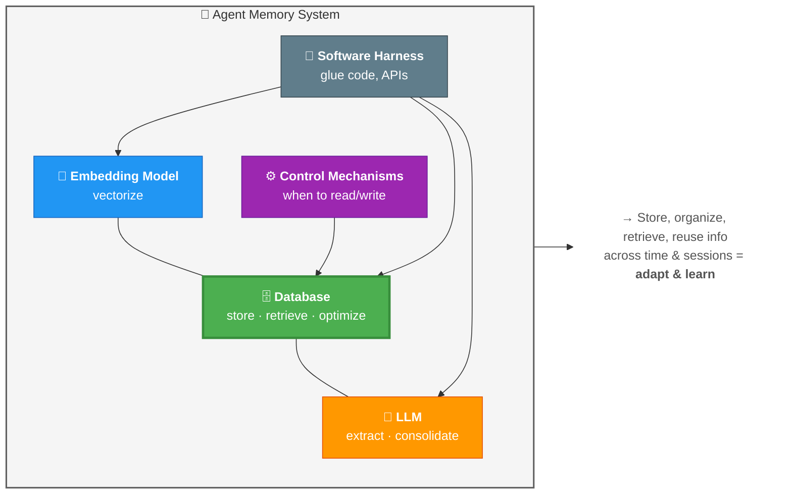
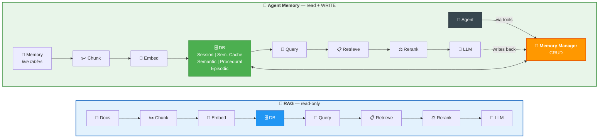

# 02 · Why AI Agents Need Memory 🤔


---

## 🎯 One Line
> An agent without memory is a genius with amnesia — brilliant per turn, useless over time.

---

## 🤖 What is an AI Agent?

**4 pillars — miss one and it's not really an agent:**



> 💡 Perception, Reasoning, Action = body. **Memory = soul** — iske bina agent 5 min pehle ka bhi bhool jaata hai.

---

## 🐟 Stateless vs 🧠 Memory-Augmented

**The Restaurant Problem (multi-turn interaction):**

| Turn | Who | 🐟 Stateless | 🧠 Memory-Augmented |
|------|-----|-------------|----------------------|
| **1** | 👤 | "Recommend Italian restaurants near me" | Same |
| **2** | 🤖 | Lists 3 options ✅ | Lists 3 options ✅ → **stores in external DB** |
| **3** | 👤 | "Book the first one for 7pm" | Same |
| **4** | 🤖 | ❌ *"I have no recollection. Please specify."* | ✅ Identifies #1 from memory, asks for date & time |

> 🐟 Goldfish brain — har turn fresh start. "First one" ka matlab samajh hi nahi aata!
> 🧠 Turns 1-2 DB mein save → turn 3-4 mein reference kar ke kaam done ✅

---

## ❌ Stateless Pain vs ✅ Memory Gains

| | ❌ Stateless Agent | ✅ Memory-Augmented Agent |
|--|-------------------|--------------------------|
| ⏳ **Long-horizon tasks** | Can't do (mins→hrs→days) — no memory of prev steps | ✅ Reference previous interactions & context |
| 🔄 **Cross-session context** | Every session = blank slate | ✅ Sustained — feels like continuous interaction |
| 📈 **Learning / Adaptation** | New info during convo = lost forever | ✅ Adapts from past interactions |
| 💰 **Operational cost** | Stuff EVERYTHING into context every turn 💸 | ✅ Retrieve only relevant context from external store |
| 🛡️ **Multi-step reliability** | No reference to prev steps = fragile | ✅ Reference prev steps + context = reliable outcomes |

---

## 💬 Conversational Memory (Simplest Form)

Going from stateless → memory-augmented starts with storing **interaction history** in an external store. This is the simplest form — **Conversational Memory**.

| Field | What's stored |
|-------|--------------|
| ⏰ Timestamp | When the interaction happened |
| 👤 User msg | What the human said |
| 🤖 Assistant msg | What the agent replied |

- Interactions = back & forth between user(s) and agent(s)/assistant(s)
- **Time-ordered** retrieval — sequence preserved
- Also called **Episodic Memory** (timestamp → time-based reference)

**How it enters the LLM context window:**

```
┌──────────────────────────────────────────────┐
│  📋 System Prompt + Instructions             │
├──────────────────────────────────────────────┤
│  💬 Conversational Memory (time-ordered)     │
│    [t1] User: ...  Assistant: ...            │  ← retrieved from
│    [t2] User: ...  Assistant: ...            │    external store
│    [t3] User: ...  Assistant: ...            │
├──────────────────────────────────────────────┤
│  🎤 Current User Prompt                     │
└──────────────────────────────────────────────┘
         ↓ all of this → LLM context window
```

---

## 🚫 Why Conversational Memory Isn't Enough

| # | Limitation | Why it hurts |
|---|-----------|--------------|
| 1 | 📏 **Context windows are finite, user relationships are not** | More relationships exist beyond what fits in the window |
| 2 | 👤 **Entities not explicitly captured** | People, places, relationships — buried in chat, not extracted |
| 3 | 📦 **Not all valuable info lives in conversations** | Workflow steps, tool outcomes — useful but not in chat |
| 4 | 🔍 **Agents need structured, queryable knowledge** | Chat logs ≠ searchable knowledge — just raw dumps |

---

## 🗺️ Memory Taxonomy (The Big Picture)



**Cheat sheet:**

| Type | ⏱ | What it stores | Example |
|------|---|---------------|---------|
| 🔍 **Semantic Cache** | Short | Vector search + cached LLM responses for similar queries | "Weather in Delhi?" → reuse cached response |
| 📝 **Working Memory** | Short | LLM context window + session-based memory (scratchpad) | Chain-of-thought, intermediate results. **Lost after session.** |
| ⚙️ **Procedural** | Long | **Workflow** memory (steps taken) + **Toolbox** (tool configs) | "Called API A → parsed → triggered B" |
| 📚 **Semantic** | Long | **Entity Memory** + **Knowledge Base** (domain knowledge) | "Ayush works at SAP", "Kafka uses partitions" |
| 📖 **Episodic** | Long | **Persona** + **Summaries** + **Conversational** memory | Past interactions, behavioral patterns |

> 💡 Short-term = RAM (gone when you shut down). Long-term = hard disk (survives reboots). Bas yehi farak hai! 💾

---

## 🏗️ What IS Agent Memory?

Not just a database. It's a **system** of parts working together:



---

## 🔗 RAG → Agent Memory Connection

**Same pipeline, upgraded purpose.** If you understand RAG, you understand 80% of agent memory.



| | 📖 RAG | 🧠 Agent Memory |
|--|--------|-----------------|
| **Data** | Static knowledge base (docs) | **Live memory tables** (entities, workflows, convos) |
| **Ops** | Read-only | **CRUD** (Create, Read, Update, Delete) |
| **Abstraction** | Direct DB query | **Memory Manager** abstracts all ops |
| **Agent access** | Via retrieval | Via **tools** connected to Memory Manager |

> RAG = library (read only). Agent Memory = living notebook (read + write + cross out). Memory Manager = the librarian doing CRUD. 📚✏️

---

## 🏛️ Agent Memory Core = The Database

Memory exists in 3 system components. But one sees the **most traffic**:

| Component | Has memory? | Why NOT the core? |
|-----------|-------------|-------------------|
| 🤖 **LLM** | ✅ Parametric (training data) | Frozen after training — **can't update** |
| 🔢 **Embedding Model** | ✅ Learned semantic representations | Draws semantic & context info when generating embeddings, but not where data is stored/retrieved |
| 🗄️ **Database** | ✅ All stored data | **✅ THE CORE — ALL data traffic: storage, retrieval, optimization** |

> **Agent Memory Core** = the primary infrastructure seeing the most data traffic in your agentic system. That's the database.

> 💡 LLM soochta hai, DB yaad rakhta hai. Yaad rakhne waala zyada important hai! 📓

---

## 🧪 Quick Check

<details>
<summary>❓ What are the 4 pillars of an AI agent?</summary>

**Perception** (inputs) · **Action** (tools) · **Reasoning** (LLM) · **Memory** (store/retrieve/apply)

Agent operates: independently, little to no feedback, goal & objective bound.
</details>

<details>
<summary>❓ In the restaurant scenario, why does the stateless agent fail at Turn 4?</summary>

User asks "book the first one" in Turn 3, but the agent has **zero recollection** of Turns 1-2. No memory = "I have no recollection, please specify."

Memory-augmented agent stores Turns 1-2 in external DB → resolves "first one" easily.
</details>

<details>
<summary>❓ Why isn't conversational memory enough?</summary>

4 gaps: finite context windows, no entity extraction, misses non-chat info (workflows, outcomes), not queryable/structured.

> Sirf diary se kaam nahi chalta — contacts, to-do, KB bhi chahiye! 📋
</details>

<details>
<summary>❓ Name the 5 memory types in the taxonomy</summary>

**Short-term:** Semantic Cache · Working Memory
**Long-term:** Procedural · Semantic · Episodic

> RAM vs Hard Disk 💾
</details>

<details>
<summary>❓ RAG vs Agent Memory?</summary>

Same pipeline! But RAG = **read-only** from static docs. Agent Memory = **CRUD** on live tables via Memory Manager. Agent accesses it through tools.
</details>

<details>
<summary>❓ Why is the DATABASE the agent memory core?</summary>

LLM = parametric, frozen. Embedding model = not the bottleneck. **Database sees ALL data traffic** — storage, retrieval, optimization. Primary infrastructure.
</details>

---

> **← Prev:** [Introduction](01-introduction.md) | **Next →** [Memory Manager](03-memory-manager.md)
