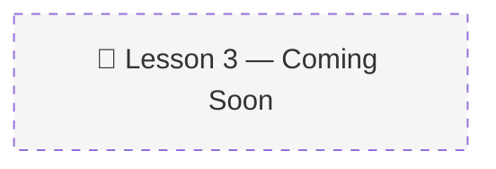

# 03 · Constructing The Memory Manager 🏗️

> 📚 Source: DeepLearning.AI × Oracle — "Agent Memory: Building Memory-Aware Agents" (Lesson 3)
> 🔴 Placeholder — pending course completion
> 
> Confidence tags: ✅ Direct from source | 🔍 Web-verified | 💡 Analogy | ⚠️ My interpretation

---

## 🎯 One Line
> _To be filled after watching Lesson 3 (22 min, code lab)_

---

## 🖼️ The Picture

---

> **← Prev:** [Why AI Agents Need Memory](02-why-agents-need-memory.md) | **Next →** [Semantic Tool Memory](04-semantic-tool-memory.md)
