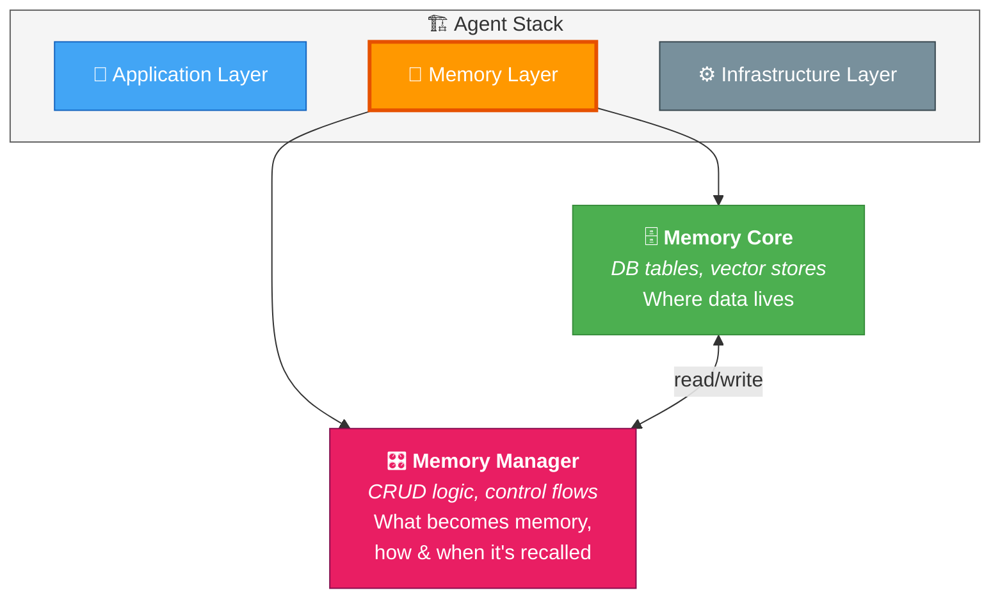
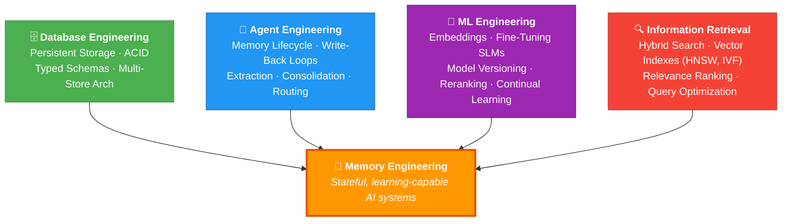
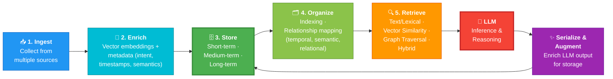
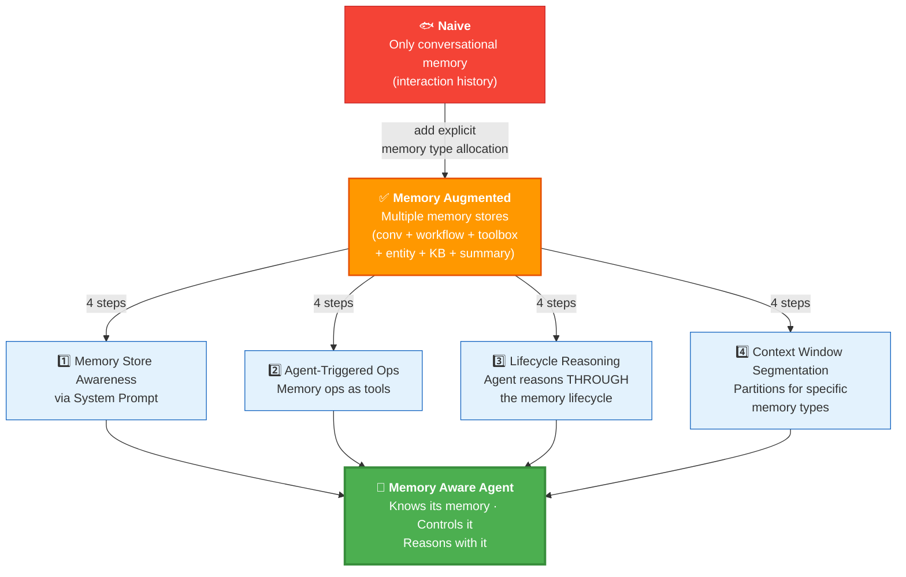

# 03 · Constructing The Memory Manager 🏗️


---

## 🎯 One Line
> The Memory Manager is the **CRUD librarian** sitting between your agent and the database — it decides what becomes memory, how it's structured, and when it's recalled.

---

## 📚 What This Lesson Covers

| # | Topic | Type |
|---|-------|------|
| 1 | Agent Stack & where Memory Layer fits | 📖 Concept |
| 2 | Memory Manager = abstraction on DB | 📖 Concept |
| 3 | Memory Operations (CRUD per memory type) | 📖 Concept |
| 4 | Deterministic vs Agent-Triggered ops | 📖 Concept |
| 5 | Key Terms: Memory Unit, Context Eng, Memory Eng | 📖 Concept |
| 6 | Memory Lifecycle (the continuous loop) | 📖 Concept |
| 7 | Memory Augmented → Memory Aware Agent | 📖 Concept |
| 8 | Code Lab: Build DB + StoreManager + MemoryManager | 💻 Hands-on |

---

## 🏗️ The Modern Agent Stack

A **layered composition of tools and technologies** forming a system architecture that enables an AI agent.

```
┌─────────────────────────────────────┐
│         Application Layer           │  ← UI, chat interfaces
├─────────────────────────────────────┤
│     Gateway and Connectivity        │
├─────────────────────────────────────┤
│          Orchestration              │
├─────────────────────────────────────┤
│           Reasoning                 │  ← LLM lives here
├─────────────────────────────────────┤
│            Tooling                  │
├─────────────────────────────────────┤
│      Data Layer → MEMORY LAYER      │  ← 🧠 WE FOCUS HERE
├─────────────────────────────────────┤
│    Governance and Reliability       │
├─────────────────────────────────────┤
│         Infrastructure              │  ← DB, compute, cloud
└─────────────────────────────────────┘
```

> 💡 For an agentic perspective, swap "Data Layer" for **Memory Layer** — same position, different mindset. Data = passive storage. Memory = active, queryable, evolving knowledge.

### Compressed View (3 Layers for This Course)

| Layer | What |
|-------|------|
| **Application** | UI, APIs, chat — what users see |
| **Memory** | Memory Core + Memory Manager — what agents *remember* |
| **Infrastructure** | Database, compute, cloud — where memory physically lives |

---

## 🧠 Memory Layer = Memory Core + Memory Manager



> **Memory Core** = the actual DB tables (covered in L02)
> **Memory Manager** = the **control logic** — what becomes memory, how it's structured, how it's updated, when it's recalled during execution

Together they create **memory-augmented agents** that can:
- Handle **continuous tasks** (multi-session)
- Operate on **long-horizon tasks** (hours → days)
- **Adapt and learn** from new information

> 💡 Memory Core = almaari (cupboard). Memory Manager = the person who organizes & retrieves stuff from it. Without the manager, you just have a pile of junk! 🗄️

---

## ⚙️ Common Memory Operations

The Memory Manager holds CRUD methods for EACH memory type stored in the DB.

### 📖 What Each Memory Type Actually Is

| Memory Type | One-Liner | What Gets Stored | Example |
|---|---|---|---|
| 💬 **Conversational** | Chat history per thread | `role`, `content`, `timestamp` per message | `[user] "Book the first one for 7pm"` |
| 📚 **Knowledge Base** | Domain knowledge & facts | Documents, papers, reference material + vector embeddings | arXiv papers, product docs, wiki articles |
| ⚙️ **Workflow** | "How did I do this before?" | Steps taken + outcome (success/fail) for a task | `Query → arXiv search → filter → summarize → ✅` |
| 🔧 **Toolbox** | Available tools & capabilities | Tool name, description, parameters, signature | `search_arxiv(query, k=5) → "Search arXiv papers..."` |
| 👤 **Entity** | People, places, systems mentioned | Name, type (PERSON/PLACE/SYSTEM), description | `Dr. Sarah Chen (PERSON): MIT, efficient attention` |
| 📝 **Summary** | Compressed older conversations | Condensed context when chat history gets too long | 30 messages → 1 paragraph summary + summary_id |
| 📋 **Tool Log** | Raw tool execution audit trail | Tool name, args, result, status, timestamp | `search_arxiv({query:"flash"}) → 5 results (success)` |

> 💡 **Workflow vs Tool Log:** Workflow = "what strategy worked" (reusable patterns). Tool Log = "what exactly happened" (raw audit). Recipe vs kitchen CCTV! 🍳📹

### CRUD Per Memory Type

| Memory Type | Storage | Write Method | Read Method |
|-------------|---------|-------------|-------------|
| **Conversational** | SQL Table | `write_conv_mem()` | `read_conv_mem()` |
| **Knowledge Base** | Vector Store | `write_knowledge_base()` | `read_knowledge_base()` |
| **Workflow** | Vector Store | `write_workflow()` | `read_workflow()` |
| **Toolbox** | Vector Store | `write_toolbox()` | `read_toolbox()` |
| **Entity** | Vector Store | `write_entity()` | `read_entity()` |
| **Summary** | Vector Store | `write_summary()` | `read_summary()` |
| **Persona** | Vector Store | `write_persona()` | `read_persona()` |

**Why two storage types?**

| Storage | Used for | Why |
|---------|----------|-----|
| **SQL Table** | Conversational, Tool Log | Exact match by `thread_id`, chronological ordering — no semantic search needed |
| **Vector Store** | Everything else | **Semantic similarity search** — find relevant content by meaning, not exact keywords |

> 💡 SQL = "give me exact match on thread_id." Vector = "find me stuff *similar to* this query." Different tools for different jobs! 🔧

---

## 🎯 Deterministic vs Agent-Triggered Operations

```
                   Memory Operations
                  ╱                  ╲
      ┌──────────────────┐   ┌──────────────────┐
      │   DETERMINISTIC  │   │  AGENT-TRIGGERED  │
      │                  │   │                   │
      │  Runs ALWAYS —   │   │  Agent DECIDES    │
      │  fixed schedule  │   │  when to invoke   │
      │  or predefined   │   │  based on real-   │
      │  conditions      │   │  time judgment    │
      └──────────────────┘   └──────────────────┘
```

| Operation | Deterministic | Agent-Triggered |
|-----------|:---:|:---:|
| `read_conversational_memory()` | ✅ | ❌ |
| `read_knowledge_base()` | ✅ | ❌ |
| `read_workflow()` | ✅ | ❌ |
| `read_entity()` | ✅ | ❌ |
| `write_conversational_memory()` | ✅ | ❌ |
| `write_workflow()` | ✅ | ❌ |
| `read_summary_context()` | ❌ | ✅ |
| `write_entity()` | ❌ | ✅ |
| `search_tavily()` | ❌ | ✅ |
| `expand_summary()` | ❌ | ✅ |
| `summarize_and_store()` | ❌ | ✅ |
| `read_toolbox()` | ✅ | ✅ |

### Why Deterministic?

**For Retrieval (reads):**
1. **Context bootstrapping is non-negotiable** — agent needs prior context to stay consistent
2. **Chicken-and-egg problem** — agent can't decide to look up what it doesn't know exists. You need memory to know which memory you need!
3. **Predictability** — always loading memory = consistent, debuggable behavior

**For Storage (writes):**
1. **Reliability** — don't want agent to "forget to save" important info
2. **Completeness** — every interaction recorded, no gaps
3. **Reduced cognitive load** — model focuses on task, not bookkeeping

### Why Agent-Triggered?

1. **Not everything deserves storage** — agent distinguishes signal from noise
2. **Cost & latency control** — deep retrieval, summarization cost tokens/time
3. **Higher quality memory** — decisions about *what to store* require semantic understanding

> 💡 Deterministic = alarm clock ⏰ (goes off no matter what). Agent-triggered = "I should probably check..." 🤔 (judgment call)

---

## 📐 Key Terms

### 1. Memory Unit

> The **smallest atomic piece** of stored information, represented with a minimal set of attributes so it can be captured, retrieved, and updated by a memory-augmented agent.

**Two examples:**

| | Conversational Memory Unit | Workflow Memory Unit |
|--|---|---|
| **Structure** | JSON object | DB row with vector |
| **Key fields** | `content`, `role`, `timestamp` | `content` (CLOB), `type` (VARCHAR2), `timestamp`, `vector` (float[]) |
| **Data types** | String, string, datetime | CLOB, VARCHAR2, TIMESTAMP, VECTOR |
| **Example** | `{"content": "User prefers concise responses", "role": "user", "timestamp": "2026-01-18T10:15:00Z"}` | `Tool call: db.query({collection: "contracts"}) → result: 12 records (success)` |

### 2. Context Engineering

> The practice of **optimally selecting and shaping** information placed into an LLM context window so it can perform a task reliably — while explicitly accounting for context window limits and model constraints.

```
┌─ Data Sources ──────┐     ┌─ Optimally Selected ─┐     ┌─ Context Window ───────────┐
│  🗄️ API             │     │                      │     │  System Instructions       │
│  ⚙️ MCP             │ ──► │  Filter & curate     │ ──► │  Knowledge Base Docs       │
│  🌐 Knowledge Graph │     │  what goes IN         │     │  Tools  Tools  Tools       │
│  📄 Documents       │     └──────────────────────┘     │  Entity Mem | Workflow Mem │
└─────────────────────┘                                   │  Conversational Memory     │
                                                          │  User Prompt               │
                                                          └────────────────────────────┘
```

**Goal:** Maximize the **signal-to-noise ratio** of every token. Don't stuff everything — curate what matters.

> 💡 Context window = exam paper. Context engineering = choosing which cheat sheets to bring. Sab mat laao, sirf relevant laao! 📝

### 3. Memory Engineering

> The **engineering discipline** focused on designing, building, and maintaining memory systems for AI agents. It encompasses storage, retrieval, classification, and lifecycle management of agent memory.

**Memory Engineering = intersection of 4 existing disciplines:**



> 💡 Nothing new here — just existing disciplines combined for a specific purpose: **stateful, learning-capable AI systems**.

---

## 🔄 Memory Lifecycle

The continuous loop that makes an agent **learn over time**:



**Key insight:** LLM **output** can also become new memory → goes through Serialization → Augmentation → back into Storage → Organization → Retrieval → LLM again. **Continuous learning cycle!**

> 💡 It's a circular conveyor belt 🔄 — data goes in, gets enriched, stored, organized, retrieved, processed by LLM, and LLM's output feeds BACK into the belt!

---

## 🚀 Memory Augmented → Memory Aware Agent

The **evolution path** from basic to fully memory-aware:



| Level | What it has | What it adds |
|-------|------------|-------------|
| **Naive** | Only chat history | — |
| **Memory Augmented** | Multiple memory stores | Explicit type allocation (workflow, entity, KB, toolbox, etc.) |
| **Memory Aware** | All of above + self-aware | 1) System prompt awareness 2) Mem ops as tools 3) Lifecycle reasoning 4) Context window segmentation |

> 💡 Augmented = agent HAS memory. Aware = agent KNOWS it has memory and decides how to use it. Difference = awareness + autonomy! 🧠

---

## 💻 Code Lab: Building It All

> 📂 See `code/L3/L3.ipynb` for the full implementation

### Part 1: Setup — DB + Embedding + Tables

**Step 1: Oracle AI Database 26ai**
```python
database_connection = connect_to_oracle(
    user="VECTOR", password="VectorPwd_2025",
    dsn="127.0.0.1:1521/FREEPDB1"
)
```

**Step 2: Embedding Model**
```python
from langchain_huggingface import HuggingFaceEmbeddings
embedding_model = HuggingFaceEmbeddings(
    model_name="sentence-transformers/paraphrase-mpnet-base-v2"
)
```

**Step 3: Define Table Names (7 memory types)**
```python
CONVERSATIONAL_TABLE = "CONVERSATIONAL_MEMORY"  # SQL
KNOWLEDGE_BASE_TABLE = "SEMANTIC_MEMORY"        # Vector
WORKFLOW_TABLE       = "WORKFLOW_MEMORY"         # Vector
TOOLBOX_TABLE        = "TOOLBOX_MEMORY"          # Vector
ENTITY_TABLE         = "ENTITY_MEMORY"           # Vector
SUMMARY_TABLE        = "SUMMARY_MEMORY"          # Vector
TOOL_LOG_TABLE       = "TOOL_LOG_MEMORY"         # SQL
```

**Step 4: Create SQL Tables** (Conversational + Tool Log)

The conversational history table schema:

| Column | Type | Purpose |
|--------|------|---------|
| `id` | VARCHAR2 (GUID) | Primary key |
| `thread_id` | VARCHAR2 | Group conversations |
| `role` | VARCHAR2 | user / assistant |
| `content` | CLOB | Message text |
| `timestamp` | TIMESTAMP | When it happened |
| `metadata` | CLOB | Extra JSON data |
| `created_at` | TIMESTAMP | Row creation time |
| `summary_id` | VARCHAR2 | Links to summary (for later) |

**Indexes created on:** `thread_id` (fast lookup) + `timestamp` (chronological ordering)

> 💡 `summary_id` is interesting — it's NULL by default, gets filled when messages are summarized. More on this in L05!

### Part 2: StoreManager — Vector Stores

The `StoreManager` class abstracts creation of ALL vector stores:

```python
store_manager = StoreManager(
    client=database_connection,
    embedding_function=embedding_model,
    table_names={
        'knowledge_base': KNOWLEDGE_BASE_TABLE,
        'workflow': WORKFLOW_TABLE,
        'toolbox': TOOLBOX_TABLE,
        'entity': ENTITY_TABLE,
        'summary': SUMMARY_TABLE,
    },
    distance_strategy=DistanceStrategy.COSINE,
    conversational_table=CONVERSATION_HISTORY_TABLE,
    tool_log_table=TOOL_LOG_HISTORY_TABLE,
)
```

**What's inside:** Uses `OracleVS` (LangChain Oracle integration) for each vector store. Distance strategy = **COSINE** (measures angle between vectors in high-dimensional space).

**Gets instances via getters:**
```python
knowledge_base_vs = store_manager.get_knowledge_base_store()
workflow_vs       = store_manager.get_workflow_store()
# ... etc
```

**Vector indexes** created on all stores using `safe_create_index()` — **IVF** (Inverted File Index) strategy with 95% target accuracy. Indexes = fast retrieval without scanning all rows.

> 💡 Without indexes, searching = reading every row in DB. With indexes = skip straight to relevant rows. Like a book index vs reading every page! 📖

### Part 3: MemoryManager — The Unified CRUD Interface

```python
memory_manager = MemoryManager(
    conn=database_connection,
    conversation_table=CONVERSATION_HISTORY_TABLE,
    knowledge_base_vs=knowledge_base_vs,
    workflow_vs=workflow_vs,
    toolbox_vs=toolbox_vs,
    entity_vs=entity_vs,
    summary_vs=summary_vs,
    tool_log_table=TOOL_LOG_HISTORY_TABLE
)
```

**One class → unified read/write for ALL 7 memory types.** Agent doesn't care about SQL vs Vector — it just calls `memory_manager.write_knowledge_base()` or `memory_manager.read_entity()`.

### Part 4: Using It — Write & Read Knowledge Base

**Write:** Ingest arXiv papers from HuggingFace → extract title, abstract, subjects, submission_date → concatenate → `memory_manager.write_knowledge_base(text, metadata)`

What happens under the hood:
1. Text → **vector embedding** created
2. Embedding + metadata → stored in vector store table
3. Now **semantically searchable**!

**Read:**
```python
results = memory_manager.read_knowledge_base(query="space exploration")
```

Returns: formatted string with memory type info + retrieved passages semantically similar to the query. Includes instructions for the LLM on **how to use this memory**.

> 💡 This is what makes it "memory aware" — the returned data tells the LLM "this is Knowledge Base Memory, ground your responses in these passages." The agent KNOWS what kind of memory it's looking at!

---

## 🔑 Key Takeaways

| # | Takeaway |
|---|---------|
| 1 | **Agent Stack** = layered architecture. Memory Layer = Memory Core + Memory Manager |
| 2 | **Memory Manager** = abstraction on DB with CRUD for each memory type |
| 3 | **SQL** for exact-match (conversations), **Vector Store** for semantic search (everything else) |
| 4 | **Deterministic** ops = always run (reliable). **Agent-triggered** = judgment call (flexible) |
| 5 | **Memory Unit** = smallest atomic info piece. **Context Eng** = curate what enters context window. **Memory Eng** = build & maintain memory systems |
| 6 | **Memory Lifecycle** = ingest → enrich → store → organize → retrieve → LLM → serialize → back to store (continuous loop!) |
| 7 | **Memory Aware > Memory Augmented** — aware agents KNOW their memory, control it via tools, reason through lifecycle, segment context window |
| 8 | In code: `StoreManager` creates stores, `MemoryManager` provides unified CRUD, both use Oracle AI DB + LangChain |

---

## 🧪 Quick Check

<details>
<summary>❓ What is a Memory Manager?</summary>

An **abstraction on the database** with control logic that decides what becomes memory, how it's structured, how it's updated, and when it should be recalled during execution. Provides CRUD methods for each memory type.
</details>

<details>
<summary>❓ Why does conversational memory use SQL tables instead of vector stores?</summary>

Conversational memory needs **exact match** by `thread_id` and chronological ordering by `timestamp` — no semantic similarity needed. SQL is faster and simpler for this. Vector stores are for semantic search (find similar content by meaning).
</details>

<details>
<summary>❓ Deterministic vs Agent-Triggered — which is better?</summary>

Neither — they complement each other!
- **Deterministic** = reliability (always load context, always save conversations — no gaps)
- **Agent-triggered** = flexibility (summarize when needed, extract entities when relevant — less noise)

> Auto-save ⏰ vs "let me think if I should save this" 🤔
</details>

<details>
<summary>❓ What's the chicken-and-egg problem with agent-triggered retrieval?</summary>

If the agent must DECIDE whether to check memory, it needs to know what's stored. But to know what's stored, it needs to check memory first! **You need memory to know which memory you need.** That's why deterministic retrieval at start of every turn makes sense.
</details>

<details>
<summary>❓ What are the 4 steps from Memory Augmented → Memory Aware?</summary>

1. **Memory store awareness** via system prompt (agent knows its stores exist)
2. **Agent-triggered memory operations** (mem ops given as tools)
3. **Memory lifecycle reasoning** (agent reasons through the cycle)
4. **Context window segmentation** (partitions allocated for specific memory types)
</details>

<details>
<summary>❓ What's the Memory Lifecycle loop?</summary>

Raw Data → **Ingest** → **Enrich** (embeddings + metadata) → **Store** (short/medium/long term) → **Organize** (index, map relationships) → **Retrieve** (text/vector/graph/hybrid) → **LLM** (inference) → **Serialize & Augment** output → back to **Store** → loop!

> Conveyor belt jo kabhi nahi rukta 🔄
</details>

<details>
<summary>❓ What 4 disciplines make up Memory Engineering?</summary>

1. **Database Engineering** — ACID, persistent storage, multi-store arch
2. **Agent Engineering** — lifecycle, write-back loops, extraction
3. **ML Engineering** — embeddings, fine-tuning, reranking, continual learning
4. **Information Retrieval** — hybrid search, vector indexes, query optimization

Nothing new — just an intersection! 🔀
</details>

---

> **← Prev:** [Why Agents Need Memory](02-why-agents-need-memory.md) | **Next →** [Semantic Tool Memory](04-semantic-tool-memory.md)
