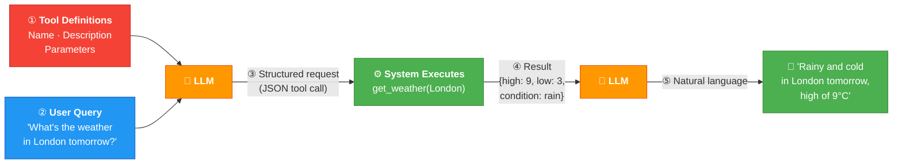
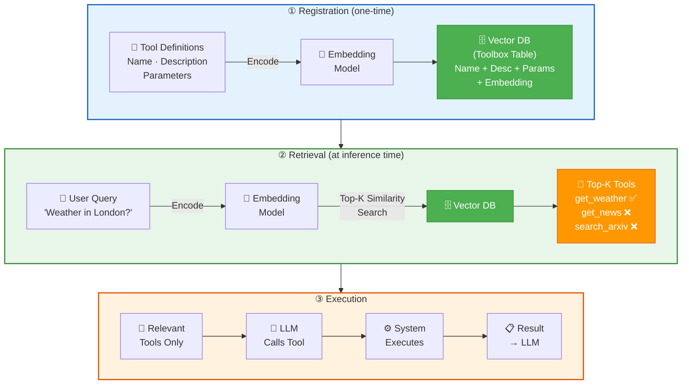
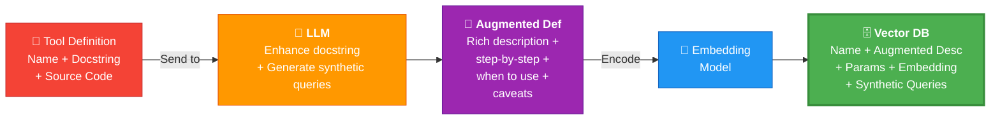

# 04 · Semantic Tool Memory 🔧

> ✅ Direct from course transcript + lecture slides + code lab (L4.ipynb)

---

## 🎯 One Line
> When you have 100+ tools, don't stuff them ALL into the prompt — **store them as searchable memory** and retrieve only the relevant ones via semantic search.

---

## 📚 What This Lesson Covers

| # | Topic | Type |
|---|-------|------|
| 1 | How LLMs use tools (Tool Calling pattern) | 📖 Concept |
| 2 | Why stuffing all tools fails at scale | 📖 Concept |
| 3 | Solution: Semantic Tool Retrieval (Toolbox Pattern) | 📖 Concept |
| 4 | Memory Unit Augmentation (LLM-enhanced tool defs) | 📖 Concept |
| 5 | Code Lab: Toolbox class, register tools, search, augment | 💻 Hands-on |

---

## 🔧 Tool Calling — How LLMs Use Tools

> **Tool calling** = a pattern where the LLM **doesn't execute code directly**. Instead, it outputs a **structured request** (JSON), the environment executes it, and returns the result to the LLM.



**Key:** LLM sees tool definitions (name, description, parameters) → decides WHICH tool to call → outputs structured JSON → system executes → result fed back → LLM generates final response.

> 💡 LLM = the brain that DECIDES. System = the hands that DO. LLM code nahi chalata, sirf bolta hai "yeh karo" 🧠→🤲

---

## ❌ The Problem: Too Many Tools

Model providers support ~100+ tools in theory, but recommend **~5–20 in practice**. Why?

```
┌────────────────────────────────────┐
│  Context Window                    │
│  ┌──────────────────────────────┐  │
│  │  System Instructions         │  │
│  ├──────────────────────────────┤  │
│  │  Knowledge Base Docs         │  │
│  ├──────────────────────────────┤  │
│  │  ┌──────┐ ┌──────┐ ┌──────┐ │  │  ← Tools eating up
│  │  │ Tool │ │ Tool │ │ Tool │ │  │    all the space!
│  │  │      │ │      │ │      │ │  │
│  │  └──────┘ └──────┘ └──────┘ │  │
│  ├──────────────────────────────┤  │
│  │  Conversational Memory       │  │
│  ├──────────────────────────────┤  │
│  │  User Prompt                 │  │
│  └──────────────────────────────┘  │
└────────────────────────────────────┘
```

### 6 Ways Too Many Tools Break Your Agent

| # | Problem | What Happens |
|---|---------|-------------|
| 1 | 🌊 **Context Confusion** | LLM gets overwhelmed by too much tool info — less room for actual content |
| 2 | 📦 **Context Bloat** | Tool definitions consume tokens, leaving less for input/output |
| 3 | 📉 **Tool Selection Degradation** | LLM picks wrong tools when there are too many choices |
| 4 | 💸 **High Token Cost** | More tool definitions = more tokens = more $$ per request |
| 5 | 🐌 **Latency Increase** | LLM takes longer to process all that extra info |
| 6 | 📉 **Performance Degradation** | Overall agent quality drops |

> 💡 100 tools context mein daaloge toh LLM confuse ho jaayega — jaise kisi ko ek saath 100 menu cards de do aur bolo "order karo!" 😵‍💫

---

## ✅ The Solution: Semantic Tool Retrieval (Toolbox Pattern)

Instead of stuffing all tools into the prompt → **store tools in a vector DB** and **retrieve only the relevant ones** at inference time.



### The 7-Step Flow

| Step | What happens |
|------|-------------|
| ① | **Tool Definitions** (name, description, parameters) are collected |
| ② | Each tool is **encoded** through an embedding model → vector created |
| ③ | Tool + embedding → **loaded into vector DB** (Toolbox table) |
| ④ | At runtime, **user query** is also encoded → vector |
| ⑤ | **Top-K similarity search** finds tools closest to the query in embedding space |
| ⑥ | LLM receives **only the relevant tools** → calls the best one |
| ⑦ | System executes → result returned to LLM |

> 💡 Instead of giving the LLM a phone book of 100 tools → you give it a smart search bar. "Kya chahiye?" → top 3 results. Done! 🔍

---

## ✨ Memory Unit Augmentation (The Secret Sauce)

Basic semantic search on tool names/descriptions works, but we can do **much better** with LLM-enhanced tool definitions.

### Without vs With Augmentation

| | Without Augmentation | With Augmentation |
|--|---|---|
| **What's embedded** | Original docstring (often 1 line) | LLM-enhanced description (detailed, step-by-step) |
| **Example** | `"Search the web and store results"` | `"1. Accepts a query string. 2. Calls Tavily API. 3. Iterates results. 4. Writes each to knowledge base with metadata (title, URL, score, timestamp). Returns raw result list. Use when you need external web information not in existing memory."` |
| **Embedding quality** | Low signal — vague | High signal — specific, detailed |
| **Search results** | Tools may overlap, hard to distinguish | Better **separability** between tools in embedding space |
| **Recall** | Lower — query might not match vague description | Higher — richer text catches more query variations |

### How Augmentation Works



**What the LLM generates:**
1. **Augmented docstring** — detailed description, step-by-step, when to call, caveats
2. **Synthetic queries** — example user queries that would trigger this tool (improves recall)

**Result:** In embedding space, tools are **more spread out** (better separability) → similarity search returns the RIGHT tool more often.

> 💡 Without augmentation = all tools bunched together in embedding space (confusing). With augmentation = each tool has a unique "fingerprint" → easy to find! 🎯

---

## 💻 Code Lab: Building the Toolbox

> 📂 See `code/L4/L4.ipynb` for the full implementation

### Setup (same as L3)

Same stack reused: Oracle AI DB → embedding model → StoreManager → MemoryManager. Plus now: **OpenAI client** (for augmentation) + **Toolbox class**.

### Part 1: Initialize Toolbox

```python
from helper import MemoryManager, Toolbox

toolbox = Toolbox(memory_manager, client, embedding_model)
```

`Toolbox` takes: memory_manager (to store in toolbox vector store), LLM client (for augmentation), embedding model (for encoding).

### Part 2: Register Tools

**4 tools registered in this lab:**

| Tool | What it does | `augment=` |
|------|-------------|-----------|
| `read_toolbox` | Meta-tool: agent searches for more tools mid-execution | `True` |
| `search_tavily` | Web search via Tavily API → results saved to KB memory | `True` |
| `get_current_time` | Returns current datetime (local utility) | `True` |
| `arxiv_search_candidates` | Search arXiv → return JSON list of paper candidates | `False` |
| `fetch_and_save_paper_to_kb_db` | Download full arXiv paper → chunk → store in KB | `True` |

**Registration pattern:**
```python
@toolbox.register_tool(augment=True)
def search_tavily(query: str, max_results: int = 5):
    """Search the web and store results in knowledge base."""
    # ... implementation
```

What happens under the hood:
1. Extract function metadata (name, description, signature, parameters)
2. If `augment=True` → LLM enhances docstring + generates synthetic queries
3. Combine all text → create embedding
4. Store in toolbox vector store (Oracle DB)

### The Search-and-Store Pattern 🔄

`search_tavily` doesn't just return results — it **persists them to KB memory**:

```
Agent calls search_tavily("latest AI news")
       ↓
Tavily API returns results
       ↓
Each result → write to knowledge_base_vs (title, URL, score, timestamp)
       ↓
Future queries can retrieve this without searching again!
```

> 💡 Agent literally **learns from searching** — search once, remember forever. Ek baar Google karo, hamesha ke liye yaad! 🧠

### Part 3: Two Types of Tools

| Type | Example | Implementation |
|------|---------|---------------|
| **External/API** | `search_tavily`, `arxiv_search_candidates` | Calls third-party service |
| **Local/Python** | `get_current_time` | Uses local Python code (no API) |

Both registered the same way — the Toolbox doesn't care about the implementation, only the interface.

### Part 4: Test Semantic Retrieval

```python
tools = memory_manager.read_toolbox("Get more details on a paper on AI", k=1)
# Returns: fetch_and_save_paper_to_kb_db ✅
```

The query mentions "paper on AI" → semantic search finds `fetch_and_save_paper_to_kb_db` as the closest match. Agent dynamically discovers the right tool at runtime!

---

## 🔑 Key Takeaways

| # | Takeaway |
|---|---------|
| 1 | **Tool calling** = LLM outputs structured JSON request, system executes, result fed back |
| 2 | **Stuffing 100+ tools** into context → context bloat, tool selection degradation, high cost, latency |
| 3 | **Toolbox Pattern** = store tools in vector DB, retrieve top-K via semantic search at runtime |
| 4 | **Memory Unit Augmentation** = LLM enhances tool descriptions → better embedding separability → higher recall |
| 5 | **Search-and-store** pattern = tool results get persisted to KB → agent learns from its searches |
| 6 | **`read_toolbox`** = meta-tool letting the agent discover MORE tools mid-execution |
| 7 | Tools can be **external** (API calls) or **local** (Python code) — registered the same way |

---

## 🧪 Quick Check

<details>
<summary>❓ What is tool calling?</summary>

A pattern where the LLM **doesn't execute code directly** — it outputs a structured JSON request (function name + args), the **system/environment executes** it, and returns the result. LLM = brain, system = hands.
</details>

<details>
<summary>❓ Why can't you just put all tools in the context window?</summary>

6 problems: **Context Confusion** (overwhelmed), **Context Bloat** (tokens eaten by tool defs), **Tool Selection Degradation** (wrong tool picked), **High Token Cost** (💸), **Latency Increase** (🐌), **Performance Degradation** (📉).

Providers recommend ~5-20 tools max per call, not 100+.
</details>

<details>
<summary>❓ How does the Toolbox Pattern solve the scaling problem?</summary>

Store all tools in a **vector DB** with embeddings. At runtime, encode the user query → **top-K similarity search** → retrieve only the relevant tools → pass just those to the LLM.

100 tools in DB, but LLM only sees the best 3-5. Smart search bar instead of phone book! 🔍
</details>

<details>
<summary>❓ What is Memory Unit Augmentation?</summary>

Send tool definition + source code to an **LLM** → get back an enhanced, detailed docstring + synthetic example queries. This richer text creates **better embeddings** with higher separability in vector space = more accurate tool retrieval.

> Original: "Search the web." → Augmented: "1. Accepts query string. 2. Calls Tavily API. 3. Stores results in KB with metadata..." 
</details>

<details>
<summary>❓ What's the search-and-store pattern?</summary>

When a tool like `search_tavily` runs, it doesn't just return results — it **writes them to Knowledge Base memory**. Next time the agent needs similar info, it's already in memory. No API call needed.

> Ek baar search, hamesha yaad! 🧠
</details>

<details>
<summary>❓ What does `read_toolbox` do? Why is it special?</summary>

It's a **meta-tool** — a tool that searches for other tools! The agent can call it mid-execution when its current tools aren't enough. Like asking "what other capabilities do I have?" at runtime.
</details>

---

> **← Prev:** [Memory Manager](03-memory-manager.md) | **Next →** [Memory Operations](05-memory-operations.md)
