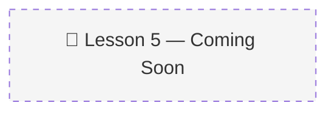

# 05 · Memory Operations: Extraction, Consolidation & Self-Updating Memory ⚙️

> 📚 Source: DeepLearning.AI × Oracle — "Agent Memory: Building Memory-Aware Agents" (Lesson 5)
> 🔴 Placeholder — pending course completion
> 
> Confidence tags: ✅ Direct from source | 🔍 Web-verified | 💡 Analogy | ⚠️ My interpretation

---

## 🎯 One Line
> _To be filled after watching Lesson 5 (23 min, code lab)_

---

## 🖼️ The Picture

---

> **← Prev:** [Semantic Tool Memory](04-semantic-tool-memory.md) | **Next →** [Memory Aware Agent](06-memory-aware-agent.md)
