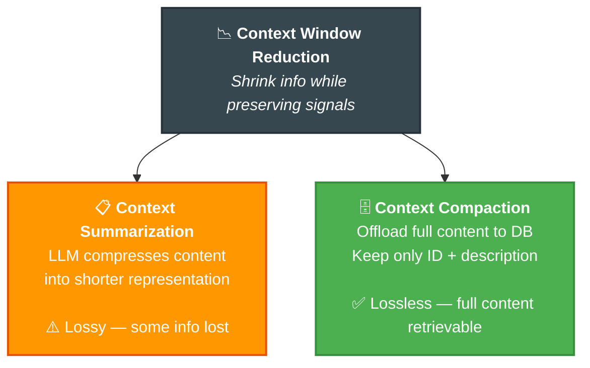
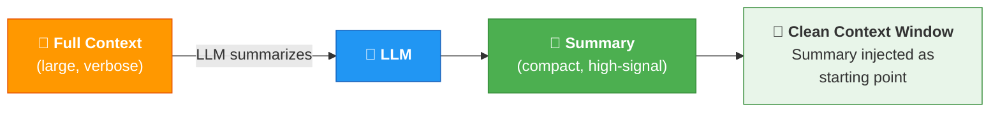
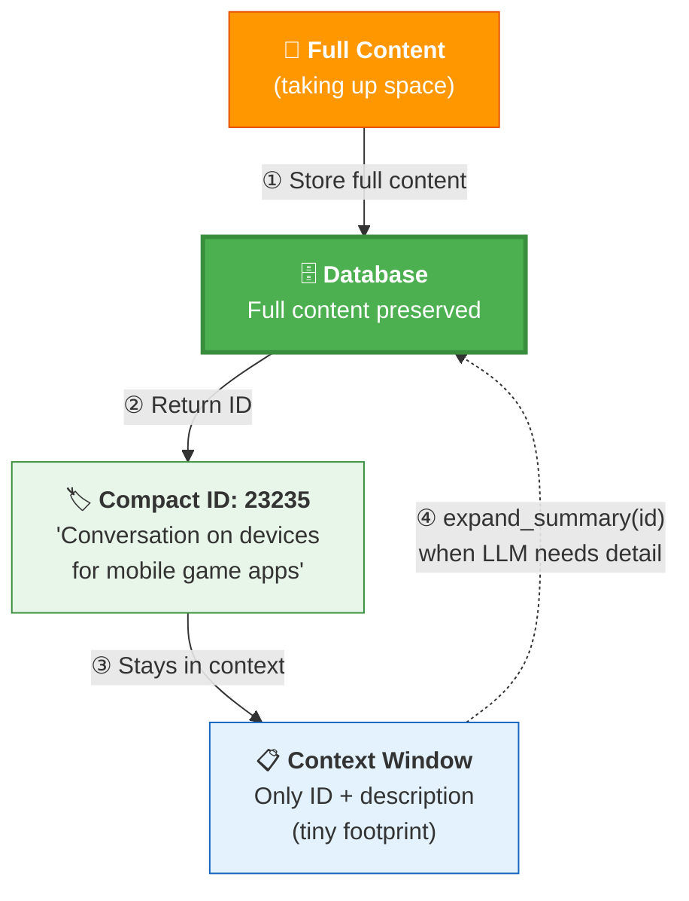
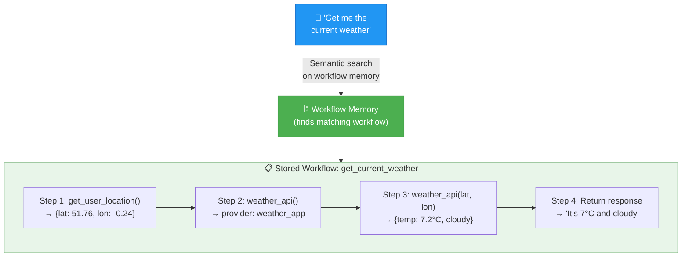

# 05 · Memory Operations ⚙️


---

## 🎯 One Line
> When your context window fills up, you have two weapons: **Summarization** (compress it) and **Compaction** (offload it to DB). Plus: Workflow Memory gives your agent a reusable playbook.

---

## 📚 What This Lesson Covers

| # | Topic | Type |
|---|-------|------|
| 1 | Context Engineering (recap + deeper) | 📖 Concept |
| 2 | Context Window Reduction — two techniques | 📖 Concept |
| 3 | Context Summarization (lossy compression) | 📖 Concept |
| 4 | Context Compaction (offload to DB) | 📖 Concept |
| 5 | Workflow Memory (reusable step sequences) | 📖 Concept |
| 6 | Code Lab: summarize, compact, expand, monitor | 💻 Hands-on |

---

## 🧠 Context Engineering (Recap)

> The practice of **optimally selecting and shaping** information placed into an LLM context window so it can perform a task reliably — while accounting for context window limits.

```
┌─ Data Sources ──────┐     ┌─ Optimally Selected ─┐     ┌─ Context Window ───────────┐
│  🗄️ Databases       │     │                      │     │  System Instructions       │
│  🔌 APIs            │ ──► │  Filter & curate     │ ──► │  Knowledge Base Docs       │
│  ⚙️ MCP Servers     │     │  what goes IN         │     │  Tools  Tools  Tools       │
│  🌐 Internet        │     └──────────────────────┘     │  Entity Mem | Workflow Mem │
└─────────────────────┘                                   │  Conversational Memory     │
                                                          │  User Prompt               │
                                                          └────────────────────────────┘
```

**Goal:** Maximize **signal-to-noise ratio** per token. Don't stuff everything — curate.

> 💡 Exam mein sab kitaabein nahi le ja sakte — sirf relevant cheat sheets laao! 📝

---

## 📉 Context Window Reduction

**Problem:** More information exists than what fits in the context window. What do you do?

> **Context Window Reduction** = the process of **shrinking** the amount of information placed in an LLM's context window, by summarizing, compressing, deduplicating, or filtering content, while **preserving the signals needed** for the current task.



---

## 📋 Technique 1: Context Summarization

> Pass the full context through an LLM → get a **shorter representation** that retains the highest-signal information → inject this summary into a **clean context window**.

### How It Works



### The 3 Goals of Good Summarization

| # | Goal | What it means |
|---|------|--------------|
| 1 | 🎯 **Retain highest-signal info** | Keep task-relevant facts, claims, decisions. Remove low-value chatter. |
| 2 | 🔗 **Preserve meaning & relationships** | Who did what, why, results, caveats — don't lose the story's structure. |
| 3 | 🗑️ **Remove redundancy & noise** | Low-value details, repetitive content, off-topic tangents — gone. |

### ⚠️ The Catch: Summarization is LOSSY

Like compressing a JPEG — the image looks okay, but pixel-perfect detail is gone forever. You **always lose some information** in summarization.

> 💡 Summary = photo ka thumbnail. Looks fine from far, but zoom in karo toh detail missing! 📸

**Quality depends heavily on the prompt** you use for summarization. Better prompt = less information loss.

---

## 🗄️ Technique 2: Context Compaction

> Instead of compressing the content, **move the full content to the database** and keep only an **ID + short description** in the context window. The LLM can retrieve the full content on demand.

### How It Works



### Why Compaction > Summarization (when possible)

| | Summarization | Compaction |
|--|---|---|
| **Data loss** | ⚠️ Lossy — always loses some info | ✅ Lossless — full content in DB |
| **Context savings** | Good | Great (only ID + description kept) |
| **Retrieve detail** | ❌ Can't get back what's lost | ✅ `expand_summary(id)` gets everything |
| **Cost** | LLM call needed for compression | Just a DB write + read |
| **Best for** | When you need a quick overview | When you might need full details later |

> 💡 Summarization = notes bana ke original phad do 📝. Compaction = original file ko drawer mein rakh do, Post-it note chipka do "Drawer 3 mein hai" 🗄️. Drawer se kab bhi nikal sakte ho!

---

## ⚙️ Workflow Memory

> The agent's ability to **persist and reuse the state and structure of work** over time, so multi-step tasks can be continued, resumed, audited, or repeated reliably.

### The Problem Without Workflow Memory

Every time a user asks "Get me the current weather", the LLM has to **figure out the steps from scratch** — which tool to call first, what params to pass, in what order. Wasteful!

### With Workflow Memory: Reusable Playbook



### What Gets Stored

```sql
CREATE TABLE workflow_memory (
    run_id        VARCHAR2(64) PRIMARY KEY,
    thread_id     VARCHAR2(64),
    created_at    TIMESTAMP DEFAULT SYSTIMESTAMP,
    workflow_doc  JSON,       -- full workflow with steps
    embedding     VECTOR      -- for semantic search
);
```

**Workflow JSON example:**
```json
{
  "workflow_name": "get_current_weather",
  "user_request": "Get me the current weather",
  "steps": [
    {"step": 1, "action": "Get current user location", "tool": "get_user_location", "status": "OK"},
    {"step": 2, "action": "Use weather API", "tool": "weather_api", "status": "OK"},
    {"step": 3, "action": "Pass lat/long", "tool": "weather_api", "output": {"temp_c": 7.2}, "status": "OK"},
    {"step": 4, "action": "Return weather to user", "type": "assistant_response", "status": "OK"}
  ]
}
```

### Why Workflow Memory Matters

| Benefit | How |
|---------|-----|
| ♻️ **Reuse** | Same steps work for any user's weather query — no re-figuring |
| ⚡ **Efficiency** | LLM doesn't burn tokens figuring out the plan each time |
| 🔍 **Auditability** | You can see exactly what steps were taken and what happened |
| 🔄 **Resumability** | If a workflow fails midway, it can be resumed from the failure point |

> 💡 First time = trial and error. Second time = "oh, I've done this before!" → follow saved recipe 🍳

---

## 💻 Code Lab: Building It All

> 📂 See `code/L5/L5.ipynb` for the full implementation

### Context Window Monitor

```python
def calculate_context_usage(context, model="gpt-5"):
    estimated_tokens = len(context) // 4   # ~4 chars per token
    max_tokens = 256000                     # model limit
    percentage = (estimated_tokens / max_tokens) * 100
    return {"tokens": estimated_tokens, "max": max_tokens, "percent": percentage}

def monitor_context_window(context, model="gpt-5"):
    result = calculate_context_usage(context, model)
    if result['percent'] < 50:   result['status'] = 'ok'        # 🟢
    elif result['percent'] < 80: result['status'] = 'warning'    # 🟡
    else:                        result['status'] = 'critical'   # 🔴
    return result
```

**Three states:** `ok` (< 50%) → `warning` (50-80%) → `critical` (80%+, summarize NOW!)

### Summarization Pipeline (5 steps)

| Step | What happens |
|------|-------------|
| ① | Read all **unsummarized** messages from a thread (SQL query, `summary_id IS NULL`) |
| ② | Build a **transcript** from those messages |
| ③ | Send transcript to LLM → get structured **summary** (technical info, emotional context, entities, action items) |
| ④ | Store summary in **summary memory** (vector store) with a `summary_id` |
| ⑤ | **Mark** original messages with that `summary_id` → they won't be summarized again |

### Expand Summary (reverse operation)

```python
def expand_summary(summary_id, thread_id=None):
    summary_text = memory_manager.read_summary_memory(summary_id)
    original_conversations = memory_manager.read_conversations_by_summary_id(summary_id)
    return f"{summary_text}\n{original_conversations}"
```

Compacted content → `expand_summary(id)` → get FULL original 32 messages back. Lossless! ✅

### Tools Registered as Toolbox Patterns

Both `summarize_and_store` and `expand_summary` registered as agent tools → agent can **autonomously** trigger summarization at 80%+ usage and expand when it needs details.

---

## 🔑 Key Takeaways

| # | Takeaway |
|---|---------|
| 1 | **Context Engineering** = curate what goes INTO the context window. Signal-to-noise per token. |
| 2 | **Context Window Reduction** has 2 techniques: Summarization (lossy) and Compaction (lossless) |
| 3 | **Summarization** = LLM compresses content → inject into clean window. ⚠️ Always loses some info. Prompt quality = summary quality. |
| 4 | **Compaction** = offload full content to DB, keep only ID + description. ✅ `expand_summary(id)` retrieves everything. |
| 5 | **Workflow Memory** = persist & reuse multi-step task sequences. Agent follows the saved recipe instead of figuring it out from scratch. |
| 6 | **Context monitor** tracks usage: ok (<50%) → warning (50-80%) → critical (80%+ → summarize!) |
| 7 | Summarized messages are **marked** with `summary_id` → never re-summarized |

---

## 🧪 Quick Check

<details>
<summary>❓ What is Context Window Reduction?</summary>

The process of **shrinking** information in the context window while **preserving signals** needed for the task. Two techniques: **Summarization** (LLM compresses, lossy) and **Compaction** (offload to DB, lossless).
</details>

<details>
<summary>❓ Summarization vs Compaction — kya farak hai?</summary>

**Summarization** = LLM compresses content into shorter form. ⚠️ **Lossy** — some info permanently gone. Like JPEG compression.

**Compaction** = Full content moved to DB, only ID + description in context. ✅ **Lossless** — `expand_summary(id)` gets everything back. Like moving files to an external drive.

> Summarization = thumbnail 📸. Compaction = original file in drawer 🗄️
</details>

<details>
<summary>❓ What are the 3 goals of good summarization?</summary>

1. 🎯 **Retain highest-signal** task-relevant facts
2. 🔗 **Preserve meaning & relationships** (who, what, why, results)
3. 🗑️ **Remove redundancy & noise** (low-value, repetitive, off-topic)

Quality depends on the summarization prompt!
</details>

<details>
<summary>❓ What is Workflow Memory? Why is it useful?</summary>

The agent's ability to **persist and reuse step sequences** for multi-step tasks. Stored as JSON with ordered steps + embeddings for semantic search.

**Without:** LLM figures out steps from scratch every time (slow, wasteful).
**With:** "I've done this before!" → follow saved playbook (fast, reliable).

> Pehli baar trial-error, doosri baar recipe follow 🍳
</details>

<details>
<summary>❓ How does the summarization pipeline prevent double-summarizing?</summary>

After summarization, each original message gets **marked** with a `summary_id` in the DB. Next time, the SQL query filters `WHERE summary_id IS NULL` → only unsummarized messages are picked up. Already-summarized ones are skipped.
</details>

<details>
<summary>❓ When does the agent trigger summarization?</summary>

**Context monitor** tracks token usage:
- `ok` (< 50%) → do nothing
- `warning` (50-80%) → heads up
- `critical` (80%+) → trigger `summarize_and_store` (registered as toolbox pattern, agent can call it autonomously)
</details>

---

> **← Prev:** [Semantic Tool Memory](04-semantic-tool-memory.md) | **Next →** [Memory Aware Agent](06-memory-aware-agent.md)
