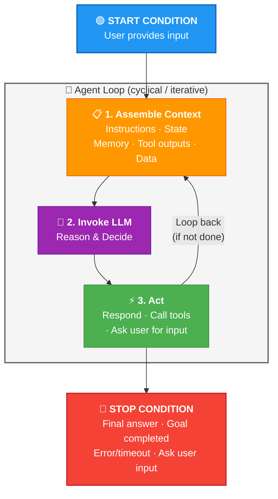
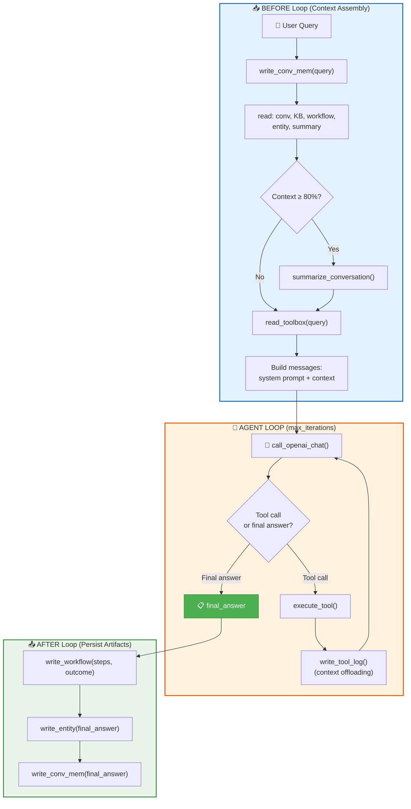

# 06 · Memory Aware Agent 🤖

---

## 🎯 One Line
> Everything from L01-L05 assembled into one agent: a **cyclical loop** that reads memory before acting, writes memory after acting, and uses tools + context engineering to stay sharp across sessions.

---

## 📚 What This Lesson Covers

| # | Topic | Type |
|---|-------|------|
| 1 | The Agent Loop (Assemble → Invoke → Act) | 📖 Concept |
| 2 | Memory Ops IN and OUT of the loop | 📖 Concept |
| 3 | Agent Harness = the full scaffolding | 📖 Concept |
| 4 | System Prompt → memory awareness | 📖 Concept |
| 5 | Code Lab: full `call_agent` implementation | 💻 Hands-on |
| 6 | Live demo: continuity, workflow, summarization, expand | 💻 Demo |

---

## 🔄 The Agent Loop

> A **cyclical, iterative environment** in which an LLM executes for a bounded number of iterations — assembling context, reasoning, and acting until a stop condition is met.



### The 3 Steps (every iteration)

| Step | What happens | In simple words |
|------|-------------|----------------|
| **1. Assemble Context** | Gather instructions, state, memory, tool outputs, data | "Sab kuch table pe rakh do" — gather everything the LLM needs |
| **2. Invoke LLM** | Send assembled context → LLM reasons and decides | "Ab socho kya karna hai" — LLM thinks |
| **3. Act** | LLM either: responds to user, calls a tool, or asks for more input | "Karo!" — execute the decision |

### Pseudocode

```python
def agent_loop(query, max_steps=10):
    context = assemble_context(query)     # Step 1
    for i in range(max_steps):
        response = llm.invoke(context)     # Step 2
        if response.is_final_answer:       # Stop condition
            return response.content
        result = execute_tool(response)    # Step 3 (Act)
        context.append(result)             # Feed back into loop
    return "Max iterations reached"
```

### Stop Conditions

| Condition | What it means |
|-----------|--------------|
| ✅ **Final answer** | LLM has enough info, returns response to user |
| 🎯 **Goal completed** | Task objective achieved |
| ❌ **Error / timeout** | Something broke or took too long |
| ❓ **Ask user** | LLM needs more info from the human |
| 🔢 **Max iterations** | Safety net — loop ran too many times without resolving |

> 💡 Agent Loop = washing machine cycle 🔄 — keeps spinning (assemble → invoke → act) until the clothes are clean (stop condition met). Max iterations = timer so it doesn't run forever!

---

## 🏗️ Agent Harness

> The **programmatic scaffolding** that enables reliable execution of an AI agent. It includes everything in AND out of the agent loop — memory operations, context assembly, tool execution, post-loop persistence.

In simple words: the harness is ALL the code around the LLM that makes it behave like a proper agent — not just the loop, but everything before and after it too.

---

## 📍 Memory Ops: OUTSIDE vs INSIDE the Loop

This is the core architectural insight of this lesson — **where** each memory operation lives determines its behavior.

### Outside the Loop (Before & After)

**BEFORE the loop** (building initial context):

| Operation | Why |
|-----------|-----|
| `read_conversational_memory()` | Load chat history from previous sessions |
| `read_knowledge_base()` | Load relevant KB passages |
| `read_workflow()` | Load reusable step patterns |
| `read_entity()` | Load known people, places, systems |
| `read_summary()` | Load compressed past conversations |
| `read_toolbox()` | Retrieve relevant tools for this query |
| `write_conversational_memory()` | Save user's query before entering loop |
| **Context check** (80%+) | If context too full → trigger `summarize_conversation` programmatically |

**AFTER the loop** (persisting artifacts):

| Operation | Why |
|-----------|-----|
| `write_workflow()` | Save the steps + outcome as reusable workflow |
| `write_entity()` | Extract and save entities from final answer |
| `write_conversational_memory()` | Save assistant's final answer |

### Inside the Loop (During Execution)

| Operation | Triggered by | Example |
|-----------|-------------|---------|
| `search_tavily()` | Agent (tool call) | Agent decides it needs web info |
| `expand_summary()` | Agent (tool call) | Agent needs details from a compacted summary |
| `summarize_and_store()` | Agent OR programmatic | Agent decides to summarize, OR 80% threshold hit |
| `write_tool_log()` | Programmatic | Every tool execution is logged (context offloading) |
| `read_summary/entity/workflow` | Agent (tool call) | Agent can request more memory mid-loop |

> 💡 **Outside** = deterministic setup & cleanup (always happens). **Inside** = dynamic, tool-based (happens when needed). This split makes the agent both **reliable** (deterministic base) and **flexible** (agent-triggered extras).

---

## 🧠 System Prompt → Memory Awareness

The system prompt is what makes an LLM **memory aware**. It tells the LLM:

1. **What memory types exist** (conversational, KB, workflow, entity, summary)
2. **How the context window is partitioned** (markdown headings per memory type)
3. **How to use each memory** (instructions per section)
4. **What tools are available** for memory operations

### Context Window Partitioning

The context window uses **markdown headings** to segment memory types. LLMs understand hierarchical markdown structure from training data → they can parse and reason about each section.

```
┌────────────────────────────────────────┐
│  ## System Instructions                │ ← AGENT_SYSTEM_PROMPT
├────────────────────────────────────────┤
│  ## Conversation Memory                │
│    Retrieved messages...               │
├────────────────────────────────────────┤
│  ## Knowledge Base Memory              │
│    Retrieved passages...               │
├────────────────────────────────────────┤
│  ## Workflow Memory                    │
│    Retrieved workflows...              │
├────────────────────────────────────────┤
│  ## Entity Memory                      │
│    Retrieved entities...               │
├────────────────────────────────────────┤
│  ## Summary Memory                     │
│    [Summary ID: xxx] description       │
├────────────────────────────────────────┤
│  ## User Query                         │
│    Current question                    │
└────────────────────────────────────────┘
```

Each section includes **how the agent should use that memory** — not just data, but instructions. This is what upgrades from "memory augmented" to **"memory aware"**.

> 💡 Markdown headings = labeled drawers in a filing cabinet. LLM knows exactly where to look for what type of information! 🗄️

---

## 💻 Code Lab: The Full `call_agent` Function

> 📂 See `code/L6/L6.ipynb` for the full implementation

### The Complete Flow



### Live Demo: 3 Queries Showing Continuity

| # | Query | What it demonstrates |
|---|-------|---------------------|
| 1 | *"Get me the paper on MemGPT"* | Agent uses `arxiv_search_candidates` tool → finds paper → returns info. **Workflow Memory** records the steps taken. |
| 2 | *"Save the content of the paper"* | Agent remembers "the paper" from **Conversational Memory** → calls `fetch_and_save_paper_to_kb_db` → chunks & saves. **Workflow** from Q1 visible. |
| 3 | *"Main takeaways from the paper"* | Answers in **1 iteration** (no tool call needed) — paper content already in **KB Memory** from Q2. |

### Summary Memory in Action

| Step | What happens |
|------|-------------|
| Agent asked to *"summarize the conversation"* | Agent calls `summarize_and_store` tool |
| 7 messages marked as summarized | `summary_id` written to each row |
| Next query: *"What was our first question?"* | Conv. Memory is now empty (all summarized!) |
| Agent sees **Summary Memory** has an ID + description | Calls `expand_summary(id)` to retrieve original messages |
| Original 7 messages retrieved from DB | Agent answers: "Your first question was 'Get me the paper on MemGPT'" ✅ |

> 💡 This is the full circle: Summarize → Compact to DB → Conversation memory freed up → Agent discovers summary reference → Expands when needed. **Memory Engineering in action!** 🔄

---

## 🔑 Key Takeaways

| # | Takeaway |
|---|---------|
| 1 | **Agent Loop** = cyclical: Assemble Context → Invoke LLM → Act. Repeats until stop condition (final answer, error, timeout, max iterations) |
| 2 | **Agent Harness** = all programmatic scaffolding (in + out of loop) that enables reliable agent execution |
| 3 | **Outside loop** = deterministic context assembly (reads) + post-loop persistence (writes). **Inside loop** = dynamic tool calls + context offloading |
| 4 | **System prompt** makes LLM memory-aware: tells it what memory types exist, how context is partitioned, how to use each |
| 5 | **Markdown headings** partition the context window per memory type — LLMs understand hierarchical markdown from training |
| 6 | **Entity Memory** auto-extracts people, places, organizations from interactions |
| 7 | **Full continuity demo**: conversational memory (cross-query context), workflow memory (reusable steps), summary memory (compact → expand), entity memory (extracted facts) |

---

## 🧪 Quick Check

<details>
<summary>❓ What is the Agent Loop?</summary>

A **cyclical, iterative environment** with 3 steps per iteration:
1. **Assemble Context** (gather everything)
2. **Invoke LLM** (reason & decide)
3. **Act** (respond, call tool, or ask user)

Loops until a **stop condition**: final answer, goal completed, error/timeout, or max iterations reached.
</details>

<details>
<summary>❓ Agent Harness kya hai?</summary>

The **full programmatic scaffolding** around the agent — not just the loop, but ALL the code before (context assembly, memory reads), during (tool execution, context offloading), and after (workflow write, entity extraction, conversation save).

> Agent Loop = engine. Harness = the entire car around it 🚗
</details>

<details>
<summary>❓ Which memory ops happen OUTSIDE vs INSIDE the loop?</summary>

**Outside (before):** Read all memory types (conv, KB, workflow, entity, summary, toolbox) + check context 80% threshold + write user query.

**Outside (after):** Write workflow (steps + outcome), write entities, write final answer to conv memory.

**Inside:** Tool calls (search, expand_summary, summarize_and_store), tool log writes (context offloading).

> Outside = deterministic (always happens). Inside = dynamic (when needed).
</details>

<details>
<summary>❓ How does the system prompt make an LLM "memory aware"?</summary>

It tells the LLM:
1. What **memory types** exist (conv, KB, workflow, entity, summary)
2. How the **context window is partitioned** (markdown headings per type)
3. **How to use** each memory section
4. What **tools** are available for memory operations

Without this, the LLM just sees raw text. With it, the LLM knows "this section is Knowledge Base — ground my claims here."
</details>

<details>
<summary>❓ Why use markdown headings to partition the context window?</summary>

LLMs understand **hierarchical markdown** from training data. Using `## Conversation Memory`, `## Knowledge Base Memory` etc. lets the LLM parse and reason about each section separately — like labeled drawers in a filing cabinet 🗄️
</details>

<details>
<summary>❓ What did the live demo show with 3 queries?</summary>

1. **"Get me the paper on MemGPT"** → tool call (arxiv search) + workflow saved
2. **"Save the content"** → agent remembers "the paper" from conv memory → fetches & stores
3. **"Main takeaways"** → answers in 1 iteration, no tool call (paper already in KB!)

Then: summarize → conv memory freed → ask "first question?" → agent expands summary from DB → answers correctly. **Full memory lifecycle!**
</details>

---

> **← Prev:** [Memory Operations](05-memory-operations.md) | **Next →** [Conclusion](07-conclusion.md)
