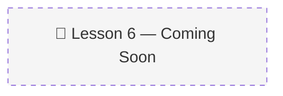

# 06 · Memory Aware Agent 🤖

> 📚 Source: DeepLearning.AI × Oracle — "Agent Memory: Building Memory-Aware Agents" (Lesson 6)
> 🔴 Placeholder — pending course completion
> 
> Confidence tags: ✅ Direct from source | 🔍 Web-verified | 💡 Analogy | ⚠️ My interpretation

---

## 🎯 One Line
> _To be filled after watching Lesson 6 (20 min, code lab)_

---

## 🖼️ The Picture

---

> **← Prev:** [Memory Operations](05-memory-operations.md) | **Next →** [Conclusion](07-conclusion.md)
