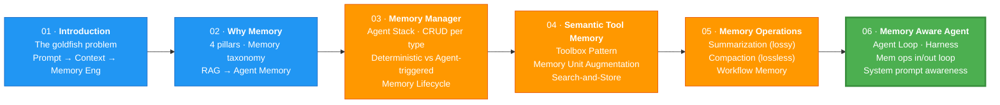

# 07 · Conclusion 🎓

---

## 🎯 One Line
> You went from **stateless goldfish** 🐟 to **persistent memory-aware agent** 🧠 — one that loads prior context, checkpoints reasoning, and gets better over time.

---

## 🗺️ The Full Journey

---

## 🧱 The 5 Building Blocks of Memory Engineering

These are the **production patterns** you can take to any agent project:

| # | Pattern | What it does | Where you learned it |
|---|---------|-------------|---------------------|
| 1 | 🗄️ **Memory Modeling** | Design persistent stores per memory type (SQL + Vector) | L03 |
| 2 | 🔍 **Semantic Retrieval** | Find relevant tools/knowledge by meaning, not keywords | L04 |
| 3 | ✂️ **Extraction** | Pull structured facts, entities, workflows from raw conversations | L05, L06 |
| 4 | 📦 **Consolidation** | Summarize + compact long contexts while preserving signal | L05 |
| 5 | 🔄 **Write-Back** | Agent autonomously updates its own memory (self-improving loop) | L05, L06 |

> 💡 These 5 patterns = the DNA of any production agent that **improves over time** instead of starting from scratch every session.

---

## 📚 What You Built (Full Stack)

| Component | Tool/Tech | Purpose |
|-----------|-----------|---------|
| Database | **Oracle AI Database 26ai** | Persistent storage (SQL + Vector) |
| Embedding | `paraphrase-mpnet-base-v2` | Text → vector representations |
| Vector Store | **OracleVS** (LangChain) | Semantic similarity search |
| LLM | **GPT-5** (OpenAI) | Reasoning, extraction, summarization |
| Orchestration | **LangChain** | Agent framework, retrievers, splitters |
| Store Abstraction | **StoreManager** | Creates & manages all vector stores |
| CRUD Abstraction | **MemoryManager** | Unified read/write for 7 memory types |
| Tool Management | **Toolbox** | Register, augment, retrieve tools semantically |
| Context Eng | **Summarization + Compaction** | Keep context window efficient |
| Agent | **call_agent()** | Full agent loop with memory harness |

---

## 🔗 Extra Resource

> 🔗 [Oracle AI Developer Hub](https://github.com/oracle-devrel/oracle-ai-developer-hub) — additional code samples, tutorials, and reference architectures for building AI with Oracle.

---

> **← Prev:** [Memory Aware Agent](06-memory-aware-agent.md)
