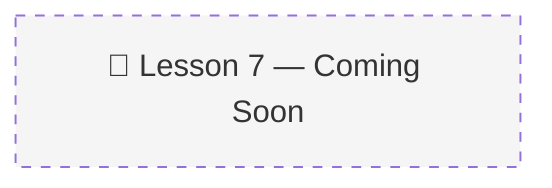

# 07 · Conclusion 🎓

> 📚 Source: DeepLearning.AI × Oracle — "Agent Memory: Building Memory-Aware Agents" (Lesson 7)
> 🔴 Placeholder — pending course completion
> 
> Confidence tags: ✅ Direct from source | 🔍 Web-verified | 💡 Analogy | ⚠️ My interpretation

---

## 🎯 One Line
> _To be filled after watching Lesson 7 (1 min + quiz)_

---

## 🖼️ The Picture

---

> **← Prev:** [Memory Aware Agent](06-memory-aware-agent.md)
