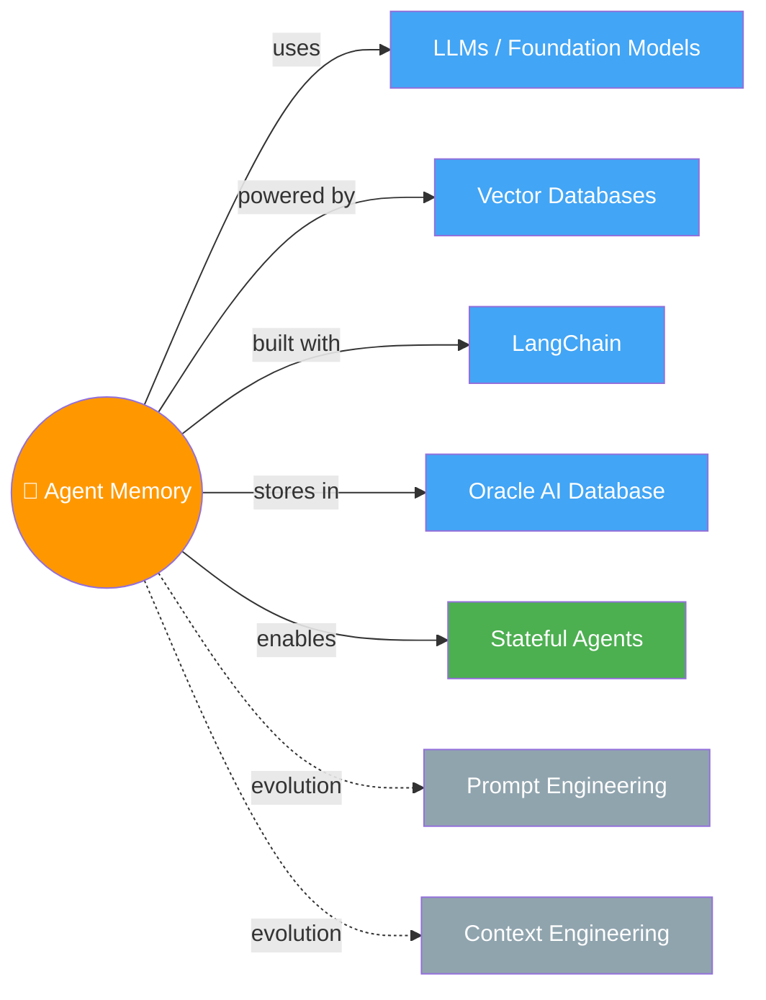

# 🧠 Agent Memory — Building Memory-Aware Agents

> Stateless agents = goldfish 🐟. Memory engineering = giving them a diary that actually sticks.

---

## 🧠 Brain — How This Connects

## 📊 Progress
| # | Lesson | Confidence | Revised |
|---|--------|-----------|---------|
| 01 | [Introduction](01-introduction.md) | 🟡 | — |
| 02 | [Why AI Agents Need Memory](02-why-agents-need-memory.md) | 🔴 | — |
| 03 | [Constructing The Memory Manager](03-memory-manager.md) | 🔴 | — |
| 04 | [Semantic Tool Memory](04-semantic-tool-memory.md) | 🔴 | — |
| 05 | [Memory Operations](05-memory-operations.md) | 🔴 | — |
| 06 | [Memory Aware Agent](06-memory-aware-agent.md) | 🔴 | — |
| 07 | [Conclusion](07-conclusion.md) | 🔴 | — |

## 🧩 Memory Fragments
> Things picked up over time. Random "aha!" moments, project learnings.
> 
> - 💡 The evolution: Prompt Engineering → Context Engineering → Memory Engineering. Each layer adds more persistence.
> - 🐟 Stateless agents = goldfish. They do great in one conversation, then forget everything. Memory engineering fixes this.
> - 🏗️ Memory is infrastructure, not a feature — it lives OUTSIDE the model, persists across sessions, and has structure.

---

## 🎬 Teach Mode — Lesson Flow

> Open these in order = you can teach anyone Agent Memory

| # | Lesson | One-liner | Time |
|---|--------|-----------|------|
| 01 | [Introduction](01-introduction.md) | Course overview — why memory matters | 2 min |
| 02 | [Why AI Agents Need Memory](02-why-agents-need-memory.md) | The problem with stateless agents | 18 min |
| 03 | [Constructing The Memory Manager](03-memory-manager.md) | Build the core memory system | 22 min |
| 04 | [Semantic Tool Memory](04-semantic-tool-memory.md) | Scale tool use with semantic memory | 17 min |
| 05 | [Memory Operations](05-memory-operations.md) | Extraction, consolidation, self-updating | 23 min |
| 06 | [Memory Aware Agent](06-memory-aware-agent.md) | Build the fully stateful agent | 20 min |
| 07 | [Conclusion](07-conclusion.md) | Wrap-up + quiz | 1 min |

**Supporting:**
- [Flashcards](flashcards.md) — revision cards across all lessons

---

## 📚 Sources
> - 🎓 Course: [Agent Memory: Building Memory-Aware Agents](https://www.deeplearning.ai/) — DeepLearning.AI × Oracle
> - 👨‍🏫 Instructors: Richmond Alake (Director of AI Dev Experience, Oracle) & Nacho Martínez (Principal Data Science Advocate, Oracle)
> - 🎙️ Introduced by: Andrew Ng

## 🔗 Connected Topics
> _First topic in the vault! Connections will grow as more topics are added._

## 30-Second Recall 🧠
> Today's AI agents are stateless goldfish — they nail one session but forget everything after. Memory engineering treats long-term memory as first-class infrastructure: external to the model, persistent, and structured. This course builds a full memory-aware agent using Oracle AI Database + LangChain — covering memory managers, extraction pipelines, contradiction handling, and write-back loops. The evolution: prompt engineering → context engineering → memory engineering.
