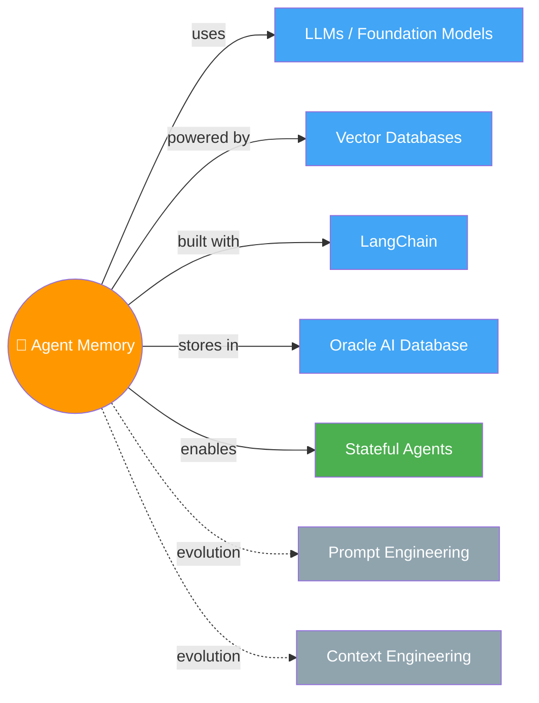

# 🧠 Agent Memory — Building Memory-Aware Agents

> Stateless agents = goldfish 🐟. Memory engineering = giving them a diary that actually sticks.

---

## 🧠 Brain — How This Connects

## 📊 Progress

| # | Lesson | Status |
|---|--------|--------|
| 01 | [Introduction](01-introduction.md) | 🟡 Learning |
| 02 | [Why Agents Need Memory](02-why-agents-need-memory.md) | 🟡 Learning |
| 03 | [Memory Manager](03-memory-manager.md) | 🟡 Learning |
| 04 | [Semantic Tool Memory](04-semantic-tool-memory.md) | 🟡 Learning |
| 05 | [Memory Operations](05-memory-operations.md) | 🟡 Learning |
| 06 | [Memory Aware Agent](06-memory-aware-agent.md) | 🟡 Learning |
| 07 | [Conclusion](07-conclusion.md) | 🟡 Learning |

## 🧩 Memory Fragments
> Random "aha!" moments picked up along the way:
> 
> - 💡 **Evolution path:** Prompt Eng → Context Eng → Memory Eng. Each layer adds persistence.
> - 🐟 Stateless agents do great in one convo, then forget *everything*. Memory engineering fixes this.
> - 🏗️ Memory = **infrastructure**, not a feature — external to the model, persistent, structured.
> - 🤖 **4 pillars of an agent:** Perception · Reasoning · Action · Memory — remove any one and it's not a real agent.
> - 🗄️ **Database is the core** of agent memory — not the LLM (frozen), not the embedding model. DB sees all the data traffic.
> - 🔗 **Agent Memory = RAG + CRUD.** Same pipeline, but the agent can WRITE back, not just read.
> - 📖 Conversational memory alone = just a diary. You also need contacts, to-do lists, and a knowledge base.
> - 🏗️ **Memory Manager = abstraction on DB.** CRUD methods per memory type. SQL for exact-match, Vector for semantic search.
> - ⏰ **Deterministic ops = alarm clock** (always run). Agent-triggered = judgment call. Both are needed!
> - 🐔 **Chicken-and-egg problem:** Agent can't decide to check memory it doesn't know exists → deterministic retrieval at start.
> - 🔄 **Memory Lifecycle is a continuous loop** — LLM output feeds BACK as new memory. The agent literally learns!
> - 🧠 **Aware > Augmented:** Augmented = HAS memory. Aware = KNOWS it has memory + controls it via tools + reasons through lifecycle.
> - 🔧 **Toolbox Pattern:** Don't stuff 100 tools into context → store in vector DB, retrieve top-K via semantic search at runtime.
> - ✨ **Memory Unit Augmentation:** LLM enhances tool descriptions → better separability in embedding space → higher recall.
> - 🔄 **Search-and-store:** Tool results get persisted to KB memory — agent literally learns from searching.
> - 📉 **Context Window Reduction** has 2 techniques: Summarization (lossy) and Compaction (lossless via DB offload).
> - 🗄️ **Compaction > Summarization** when you might need details later — full content in DB, expand anytime.
> - ⚙️ **Workflow Memory** = reusable step-by-step playbooks. Do it once, follow the recipe forever.
> - 🔄 **Agent Loop** = cyclical: Assemble Context → Invoke LLM → Act. Repeats until stop condition.
> - 🏗️ **Agent Harness** = full scaffolding (before + during + after loop). Memory ops outside = deterministic. Inside = dynamic.
> - 📋 **Markdown headings** partition the context window per memory type — LLMs understand hierarchical structure from training.
> - 🧠 **System prompt** is what makes LLM memory-aware: tells it what memory exists, how context is partitioned, how to use each type.

---

## 🎬 Teach Mode — Lesson Flow

> Open in order = teach anyone Agent Memory

| # | Lesson | What You'll Get |
|---|--------|-----------------|
| 01 | [Introduction](01-introduction.md) | Why memory matters — the goldfish problem |
| 02 | [Why Agents Need Memory](02-why-agents-need-memory.md) | Failure modes + memory-first architecture |
| 03 | [Memory Manager](03-memory-manager.md) | Build core store/retrieve system |
| 04 | [Semantic Tool Memory](04-semantic-tool-memory.md) | Scale tool selection via semantic search |
| 05 | [Memory Operations](05-memory-operations.md) | Extraction, consolidation, self-update |
| 06 | [Memory Aware Agent](06-memory-aware-agent.md) | Full stateful agent, end-to-end |
| 07 | [Conclusion](07-conclusion.md) | Wrap-up + quiz |

**Supporting:** [Flashcards](flashcards.md) — revision cards across all lessons

---

## 📚 Source
> 🎓 [Agent Memory: Building Memory-Aware Agents](https://www.deeplearning.ai/) — DeepLearning.AI × Oracle

## 🔗 Connected Topics
> _First topic in the vault! Connections will grow as more topics are added._

## 30-Second Recall 🧠
> AI agents are **stateless goldfish** — great in one session, blank slate next. Memory engineering treats memory as **infrastructure**: external, persistent, structured. Build a full memory-aware agent using vector DBs + LangChain — covering memory managers, extraction pipelines, contradiction handling, and write-back loops.
