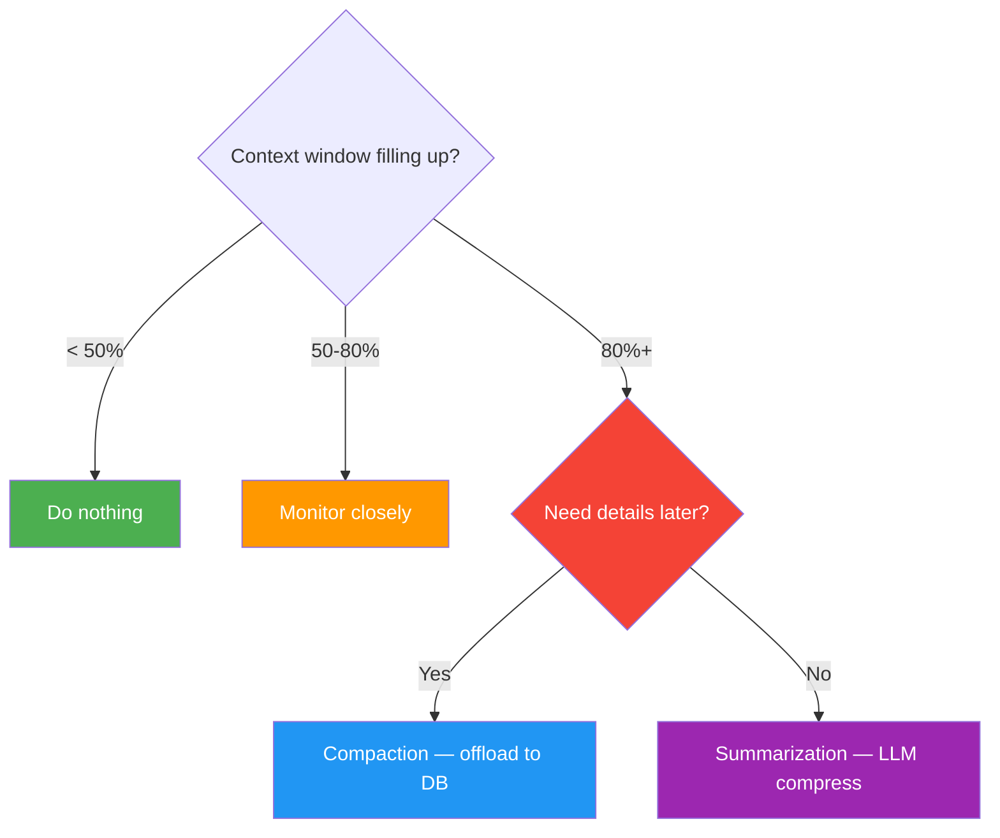

# 📋 Agent Memory Cheatsheet

> Everything on one page. Print it. Stick it on your wall. Screenshot it.

---

## Core Concepts (30 sec)

| Concept | What | Remember |
|---------|------|---------|
| Memory Engineering | Discipline of building & maintaining memory systems for AI agents | DB Eng + Agent Eng + ML Eng + Info Retrieval = Memory Eng |
| Memory Manager | Abstraction on DB — CRUD methods for each memory type | The librarian between your agent and the database |
| Memory Unit | Smallest atomic piece of stored info (e.g., one chat message, one workflow step) | One row in the DB |
| Context Engineering | Curate what goes INTO the context window — maximize signal per token | Choosing which cheat sheets to bring to the exam |
| Agent Loop | Cyclical: Assemble Context → Invoke LLM → Act. Until stop condition. | Washing machine — spins until clothes are clean |
| Agent Harness | All programmatic scaffolding before + during + after the loop | Loop = engine. Harness = the entire car |
| Toolbox Pattern | Store tools in vector DB, retrieve top-K via semantic search at runtime | Smart search bar instead of phone book |
| Memory Unit Augmentation | LLM enhances tool descriptions → better embeddings → better retrieval | Detailed resume beats one-liner bio |
| Context Summarization | LLM compresses content → shorter form. Lossy. | JPEG — looks fine but zoom in = detail gone |
| Context Compaction | Offload full content to DB, keep ID + description in context. Lossless. | File moved to drawer, Post-it says where |
| Workflow Memory | Persist & reuse multi-step task sequences | Recipe — do it once, follow it forever |

---

## 7 Memory Types

| Type | Storage | Retrieval | What it stores |
|------|---------|-----------|---------------|
| Conversational | SQL Table | Exact match (`thread_id`) | Chat history per thread |
| Knowledge Base | Vector Store | Semantic similarity | Domain docs, papers, facts |
| Workflow | Vector Store | Semantic similarity | Multi-step task playbooks |
| Toolbox | Vector Store | Semantic similarity | Tool definitions + augmented descriptions |
| Entity | Vector Store | Semantic similarity | People, places, systems |
| Summary | Vector Store | Semantic similarity + ID | Compressed older conversations |
| Tool Log | SQL Table | Exact match (`thread_id`) | Raw tool execution audit trail |

---

## Tech Stack

| Component | Tool |
|-----------|------|
| Database | Oracle AI Database 26ai |
| Embedding | `sentence-transformers/paraphrase-mpnet-base-v2` |
| Vector Store | OracleVS (LangChain integration) |
| Distance | COSINE |
| Index | IVF (95% target accuracy) |
| LLM | GPT-5 (OpenAI) |
| Orchestration | LangChain |
| Abstractions | StoreManager → MemoryManager → Toolbox |

---

## Memory Operations Classification

| Operation | Deterministic | Agent-Triggered |
|-----------|:---:|:---:|
| read_conversational_memory | ✅ | |
| read_knowledge_base | ✅ | |
| read_workflow | ✅ | |
| read_entity | ✅ | |
| write_conversational_memory | ✅ | |
| write_workflow | ✅ | |
| read_summary_context | | ✅ |
| write_entity | | ✅ |
| expand_summary | | ✅ |
| summarize_and_store | | ✅ |
| read_toolbox | ✅ | ✅ |

**Deterministic** = always runs (alarm clock). **Agent-triggered** = LLM decides (judgment call).

---

## Common Patterns

```
Pattern 1: Search-and-Store
→ When: Agent searches web/arXiv for info
→ How: Tool returns results AND writes them to KB memory. Search once, remember forever.

Pattern 2: Summarize-and-Mark
→ When: Context window hits 80%+ usage
→ How: LLM summarizes thread → stores summary with ID → marks original messages with summary_id

Pattern 3: Compact-and-Expand
→ When: Need to free context but might need full details later
→ How: Move full content to DB, keep ID + description. expand_summary(id) retrieves everything.

Pattern 4: Register-and-Retrieve (Toolbox)
→ When: Scaling to 100+ tools
→ How: Store tool defs as embeddings. At runtime, semantic search returns top-K relevant tools only.
```

---

## Decision Guide



---

## Memory Lifecycle (the loop)

```
Ingest → Enrich (embeddings + metadata) → Store (DB) → Organize (index) → Retrieve (semantic/lexical/hybrid) → LLM → Serialize output → back to Store → repeat
```

LLM output feeds BACK as new memory. Continuous learning cycle.

---

## Augmented → Aware (4 steps)

1. Memory store awareness via system prompt
2. Memory operations as agent tools
3. Agent reasons through memory lifecycle
4. Context window segmented by memory type (markdown headings)

---

## Gotchas

1. Stuffing all tools into context → context bloat, wrong tool selection, high cost, latency
2. Summarization is LOSSY — prompt quality = summary quality
3. Agent can't check memory it doesn't know exists → deterministic retrieval at loop start
4. Without indexes on vector stores → every query scans all rows (slow)
5. Forgetting to mark summarized messages → double-summarization

---

> One page. Bas. Isse zyada chahiye toh lessons padho 📖
