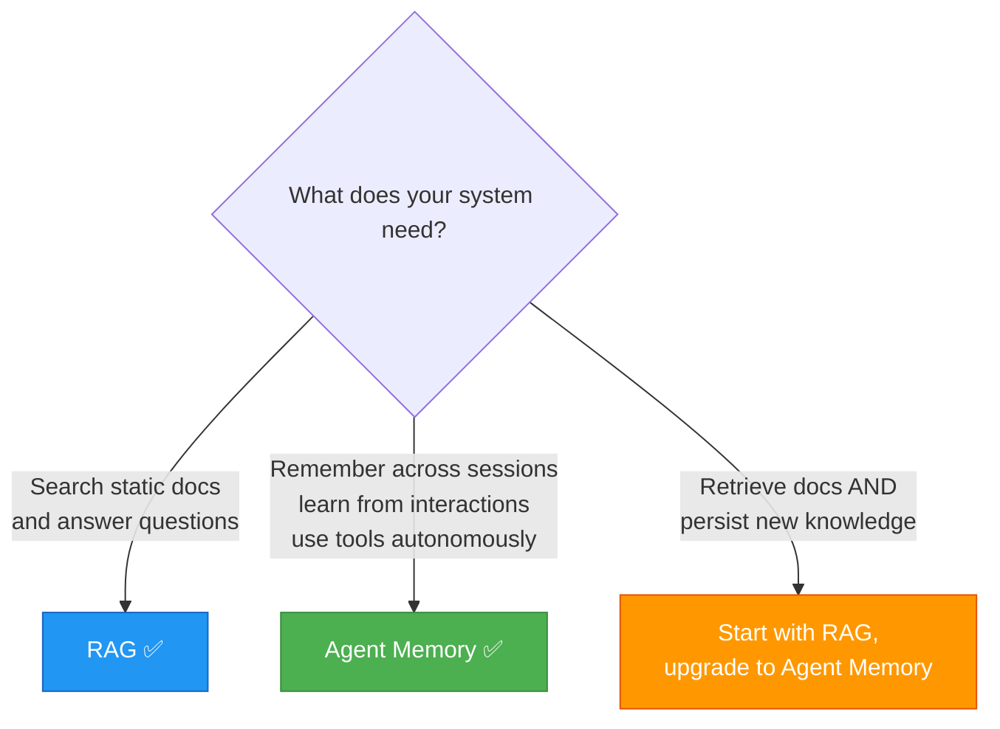
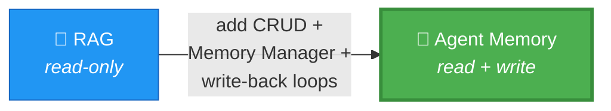

# ⚔️ RAG vs Agent Memory

> Same family, different ambitions. Know the difference.

---

## Quick Pick

---

## One-Liner Each

> **RAG** = Retrieve relevant docs from a static knowledge base and inject them into the LLM context for grounded answers. Read-only.

> **Agent Memory** = A full system (DB + embedding model + LLM + control logic) that lets an agent store, organize, retrieve, and reuse information across time and sessions. Read + Write.

---

## Full Comparison

| Feature | RAG | Agent Memory |
|---------|-----|-------------|
| **Data** | Static docs (pre-indexed) | Live memory tables (entities, workflows, convos, tools) |
| **Operations** | Read-only (retrieve) | Full CRUD (create, read, update, delete) |
| **Pipeline** | Chunk → Embed → Store → Query → Retrieve → Rerank → LLM | Same pipeline + Memory Manager + write-back loops |
| **Abstraction** | Direct DB query | Memory Manager abstracts all operations |
| **Agent access** | Via retrieval chain | Via tools connected to Memory Manager |
| **Persistence** | Knowledge base persists, but agent doesn't write to it | Agent writes new knowledge back to DB |
| **Memory types** | Just one (knowledge base) | 7 types: conversational, KB, workflow, toolbox, entity, summary, tool log |
| **Learning** | Doesn't learn from interactions | Learns — search results, workflows, entities get persisted |
| **Context management** | Basic (stuff docs in context) | Advanced — summarization, compaction, context monitoring |
| **Tool awareness** | Not applicable | Toolbox pattern — semantic tool retrieval at scale |
| **Best for** | Q&A over documents, search assistants | Long-running agents, multi-session tasks, autonomous systems |
| **Complexity** | Simpler to build | More infrastructure, but far more capable |

---

## Real Talk

**Pick RAG when:**
- You have a document corpus and need grounded Q&A
- Users ask questions, get answers, done — no multi-session needs
- You don't need the agent to learn or remember past interactions

**Pick Agent Memory when:**
- Your agent needs to operate across multiple sessions
- It should remember user preferences, past decisions, entities
- You have 10+ tools and need semantic tool retrieval
- The agent should learn from its searches and interactions
- You need workflow reuse, context management, and write-back

**Dono chalega when:**
- You're building a research assistant that searches docs (RAG) but also needs to remember what papers you've already read (Agent Memory). Start with RAG, layer Agent Memory on top.

---

## The Relationship

Agent Memory isn't a replacement for RAG — it's an **evolution**. RAG is the read-only foundation. Agent Memory adds CRUD, multiple memory types, and autonomous write-back loops on top of the same pipeline.

---

> "If you understand RAG, you understand 80% of Agent Memory. The other 20% is what makes agents actually learn." 🎯
