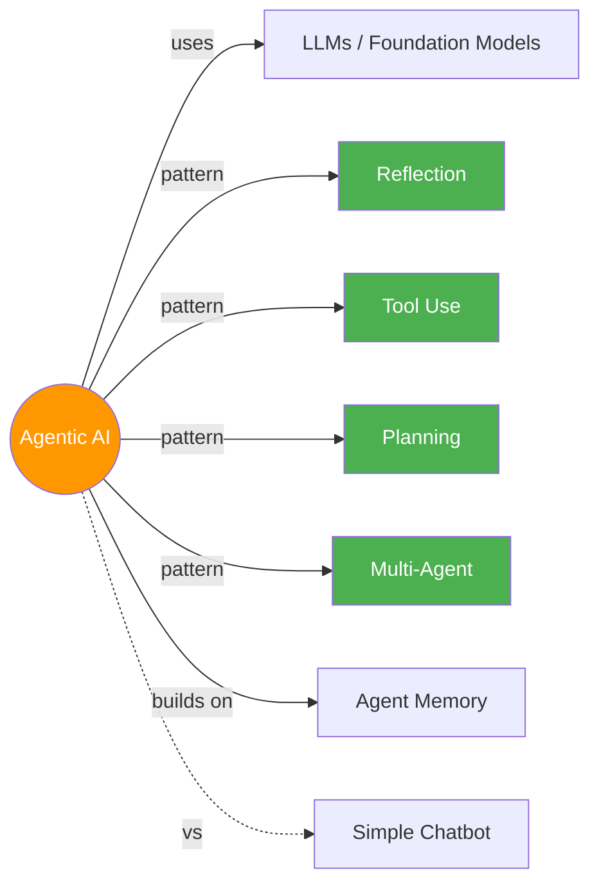

# 🤖 Agentic AI

> LLMs jo sirf jawab nahi dete, kaam bhi karte hain — plan, execute, reflect, repeat! 🔄

---

## 🧠 Brain — How This Connects

## 📊 Progress

| # | Module | Lessons | Confidence | Revised |
|---|--------|---------|-----------|---------|
| 01 | [Intro to Agentic Workflows](module-1-intro/) | 8/8 ✅ | 🟡 | — |
| 02 | [Reflection Design Pattern](module-2-reflection/) | 5/5 ✅ | 🟡 | — |
| 03 | [Tool Use](module-3-tool-use/) | 5/5 ✅ | 🟡 | — |
| 04 | [Practical Tips](module-4-practical-tips/) | 7/7 ✅ | 🟡 | — |
| 05 | [Autonomous Agents](module-5-autonomous-agents/) | 0/5 | 🔴 | — |

## 🧩 Memory Fragments

> Things picked up over time. Random "aha!" moments, project learnings.
> 
> - Andrew Ng coined "agentic" → marketers hijacked it → hype skyrocketed
> - #1 skill differentiator: disciplined dev process (evals + error analysis)
> - Without agentic workflows, many of Andrew's projects would be *impossible*
> - Reflection is surprisingly easy to implement — 2 prompts, 1 loop
> - Different LLMs for generation vs critique = powerful combo
> - External feedback (code errors, web search, regex) breaks the performance plateau
> - LLM pair comparison is unreliable (position bias!) — use binary rubric instead
> - 3 tiers: Direct generation < Reflection < Reflection + External Feedback
> - Tools = functions LLM CHOOSES to call at runtime (not hard-coded)
> - aisuite auto-generates JSON schema from docstring — docstring is the tool's resume
> - Code execution = THE meta-tool. One tool to rule them all
> - MCP turns M×N integrations into M+N — USB port for LLMs
> - Andrew Ng's team had an agent run `rm *.py` — always sandbox!

---

## 🎬 Teach Mode — Module Flow

> Open these in order = you can teach anyone Agentic AI

| # | Module | What You'll Learn | Est. Time |
|---|--------|-------------------|-----------|
| 01 | [Intro to Agentic Workflows](module-1-intro/) | What, why, applications, task decomposition, evals, 4 design patterns | ~45 min |
| 02 | [Reflection Design Pattern](module-2-reflection/) | Self-critique loops, chart/SQL generation, external feedback | ~40 min |
| 03 | [Tool Use](module-3-tool-use/) | Creating tools, tool syntax, code execution, MCP | ~45 min |
| 04 | [Practical Tips](module-4-practical-tips/) | Evals, error analysis, component evals, cost/latency optimization | ~50 min |
| 05 | [Autonomous Agents](module-5-autonomous-agents/) | Planning, LLM plans, multi-agent, communication patterns | ~45 min |

**Supporting:**
- [Flashcards](flashcards.md) — cross-module self-test
- [Cheatsheet](cheatsheet.md) — one-page everything
- [Evals & Error Analysis Comparison](vs.md) — every eval technique compared

---

## 📚 Sources

> - 🎓 Course: [Agentic AI](https://learn.deeplearning.ai/courses/agentic-ai) — DeepLearning.AI
> - 👨‍🏫 Instructor: Andrew Ng
> - 📦 5 Modules · Intermediate · Self-paced · Python

## 🔗 Connected Topics

> → [Agent Memory](../agent-memory/) · _LLMs (planned)_ · _Prompt Engineering (planned)_

## 30-Second Recall 🧠

> Agentic AI = LLMs that don't just respond, they **act**. Four design patterns: **Reflection** (self-critique loop → external feedback breaks the plateau), **Tool Use** (LLM chooses functions at runtime — aisuite auto-schemas from docstrings, code execution is the meta-tool, MCP standardizes M×N→M+N), **Planning** (break tasks into steps), **Multi-Agent** (specialized agents collaborating). Always **eval** with ground truth (objective) or binary rubrics (subjective) — NOT pair comparison (position bias!). The secret sauce? **Evals + Error Analysis** — that's what separates good builders from great ones.
